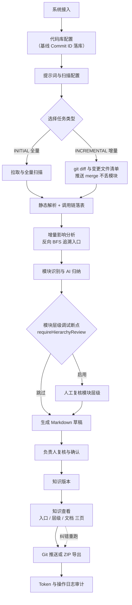

# CLAUDE.md

This file provides guidance to Claude Code (claude.ai/code) when working with code in this repository.

## 项目概述

代码洞察平台（CodeInsight Platform）将代码库转化为可维护、可追溯、可复核的知识资产。
**核心流程**：代码拉取 → Java 静态解析 → 入口识别 → AI 归纳 → 草稿复核 → 知识版本 → Git/ZIP 输出 → Token/操作日志。
**关键约束**：AI 内容必须经人工复核后才能进入正式知识库，绝不直接推送到 Git。

详细业务背景、当前 MVP 进度与已知限制见 [README.md](./README.md)。

## 技术栈

- **后端**：Java 17 + Spring Boot 3.3 + MyBatis Plus + PostgreSQL + Redis + JGit
- **前端**：React 19 + TypeScript + Vite + Ant Design + Zustand + ECharts + Monaco Editor + Hash Router
- **存储分工**：PostgreSQL（状态/元数据）｜本地/对象存储（正文）｜Redis（草稿实时编辑与锁）｜Git（已确认知识）

## 项目级 AI Skills

前端页面开发相关 skill 放在 `.codex/skills/`。涉及前端页面、路由、请求、状态、图表、编辑器或 AI 交互时，优先查看对应 `SKILL.md`：

- `codeinsight-frontend-conventions`
- `antd-token-admin-ui`
- `react-router-layout-routes`
- `axios-query-server-state`
- `zustand-client-state-boundaries`
- `ant-design-pro-crud-patterns`
- `monaco-review-editor`
- `echarts-admin-analytics`
- `antd-x-ai-workflows`
- `motion-admin-microinteractions`

## 常用命令

```bash
# 前端
cd frontend
npm install
npm run dev        # http://localhost:5173（默认把 /api 代理到 localhost:8080）
npm run lint       # eslint .
npm run build      # tsc -b + vite build

# 后端
cd backend
mvn spring-boot:run                          # http://localhost:8080/api
mvn -DskipTests compile                      # 仅编译（沙盒无 PG 时可用）
mvn test-compile                             # 含测试代码编译
mvn clean test                               # 全量测试（JUnit 5，部分单测需本地 PG + Redis；纯单测类可 -Dtest=… 单独跑）
mvn -Dtest=ClassNameTest test                # 跑单个测试类
mvn -Dtest=ClassNameTest#methodName test     # 跑单个测试方法
mvn -DskipTests clean package                # 打包 JAR

# Swagger UI
# http://localhost:8080/api/swagger-ui.html
```

后端默认 `LLM_MOCK=true`，无需真实 API Key；切到真实模型时设置 `LLM_API_KEY` 并把 `LLM_MOCK` 置为 `false`。所有可用变量见根目录 `.env.example`。

## 架构要点

### 业务闭环



### 后端模块分层

`backend/src/main/java/com/company/codeinsight/`
- `common/` — config / exception / response / storage / util（共享基础设施）
- `modules/<domain>/` — 每个领域模块统一使用 `entity/`、`mapper/`、`service/`（接口）、`service/impl/`、`controller/` 四层。

当前领域模块清单（共 21 个）：`system`、`repository`、`prompt`、`task`、`scanner`、`scanwindow`、`parser`、`callchain`、`entrypoint`、`hierarchy`、`ai`、`draft`、`knowledge`、`push`、`model`、`auth`、`token`、`log`、`quotacontrol`、`dashboard`、`businessknowledge`。模块清单直接看 `modules/` 目录。

任务状态机实现在 `modules/task/`，跨阶段推进由 `TaskStateMachineService` 负责；纠错任务（`trigger_source=KNOWLEDGE_REMEDIATION` + `remediation_kind`）可按 `resume_from` 字段跳到 `AI_ANALYZING` 或 `GENERATING_DOC`，由 `TaskQueueDispatcher` 派发。任何状态变更都需在 `ci_operation_log` 留痕。

数据库表 34 张，schema 启动时由 `backend/src/main/resources/db/schema.sql` 幂等初始化（`CREATE TABLE IF NOT EXISTS` + `ALTER TABLE ... ADD COLUMN IF NOT EXISTS`）。

### 前端 API 对齐

`frontend/src/api/` 每个文件与后端一个领域模块一一对应（如 `api/task.ts` ↔ `modules/task/`）。所有请求经过 `api/request.ts` 拦截器自动解包后端统一响应：

```json
{ "code": 0, "message": "success", "data": { ... } }
```

页面代码拿到的就是 `data` 内容，code 非零时拦截器会按 `message` 抛错。

当前前端页面（`frontend/src/pages/`）：`dashboard/`、`login/`、`systems/`、`tasks/`（含 `hierarchy-review` / `entrypoint-review` 子页与 `IncrementalImpactCard`）、`drafts/`、`knowledge/`（`entrypoints` / `hierarchy` / `documents` 三页 + `KnowledgeContextBar` + `useKnowledgeQueryContext`）、`push/`、`token-audit/`、`logs/`、`schedules/`、`basic/`（`ScanWindowHeatmap` / `orchestration`）。

### 任务状态机

```
DRAFT
  └─> PENDING
        └─> PULL_QUEUED          （已占 task 槽，等 pull.concurrency）
              └─> PULLING_CODE
                    └─> PARSE_QUEUED       （已占 task 槽，等 parse.concurrency）
                          └─> PARSING_CODE → 入口识别落表
                                ├─> ENTRYPOINT_REVIEW（requireEntrypointReview=true）
                                └─> AI_ANALYZING（跳过入口复核；不占 parse 闸）
                                      ├─> MODULE_HIERARCHY
                                      │     └─> MODULE_HIERARCHY_REVIEW（requireHierarchyReview=true）
                                      │           └─> [INCREMENTAL: BASELINE_DOC_INHERIT →] GENERATING_DOC
                                      └─> [INCREMENTAL: BASELINE_DOC_INHERIT →] GENERATING_DOC
                                            └─> PENDING_REVIEW → REVIEWING → CONFIRMED → PUSHING → PUSHED
```

人工断点通过后可经 `RESUME_QUEUED` 再抢任务槽续跑。`SPLITTING_TASK` 已废弃；`ci_chunk` / `modules/chunk` 已移除（已有库需手动 `DROP TABLE ci_chunk`）。

终止状态：`FAILED` / `CANCELLED` / `ARCHIVED`。`PUSHED` 为终态。状态机禁止非法跳转；纠错任务（`trigger_source=KNOWLEDGE_REMEDIATION`）按 `resume_from` 字段跳到 `AI_ANALYZING` / `GENERATING_DOC`。`ci_task.require_hierarchy_review` 默认 `true`；关闭后跳过层级人工断点。

### 定时 commit 轮询扫描

`ScanWindowScheduler`（Leader：`ci:leader:scan-commit-poll`）按 cron 探测远端 HEAD，与 `ci_repository.last_commit_id`（PUSHED 基线）比对后下发任务：无基线 → INITIAL；有变动 → INCREMENTAL；有基线无变动时由 `force-full-on-unchanged` 决定是否仍 INITIAL。`global-poll-enabled=true` 扫全部远程仓；`daily-coverage-enabled` 用 Redis 按自然日记录已探测仓，超时/不确定不记完成并重试。每次探测写流水表 `ci_scan_probe_record`；编排页 `/basic/orchestration` 调 `/scan/orchestration/*` 看进度与流水、配 cron（无扫描窗口 UI）。`enabled`/`cron` 存 `ci_system_config`（`scan.scheduler.*`，Redis 仅缓存）；其余 `code-insight.scan.*` / `SCAN_*` 仅文件/阿波罗。自动任务 `trigger_source=SCHEDULED`，跳过入口/层级复核，创建即入 `PENDING`。详见 [docs/scheduled-commit-poll-scan-plan.md](./docs/scheduled-commit-poll-scan-plan.md)、[docs/scan-orchestration-ui-plan.md](./docs/scan-orchestration-ui-plan.md)。

### 仓库类型 / 技术栈探测

`RepoStackProbeScheduler` **仅 Leader** 执行：先 COUNT 待探真空仓（可达或 URL `*_db`）；为 0 则写 Redis `ci:stack-probe:next-run-at` 拉长调度；非 0 则整轮锁内串行多批，NAS 目录 `stack_probe_run_{runId}/` 整轮结束统一删除。配置 `code-insight.repo.stack-probe-*`。详见 [docs/repo-stack-probe-plan.md](./docs/repo-stack-probe-plan.md)。

### 本机三闸与解析内存

| 配置 | 默认 | 维度 | 范围 |
| --- | --- | --- | --- |
| `task.concurrency` | 4 | 本机 | 流水线执行槽（排队态仍占用） |
| `pull.concurrency` | 1 | 本机 | `pullAndScan` |
| `parse.concurrency` | 1 | 本机 | 仅 AST + 入口发现；**不含** AI/层级/文档 |
| `ai.concurrency` | （系统配置） | 集群 | LLM 调用 |

解析侧无界缓存：`AstJavaParserService` 的 `parseCache` + 静态 `SYMBOL_SOLVER_CACHE` / `SUBTYPE_INDEX_CACHE`。统一经 `TaskParseMemoryService.evict(taskId)` 释放——正式任务在释 parse / 流水线 finally；**入口试跑**在 `TrialRunServiceImpl` finally（见 [docs/parse-memory-static-cache-remediation.md](./docs/parse-memory-static-cache-remediation.md)）。P1-A（去双 inherit、拆长事务、入口发现轻量分页读边）见 [docs/parse-memory-p1a-plan.md](./docs/parse-memory-p1a-plan.md)。多模块仓按最近 pom 各建一套 solver 会造成峰值告警，属已知现象；勿为压峰值改解析语义除非产品接受产出差异。

### 增量扫描（INCREMENTAL 任务）

`ci_task.type = INCREMENTAL` 时，流水线按 `git diff <repo.lastCommit>..HEAD` 识别变更/删除文件。核心类型在 `modules/scanner/model/`：

- `IncrementalContext` — 不可变上下文，封装 `changedPaths` / `deletedPaths`，提供 `isPathChanged/Deleted/Unchanged` 判定方法。`IncrementalContext.fullScan()` 走全量分支。
- `ScanResult` — `pullAndScan` 的返回值：`projectDir + IncrementalContext`。
- `IncrementalImpact` — `IncrementalImpactAnalyzer` 的产物，含 `hierarchyRetargetEntries` / `docRetargetModuleIds` / `traces` / `degradedModuleCount`，由 `IncrementalImpactPersistence` 落表。
- `MethodCallReverseGraphService` — 基于 `ci_method_call` 维护反向邻接表，对变更类做反向 BFS（默认深度上限 15），让「非入口类变更」也能精准命中其入口所属模块。

下游 5 个阶段的增量语义：

| 阶段 | 接口重载 | 增量行为 |
| --- | --- | --- |
| `scanner.pullAndScan` | — | `git diff` 算 changed/deleted；仅重写变更文件 snapshot；删被删文件 snapshot；刷新 `repo.lastCommitId` |
| `callchain.persistAstForTask` | `(taskId, projectDir, ctx)` | 删变更 + 删除文件的旧调用链；仅对 changedPaths 中 .java 重解析 |
| `IncrementalImpactAnalyzer` | `analyze(ctx)` | 在 PARSING_CODE 之后算 `hierarchyRetargetEntries` + `docRetargetModuleIds`（反向 BFS 命中入口；无调用链命中时从源码 AST 提取方法名作种子） |
| `hierarchy.buildAndPersist` | `(taskId, projectDir, ctx)` | 以 `hierarchyRetargetEntries` 替代纯路径命中；按 Maven 路径推 FQ 类名从 `function.classPaths` 移除被删引用；落表仍走 `deleteByTaskId + 全量 insert` |
| `ai.generateDraftDocument` | `(taskId, promptContent, ctx)` | `moduleTouchedByChange` ∪ `docRetargetModuleIds` 决定重跑集合；其余模块旧草稿保留 |

增量任务门禁（硬性，在创建时校验）：
- 仓库必须有 PUSHED 版本：`ci_repository.last_published_version_id` 非空 且 `last_commit_id` 非空
- 不得使用本地路径模式：`gitUrl` 指向本地目录的仓库不允许建增量任务

运行期策略（INITIAL 与 INCREMENTAL 严格功能独立）：
- 任何 INCREMENTAL 路径下条件不满足（基线 commit 不可解析 / gitHandle 为空 / lastCommitId 为空）→ 任务直接 FAIL，绝不降级为全量；`ci_operation_log` 留痕 `action_type=INCREMENTAL_BASELINE_LOST`
- INITIAL 任务走全量扫描，不读 `lastCommitId`，不做 diff
- `scanMode` 只剩 `INITIAL` / `INCREMENTAL` 两种值（不再有 `DEGRADED_FULL`）
- 错误码常量见 `common/exception/ErrorCode.java`：INCREMENTAL_NO_BASELINE(2001) / INCREMENTAL_LOCAL_PATH_NOT_SUPPORTED(2002) / INCREMENTAL_DIFF_FAILED(2003)

详细实施见 [docs/incremental-task-strict-gate.md](./docs/incremental-task-strict-gate.md)。

### 知识查看（入口 / 层级 / 文档 三页）

知识查看按 [docs/knowledge-query-split-plan.md](./docs/knowledge-query-split-plan.md) 拆为三页，共享 `KnowledgeContextBar` + `useKnowledgeQueryContext`（localStorage 键 `ci-knowledge-query-context`）：

| 子项 | 路由 | 数据源 |
| --- | --- | --- |
| 扫描入口 | `/knowledge/entrypoints` | `ci_repository_entrypoint` |
| 模块层级 | `/knowledge/hierarchy` | `ci_repository_module_hierarchy` |
| 知识文档 | `/knowledge/documents` | NAS `releases/{sys}/{repo}/{versionNum}/` |

旧路由 `/knowledge/browse` 重定向至 `/knowledge/documents`。已选仓库时只读 `last_published_version_id` 对应 release；纠错入口（`POST /api/knowledge/remediation/{entrypoints,hierarchy,documents}` + `documents/edit` / `edit/{id}/approve`）支持排除入口、调整层级、文档重跑与人工修订直写。

### 知识输出目录

负责人 `CONFIRMED` 后，平台在目标仓库生成：

```text
/docs/code-insight
  index.md
  module-index.md
  architecture-overview.md
  frontend-overview.md
  backend-overview.md
  api-index.md
  database-index.md
  dependency-index.md
  pending-confirmation.md
  /modules
  /changes
  /meta
    document-index.md
    module-map.yaml
    knowledge-version.json
    prompt-used.json
```

元数据包括 `knowledge-version.json`、`module-map.yaml` 和 `prompt-used.json`。仓库级已发布快照写在 `ci_repository_publish_snapshot`；生效版本指针 `ci_repository.last_published_version_id` 由推送成功 / 回滚更新（见 `modules/push/RepositoryPublishService`）。

### 集群 / 分布式

集群是否开启由 `CODE_INSIGHT_ENV`（`code-insight.env`）推导：`dev` 单机，非 `dev` 一律集群（单节点亦可）。已删除独立开关 `CLUSTER_ENABLED`。行为细节见 [docs/cluster-shared-storage-design.md](./docs/cluster-shared-storage-design.md) 与 [docs/cluster-readiness.md](./docs/cluster-readiness.md)：

- Leader 选举：`ci:leader:repo-git-check` / `ci:leader:scan-commit-poll` 等（任务队列 `TaskQueueDispatcher` 为多节点 SKIP LOCKED，不依赖 Leader）。
- 任务认领：`SELECT … FOR UPDATE SKIP LOCKED` + `claimed_by` / `lease_until` 预留 `PENDING` 行。
- Redis 并发：全局 `ci:permits:task:global` + 每系统 `ci:permits:task:sys:{id}`。
- AI 并发：JVM `Semaphore` → Redis Set `ci:permits:ai:global`；系统配置值缓存 Redis `ci:config:kv:*`（读穿 PG、写后 DEL，**无 Pub/Sub**）。
- 孤儿接管：`TaskOrphanReclaimScheduler` 仅在「无认领」或「租约过宽限且认领方心跳已死」时接管（见 [docs/orphan-reclaim-lease-heartbeat-design.md](./docs/orphan-reclaim-lease-heartbeat-design.md)）；**`CODE_INSIGHT_ENV=dev` 整段禁用**（见 [docs/dev-shared-db-safety-plan.md](./docs/dev-shared-db-safety-plan.md)）。
- 共享存储：所有节点挂载同一 `runtimeRoot`（含 data/ 与 workspaces/）与 `releasesRoot`（`EnvStorageResolver` 统一解析；详见 [docs/cluster-storage-runtime-root-plan.md](./docs/cluster-storage-runtime-root-plan.md)）。远程 Git clone 失败禁止 Mock 降级（见 [docs/git-clone-robustness-plan.md](./docs/git-clone-robustness-plan.md)）。

### 存储边界（不要把正文塞进数据库）

- **PostgreSQL** 只存元数据：`ci_draft_workspace`、`ci_knowledge_draft`、`ci_knowledge_version` 等表的正文字段是 URI/Hash，不是 Markdown 文本本身。
- **文件系统**（dev 写死 `./storage`；非 dev 由 `STORAGE_RUNTIME_ROOT` + `STORAGE_RELEASES_ROOT` 配置）存草稿和知识的正文。
- **Redis** 存草稿的实时编辑（自动保存）和编辑锁。
- **Git** 存已确认的知识。推送时写到目标仓库的 `/docs/code-insight/` 目录，附带 `knowledge-version.json`、`module-map.yaml`、`prompt-used.json`。

## 关键约定

- **数据库 schema 启动时自动初始化**：`spring.sql.init.mode: always` + `backend/src/main/resources/db/schema.sql`。项目未引入 Flyway/Liquibase，修改表结构直接改 SQL 文件；新列用 `ALTER TABLE ... ADD COLUMN IF NOT EXISTS`，保持幂等。
- **数据源 URL 必须带 `stringtype=unspecified`**（PostgreSQL JDBC 兼容要求），改 `application-local.properties` 时不要删这个参数。
- **本地环境特定配置**：PostgreSQL 数据库及 Redis 缓存连接配置独立存放于 `backend/src/main/resources/application-local.properties`。该文件仅供本地开发使用，且包含敏感连接凭证，切勿提交至 Git 仓库。
- **前端用 Hash Router**（`createHashRouter`），不要改成 `BrowserRouter`。
- **Ant Design 主题统一在 `App.tsx` 的 `ConfigProvider` 中配**，新增组件用主题 Token，禁止硬编码颜色值。
- **`SecurityConfig` 当前 `anyRequest().permitAll()`**——MVP 联调专用；前端 `useAuthStore` + `RequireAuth` 仅做 UI 级守卫，后端不参与鉴权。生产前必须替换为正式认证。
- **AI 内容不直接入库到正式知识**——`ci_knowledge_draft` 是草稿表，必须经 `CONFIRMED` 状态才会触发 `knowledge` 模块写出；`MODULE_HIERARCHY_REVIEW` 是模块层级的人工断点，跳过它需要在创建任务时显式传 `requireHierarchyReview=false`。
- **`auth` 模块当前为配置化占位**（`AuthService` 不依赖外部 UM/SSO，账号写在 `application-local.yml` 里），生产前必须接入真实身份源。
- **`.env` 不入库**，模板在 `.env.example`（根目录汇总所有变量，`frontend/.env.example` 仅前端）；真实密钥走环境变量。

## 测试与构建注意

- 后端测试用真实 PostgreSQL/Redis（`application-test.yml`），不是 H2/mock；运行前确保本地服务可用。沙盒环境若无 PG，`mvn test` 会因 DataSource 初始化失败而无法跑通；可改用 `mvn -DskipTests compile` 或 `mvn test-compile` 验证编译。
- 前端主包超 500 kB 时 Vite 会报 chunk-size warning，目前是已知问题（README "已知限制"），不是错误。
- Windows 下若 `mvn clean package` 失败，先停掉运行中的后端进程（旧 JAR 被锁）。
- Git 全局代理 `http://127.0.0.1:7892` 配置存在但常未运行；直连失败时用 `git -c http.proxy= -c https.proxy= <cmd>` 绕过。

## 仓库

- 本地：`C:\project\codeInsight\CodeInsightPlatform`
- Gitee 镜像：`https://gitee.com/kirvos/codeinsight.git`（已配置为 `origin`，默认分支 `main`）
