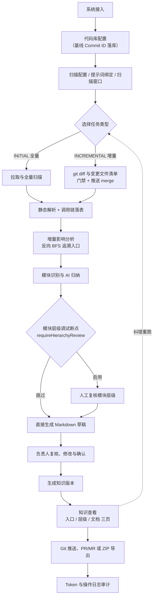

# 代码洞察平台（CodeInsight Platform）

代码洞察平台面向研发团队，将现有代码库持续转化为可维护、可追溯、可复核的代码知识资产。平台串联代码拉取、Java 静态解析、入口识别、AI 归纳、草稿复核、知识版本、Git/ZIP 输出、Token 审计和操作日志，确保 AI 内容先审后发，不直接进入正式知识库。

- 前端：React 19 + TypeScript + Vite + Ant Design + Zustand + ECharts + Monaco Editor + Hash Router
- 后端：Java 17 + Spring Boot 3.3 + MyBatis Plus + PostgreSQL + Redis + JGit
- 存储边界：数据库保存状态和元数据，本地存储/对象存储保存正文，Redis 保存临时编辑与锁，Git 保存已确认知识

## 当前状态与验证

第一阶段 MVP 任务清单已完成，覆盖系统、仓库、提示词、任务、扫描解析、AI/Mock AI、草稿、知识版本、推送、Token 与日志模块。第二阶段已完成登录认证（UM 账号 + 平安令牌）、系统/代码库软删除与聚合指标、模块层级人工复核断点，以及基于 Git Diff 的增量扫描链路。第三阶段（v0.1.5–v0.1.9）已落地：分布式 / 集群就绪、扫描窗口与定时任务、提示词绑定仓库 + 扫描配置试跑、知识查看（入口 / 层级 / 文档）三页拆分 + 纠错重跑 + NAS 发布仓库、业务知识维护、增量任务门禁 + 推送 merge（不丢模块）、方法→功能反向绑定表，以及通过 `IncrementalImpactAnalyzer` + `MethodCallReverseGraphService` 实现的「非入口类变更 → 反向 BFS 追溯入口」业务语义判定。

近期（Unreleased）已落地：本机拉/析三闸（`task` / `pull` / `parse.concurrency`）与 `PULL_QUEUED` / `PARSE_QUEUED` 排队态、解析内存 P1-A（拆长事务 / 去双 inherit / 入口发现轻量分页读边）、解析静态缓存按任务/试跑驱逐、远程 Git clone 失败禁止 Mock、孤儿接管（租约宽限 + 心跳）。详见 [CHANGELOG.md](./CHANGELOG.md) `[Unreleased]`。

本地验证基线（随迭代更新；完整清单以 CI / 本地复跑为准）：

| 验证项 | 结果 | 说明 |
| --- | --- | --- |
| `npm run lint` / `npm run build` | 通过 | Vite 构建成功；存在主包超过 500 kB 的非阻断告警 |
| `java -version` | 通过 | Java 17 |
| `mvn -DskipTests compile` / `mvn test-compile` | 通过 | 后端 21 个领域模块；测试源可编译 |
| 解析缓存相关单测 | 通过 | `AstJavaParserEvictCacheTest` / `TrialRunParseMemoryEvictTest` / `TaskParseMemoryEvictContractTest` 等 |
| `mvn test` | 受限 | 部分集成测需本地 PostgreSQL + Redis 可达 |
| `mvn clean package` | 受限 | 运行中的后端 JAR 被 Windows 锁定时 `clean` 无法删除旧产物，需先停服 |

这里的"完成"指 MVP 功能和本地验收基线完成，并不等于生产环境开箱即用。生产部署前仍需补齐正式身份认证与授权、密钥托管、真实模型服务、远程 Git 权限、基础设施运维配置和前端代码分包。详细迭代记录见 [CHANGELOG.md](./CHANGELOG.md)。

## 核心业务闭环



AI 只负责归纳和建议。模块 ID、类路径绑定、Schema 校验、状态推进、存储、版本与推送校验由程序负责；正式知识必须经过负责人确认。

## 核心能力

- **工作台**：任务吞吐、待复核、Token 成本、知识覆盖率、异常提醒与最近推送。
- **登录与会话**：UM 账号 + 平安令牌 6 位独立输入框登录；Zustand 持久化会话 + 路由守卫；当前为占位实现，待 UM/SSO 真实接入。
- **系统与仓库**：系统负责人、启停、软删除、仓库分支、扫描范围、排除规则、入口扫描规则与 Commit 基线；提示词可绑定到系统 / 仓库 / 任务三级；扫描配置可在仓库与任务间覆盖。
- **代码库聚合指标**：列表一次性返回代码库数 / 知识版本数 / 最近扫描时间，单条 SQL 避免 N+1。
- **业务知识维护**（v0.1.8）：在系统层沉淀业务术语 / 规则 / 合规口径，与代码知识统一索引。
- **提示词**：模板、版本、复制、启停、变量替换、试跑，按 `MODULARIZE` / `DOCUMENT_GENERATION` 分类；作用域支持系统级 / 仓库级，任务创建按「任务 → 仓库 → 系统」回退。
- **任务引擎**：初始化 / 增量任务、手动 / 定时调度、状态机、进度、重试、终止、执行日志、执行日志实时刷新；纠错任务按 `resume_from` 跳到指定阶段。
- **扫描解析**：JGit 拉取、文件快照、Java AST（SymbolSolver + subtype 索引）解析类型/路由/方法/调用链/SQL；扫描配置可在仓库 / 任务独立覆盖，并提供入口「试跑」（不创建正式任务；结束后驱逐解析缓存）。远程 clone 失败直接失败，不再 Mock。
- **本机三闸**：`task.concurrency`（默认 4）/ `pull.concurrency`（默认 1）/ `parse.concurrency`（默认 1，仅 AST+入口发现）；AI/层级/文档走 `ai.concurrency`，不占 parse 闸。见 [docs/pull-parse-concurrency-redesign.md](./docs/pull-parse-concurrency-redesign.md)。
- **增量扫描（v0.1.4 起 / v0.1.9 升级）**：基于 `git diff <lastCommit>..HEAD` 识别变更/删除文件；下游 AST、模块层级、草稿生成按 `IncrementalContext` 处理变更；`IncrementalImpactAnalyzer` + `MethodCallReverseGraphService`（反向 BFS 深度上限 15）让「非入口类变更」命中入口所属模块，文档重生成范围 = `moduleTouchedByChange ∪ docRetargetModuleIds`。
- **增量任务门禁 + 推送 merge**（v0.1.9）：仓库必须有 PUSHED 版本 + `lastCommitId` 非空，否则拒绝创建；运行期条件不满足时 **FAIL**（不降级全量）；推送时以 `last_published_version_id` 对应 NAS `releases` 为权威来源 merge，不丢模块。
- **AI 归纳与文档**：Token 预估、额度阻断、Mock/真实模型适配；`PipelineAiCaller` + `AiRetryProperties` 封装通用重试；文档本机并行受 `AI_DOC_PARALLELISM` 等配置约束。
- **方法→功能反向绑定**（v0.1.9）：新表 `ci_method_function_binding` 规避 `function.method_signatures` 回填污染；模块说明文档的功能级提取以此为权威源。
- **模块层级人工复核**：AI 提炼后任务停在 `MODULE_HIERARCHY_REVIEW` 状态，前端在 `/tasks/hierarchy-review` 页签中编辑后提交，流水线继续进入草稿生成。可在创建任务时通过 `requireHierarchyReview=false` 跳过该断点。
- **草稿复核**：三栏编辑区、来源行号、待确认项、修订记录、意见、自动保存和编辑锁；从任务详情「打开复核」按钮直达 `?systemId=&taskId=`。
- **知识查看（v0.1.8）**：拆为「入口 / 层级 / 文档」三页，共享 `KnowledgeContextBar` + `useKnowledgeQueryContext`；选仓库后只读 NAS `releases/{sys}/{repo}/{versionNum}/`；`localStorage` 键 `ci-knowledge-view-mode` 记忆列表 / 树形偏好。
- **知识纠错（v0.1.9）**：`POST /api/knowledge/remediation/{entrypoints,hierarchy,documents}` + `documents/edit` / `edit/{id}/approve`；纠错任务克隆 base task 工作区与 AST，按 `resume_from` 续跑；人工修订待审 → 批准直写 NAS release 并打标 `contentOrigin: HUMAN_EDITED`。
- **知识输出**：版本元数据、标准概述文件、推送前校验、Git 提交和 ZIP 导出；仓库级已发布快照写在 `ci_repository_publish_snapshot`，生效版本指针 `last_published_version_id` 由推送成功 / 回滚更新。
- **审计**：Token 明细与趋势、额度策略、操作日志和异常追踪。
- **AI 模型管理**：自定义模型、预设模型、指标与试跑。
- **扫描窗口 + 定时 commit 轮询**（见 [docs/scheduled-commit-poll-scan-plan.md](./docs/scheduled-commit-poll-scan-plan.md)）：`ScanWindowScheduler` 比对远端 HEAD 与发布基线后下发 INITIAL/INCREMENTAL；全局轮询/验证全量仅配置文件或阿波罗。
- **集群 / 分布式就绪**（v0.1.5+）：由 `CODE_INSIGHT_ENV` 推导（`dev` 单机，非 `dev` 一律集群；已删除 `CLUSTER_ENABLED`）；Leader 选举（`ci:leader:*`）、`SELECT … FOR UPDATE SKIP LOCKED` 任务认领、Redis Set `ci:permits:*` 并发控制、系统配置 Redis 值缓存（`ci:config:kv:*`，无 Pub/Sub）、共享 `runtimeRoot` + `releasesRoot`、孤儿接管（租约宽限 + 心跳）。详见 [docs/cluster-shared-storage-design.md](./docs/cluster-shared-storage-design.md)。
- **Dev 防污染共享库**：`CODE_INSIGHT_ENV=dev` 时禁用孤儿接管；任务落 `is_dev`，本地只跑 `is_dev=true`；操作日志写本机可辨识 IP（loopback 回落网卡）。详见 [docs/dev-shared-db-safety-plan.md](./docs/dev-shared-db-safety-plan.md)。

## 快速开始

### 环境要求

- JDK 17
- Maven 3.8+
- Node.js 20+
- PostgreSQL 14+
- Redis 6+（自动保存与编辑锁）

未配置真实模型时，后端默认启用 Mock AI（`LLM_MOCK=true`）。

### 1. 准备数据库

```bash
createdb -U postgres code_insight
```

后端启动时会读取 `backend/src/main/resources/db/schema.sql` 初始化表结构（`spring.sql.init.mode: always`，幂等 `CREATE TABLE IF NOT EXISTS` / `ALTER TABLE ... ADD COLUMN IF NOT EXISTS`，无需手动迁移）。

### 2. 启动后端

```bash
cd backend
mvn spring-boot:run
```

默认会读取 `backend/src/main/resources/application-local.properties` 中的本地 PostgreSQL/Redis 凭据；该文件**不要提交**。

### 3. 启动前端

```bash
cd frontend
npm install
npm run dev
```

默认地址：

- 前端：`http://localhost:5173`
- 后端 API：`http://localhost:8080/api`
- Swagger UI：`http://localhost:8080/api/swagger-ui.html`

## 配置

本地开发环境特定的 PostgreSQL 数据库和 Redis 缓存连接配置独立存放在 `backend/src/main/resources/application-local.properties` 文件中。AI 模型环境变量、模型服务地址与本地文件存储路径等，通过 `application-local.yml` 并结合根目录的 `.env` 环境变量文件进行配置（示意见 `.env.example`）。请避免将真实的密钥和密码提交至版本控制系统。

`.env.example` 列出的可用变量：

| 变量 | 默认值 | 用途 |
| --- | --- | --- |
| `SERVER_PORT` | `8080` | 后端端口 |
| `DB_HOST` / `DB_PORT` | `localhost` / `5432` | PostgreSQL 地址 |
| `DB_NAME` / `DB_USER` | `code_insight` / `postgres` | 数据库与用户 |
| `DB_PASSWORD` | `postgres` | 本地默认密码，生产环境必须覆盖 |
| `REDIS_HOST` / `REDIS_PORT` / `REDIS_PASSWORD` | `localhost` / `6379` / 空 | Redis 连接配置 |
| `CODE_INSIGHT_ENV` | `dev` | `dev` 单机写死 `./storage` + 防污染兜底（无孤儿/仅本机 IP 任务）；非 `dev` 一律集群调度 |
| `STORAGE_RUNTIME_ROOT` | （非 dev 必填） | 运行数据 + workspaces 根；已取代旧的 `STORAGE_DATA_ROOT` / `STORAGE_WORKSPACE_ROOT` |
| `STORAGE_RELEASES_ROOT` | （非 dev 必填） | 已发布知识 NAS 根 |
| `LLM_MOCK` | `true` | 是否启用本地 Mock AI；切真实模型时设为 `false` 并填 `LLM_API_KEY` |
| `LLM_API_KEY` | 空 | 真实模型服务密钥 |
| `LLM_API_URL` / `LLM_MODEL_NAME` | 见 `.env.example` | 模型服务地址与模型名 |
| `AI_DOC_PARALLELISM` 等 | 见 `.env.example` | 文档本机并行与等 AI 槽参数 |

## 开发与验证

前端：

```bash
cd frontend
npm install
npm run lint
npm run build
npm run dev
```

后端：

```bash
cd backend
java -version
mvn clean test                              # 全部测试
mvn -Dtest=ClassNameTest test               # 单个测试类
mvn -Dtest=ClassNameTest#methodName test    # 单个测试方法
mvn -DskipTests clean package               # 打包 JAR
mvn spring-boot:run                         # 启动服务
```

后端统一响应：

```json
{
  "code": 0,
  "message": "success",
  "data": {}
}
```

前端请求拦截器（`frontend/src/api/request.ts`）会自动解包 `data` 字段，非 0 时按 `message` 抛错。

## 项目结构

```text
CodeInsightPlatform/
+-- backend/
|   +-- pom.xml
|   +-- src/main/java/com/company/codeinsight/
|   |   +-- common/         配置、异常、响应、存储抽象、通用工具
|   |   +-- modules/
|   |   |   +-- system/         系统接入
|   |   |   +-- repository/     代码库配置 + 扫描配置 + 基线
|   |   |   +-- prompt/         提示词模板（系统 / 仓库 / 任务三级绑定）
|   |   |   +-- task/           知识构建任务 + 状态机 + 增量影响查询
|   |   |   +-- scanner/        拉取 + 扫描 + 增量 diff（pullAndScan / ScanResult / IncrementalContext）
|   |   |   +-- scanwindow/     扫描窗口 + 定时 commit 轮询
|   |   |   +-- parser/         Java AST 解析 + TaskParseMemoryService
|   |   |   +-- callchain/      方法调用链 + 反向 BFS + 增量影响分析
|   |   |   +-- entrypoint/     入口识别（Controller / JOB / MQ）+ 试跑
|   |   |   +-- hierarchy/      模块层级 + 人工复核落表
|   |   |   +-- ai/             AI 归纳 + 草稿生成 + 通用调用
|   |   |   +-- draft/          草稿工作区与编辑锁
|   |   |   +-- knowledge/      知识版本与发布态查询
|   |   |   +-- push/           Git 推送 / PR/MR / ZIP / 回滚
|   |   |   +-- model/          AI 模型管理
|   |   |   +-- auth/           登录认证
|   |   |   +-- token/          Token 审计
|   |   |   +-- log/            操作日志
|   |   |   +-- quotacontrol/   额度策略 + 流量管控配置
|   |   |   +-- dashboard/      工作台聚合
|   |   |   +-- businessknowledge/ 业务知识维护
|   +-- src/main/resources/
|   |   +-- application.yml
|   |   +-- application-local.yml
|   |   +-- application-local.properties
|   |   +-- analyze_prompt.md
|   |   +-- db/schema.sql       幂等初始化（表数量随迭代增减）
|   +-- src/test/java/...           测试类（JUnit 5）
+-- frontend/
|   +-- package.json
|   +-- vite.config.ts
|   +-- src/
|   |   +-- api/          与后端模块一一对应（auth/task/prompt/...）
|   |   +-- components/   跨页组件（ModuleHierarchyEditor / EntryScanConfigEditor / DraftModuleDirectory / ...）
|   |   +-- layouts/      BasicLayout
|   |   +-- pages/
|   |   |   +-- dashboard/        工作台
|   |   |   +-- login/            登录页
|   |   |   +-- systems/          系统 + 代码库 + 扫描配置 + 提示词绑定 + 业务知识
|   |   |   +-- tasks/            任务列表 / 详情 / 模块层级复核 / 入口复核 / 增量影响卡
|   |   |   +-- drafts/           草稿复核
|   |   |   +-- knowledge/        入口 / 层级 / 文档 三页 + 共享 ContextBar
|   |   |   +-- push/             知识推送
|   |   |   +-- token-audit/      Token 审计
|   |   |   +-- logs/             操作日志
|   |   |   +-- schedules/        定时计划
|   |   |   +-- basic/            ScanWindowHeatmap / orchestration（含流量管控）
|   |   +-- router/        createHashRouter 路由
|   |   +-- stores/        Zustand 状态（含 useAuthStore）
|   |   +-- types/         与后端 DTO 对齐的 TS 类型
|   |   +-- utils/         draftHierarchyTree / scanConfigDefaults / treeExpandKeys / pageTitle
+-- docs/               设计与实施方案（含 pull-parse / parse-memory / cluster / incremental 等）
+-- CHANGELOG.md
+-- CLAUDE.md
+-- README.md
+-- .env.example
```

## 任务状态机

```text
DRAFT
  └─> PENDING
        └─> PULL_QUEUED            （已占 task 槽，等 pull.concurrency）
              └─> PULLING_CODE
                    └─> PARSE_QUEUED         （已占 task 槽，等 parse.concurrency）
                          └─> PARSING_CODE → 入口识别落表
                                ├─> ENTRYPOINT_REVIEW（requireEntrypointReview=true）
                                └─> AI_ANALYZING（不占 parse 闸）
                                      ├─> MODULE_HIERARCHY
                                      │     └─> MODULE_HIERARCHY_REVIEW（requireHierarchyReview=true）
                                      │           └─> [INCREMENTAL: BASELINE_DOC_INHERIT →] GENERATING_DOC
                                      └─> [INCREMENTAL: BASELINE_DOC_INHERIT →] GENERATING_DOC
                                            └─> PENDING_REVIEW → REVIEWING → CONFIRMED → PUSHING → PUSHED

终止态：FAILED / CANCELLED / ARCHIVED
人工断点后续跑可经 RESUME_QUEUED 再抢任务槽
```

- 状态机禁止非法跳转；任何状态变更都需在 `ci_operation_log` 留痕。
- `requireHierarchyReview` 在 `ci_task` 上默认 `true`；关闭后跳过层级人工断点。
- `PULL_QUEUED` / `PARSE_QUEUED` 仍占用 `task.concurrency`，避免 PENDING 插队抢拉导致队列雪崩。
- 解析缓存经 `TaskParseMemoryService.evict` 在释 parse / 流水线结束 / 入口试跑 finally 释放。

## 增量扫描（INCREMENTAL 任务）

`ci_task.type = INCREMENTAL` 时，流水线按 `git diff <repo.lastCommit>..HEAD` 识别变更/删除文件，下游各阶段只对变更文件做处理，未变文件的产物原样保留。v0.1.9 之后，增量影响范围从「路径 / classPaths 直接命中」升级为「变更类 → 调用链反向 BFS → 入口类 → 模块」的业务语义判定，详见 [docs/incremental-hierarchy-doc-plan.md](./docs/incremental-hierarchy-doc-plan.md) 与 [docs/roadmap-8-9-plan.md](./docs/roadmap-8-9-plan.md)。

| 阶段 | 增量行为 | 跳过/保留 |
| --- | --- | --- |
| `pullAndScan` | 计算 `changedPaths` / `deletedPaths` | 仅重写变更文件 snapshot；删除被删文件的 snapshot；刷新 `repo.lastCommitId` |
| `methodCallService.persistAstForTask` | 删除变更 + 删除文件的历史调用链记录 | 仅对 `changedPaths` 中 .java 重新解析；未变文件记录保留 |
| `IncrementalImpactAnalyzer` | 对变更类做反向 BFS（深度上限 15） | 产出 `hierarchyRetargetEntries` + `docRetargetModuleIds` + `traces`；无调用链命中时可用源码方法名作种子 |
| `moduleHierarchyService` | 以 `hierarchyRetargetEntries` 替代纯路径命中；删除文件按 Maven 路径推 FQ 并从 `function.classPaths` 移除 | 落表仍走 `deleteByTaskId + 全量 insert` |
| `aiSummaryService.generateDraftDocument` | `moduleTouchedByChange ∪ docRetargetModuleIds` 决定重跑集合 | 未受影响模块的旧草稿保留 |

**INCREMENTAL 不降级为全量**：创建期门禁要求仓库有 PUSHED 版本且 `lastCommitId` 非空；运行期基线不可解析 / 无 gitHandle / 本地路径模式 → 任务 **FAIL**（`INCREMENTAL_BASELINE_LOST` 等），见 [docs/incremental-task-strict-gate.md](./docs/incremental-task-strict-gate.md)。INITIAL 任务始终全量，不读 `lastCommitId`。

推送时以 `last_published_version_id` 对应的 NAS `releases` 为权威来源与任务内产物 merge，删除文件语义同步剔除（见 [docs/incremental-release-merge-plan.md](./docs/incremental-release-merge-plan.md)）。

实现细节参见 `IncrementalContext` / `ScanResult`；反向 BFS 与影响分析见 `modules/callchain/`。

## 知识输出目录

负责人确认后，平台在目标仓库生成：

```text
/docs/code-insight
  index.md
  module-index.md
  architecture-overview.md
  frontend-overview.md
  backend-overview.md
  api-index.md
  database-index.md
  dependency-index.md
  pending-confirmation.md
  /modules
  /changes
  /meta
    document-index.md
    module-map.yaml
    knowledge-version.json
    prompt-used.json
```

元数据包括 `knowledge-version.json`、`module-map.yaml` 和 `prompt-used.json`。仓库级已发布快照写在 `ci_repository_publish_snapshot`；生效版本指针 `ci_repository.last_published_version_id` 由推送成功 / 回滚更新，知识查看（`/knowledge/documents` 等三页）默认只读该 release 目录。知识查看的纠错流程（`POST /api/knowledge/remediation/*`）会把人工修订的内容批准后直写 NAS release 文件并打标 `contentOrigin: HUMAN_EDITED`。

## 已知限制

- 前端生产主包超过 500 kB，Vite 会报告 chunk size warning；后续应对 ECharts、Monaco 和路由页面做按需加载与分包。
- `SecurityConfig` 当前允许所有请求（除登录页与 Swagger），仅适合本地 MVP 联调，不可直接作为生产权限方案。
- `auth` 模块当前为配置化账号占位实现（`AuthService` 不依赖外部 UM/SSO），生产前必须替换为真实身份源。
- 增量扫描的「被删文件对应草稿」不会主动删除，保留以备审计；后续可基于 `filePath in deletedPaths` 在 UI 增加过滤提示。
- Mock AI 能验证流程和数据落库，真实模型质量、配额和失败恢复仍需在目标环境验证。
- PostgreSQL、Redis、外部模型与远程 Git 的可用性属于运行环境前置条件；远程 clone 失败会直接让任务/试跑失败（不再 Mock）。
- 部分历史中文文档在非 UTF-8 终端下可能显示乱码，应显式使用 UTF-8 读取。
- 知识查询 MVP 限制：纠错任务的「scope 外模块」不会自动从 release 导入草稿，复核页可能不完整；文档人工修订 MVP 为「提交待审 / 批准并写入」同页操作，无独立审批工作台（详见 [docs/knowledge-query-split-plan.md](./docs/knowledge-query-split-plan.md)）。
- **解析堆峰值**：多模块仓按最近 `pom.xml` 各建一套 SymbolSolver/subtype，文档生成阶段（`doc-ai-*`）可能出现 `AstJavaParser static caches growing`；任务/试跑结束后应被 `TaskParseMemoryService.evict` 清掉。压峰值若改「仓库根合并」会改变跨模块解析结果，需单独评审（见 [docs/parse-memory-static-cache-remediation.md](./docs/parse-memory-static-cache-remediation.md)）。P1-A 未做项：B1 写完即清 parseCache、B2 SymbolSolver 降峰值（见 [docs/parse-memory-p1a-plan.md](./docs/parse-memory-p1a-plan.md)）。
- 系统配置已改为 Redis 值缓存，**不再使用 Redis Pub/Sub** 做配置广播。

## 后续演进

1. 完成生产级认证（UM/SSO 接入）、授权、审计身份绑定和密钥托管。
2. 配置真实模型与远程 Git 仓库，执行带权限、配额和失败恢复的端到端验收。
3. 拆分前端大包，清理 Ant Design 旧组件弃用提示。
4. **#9 增量影响分析**：P1 后端（已落地）→ P2 完整 `target_signature` / 方法级 seed / 可配置 `reverse-bfs-max-depth` → P3 `ImpactTrace` 持久化与 API 暴露（已有日志 + 查询 API）。
5. **#8 增量扫描 UI 化**（依赖 #9）：任务详情影响面摘要 + `ImpactTrace` 列表 + 可选增量基线（`GET /api/tasks/{id}/incremental-impact` 已具备）。
6. 解析内存后续：在**不降低产出质量、不主动降速**的前提下评估 B1/B2；多模块根合并仅在产品接受解析结果差异时推进。
7. 集群 / 分布式：非 `dev` 环境验证 Leader 选举、Redis 许可、共享卷、孤儿接管与配置 Redis 值缓存全链路（无 Pub/Sub）。
