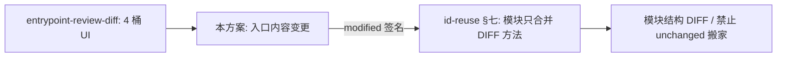

# 入口方法「内容变更」DIFF 方案

> **管什么**：INCREMENTAL 入口复核中，**同方法签名、方法体内容变了** 的识别、落库、展示，以及如何把该方法状态提供给下游模块层级合并。  
> **不管什么**：入口 4 桶 git 风格 UI 初版（见 [entrypoint-review-diff-design.md](./entrypoint-review-diff-design.md)）；模块结构 DIFF / 只合并入口 DIFF 方法（见 [module-hierarchy-id-reuse-fix.md §七](./module-hierarchy-id-reuse-fix.md)）。  
> **状态：已实施**（2026-07）。  
> **实施核对**：符号清单见 **§七**；按类勾选见 **附录 A**。本方案可**单独**验收入口 `~`；模块侧消费需叠 id-reuse §七。

---

## 一、问题

入口方法级 DIFF 原先只比 `methodSignature` 集合：

| 情况 | 原标记 |
|---|---|
| 基线无、本次有 | `new` (`+`) |
| 两边同一签名 | **一律 `unchanged`**（灰） |
| 基线有、本次无 | `deleted` (`-`) |

**签名不变、方法体改了** → 方法仍灰、类可能因「无方法增删」掉进「基线继承」。  
但内容变了往往意味着业务语义/模块归属也可能变，应视为 DIFF，并作为下游「允许改模块层级」的依据之一。

---

## 二、目标语义

| diffStatus | 含义 | UI |
|---|---|---|
| `new` | 签名新增 | `+` 蓝 |
| `modified` | **同签名、内容（方法体）有变**（内容变更） | `~` 橙 |
| `unchanged` | 签名与内容均不变 | 无前缀 |
| `deleted` | 签名删除 | `-` 红删除线 |

**类进「本次变更」**：该类下方法存在 `new` **或** `modified` **或** `deleted`。

与模块侧三层语义的关系：

| 层 | 变了什么 | 入口本方案 | 模块方案 |
|---|---|---|---|
| 签名 | 方法签名增删 | `+` / `-` | 已有 |
| **内容** | 同签名、方法体变 | **`~`（本方案）** | 合并时允许改该签名 |
| 结构 | 同签名、换模块/子模块挂载 | — | id-reuse §七 |

---

## 三、数据流与数据模型

```text
AstJavaParserService.attachMethodBody
  → MethodInfo.bodyHash (= hashMethodBody(BlockStmt.toString()))
EntryPointDiscoveryServiceImpl.extractMethodsForEntry
  → DiscoveredMethod.bodyHash（四分支均需 setBodyHash）
EntrypointReviewServiceImpl.serializeMethods
  → ci_entrypoint.methods_json（Jackson 字段名 bodyHash）
EntrypointReviewServiceImpl.getEntrypointDiff
  → 同签名 + 双方 hash 非空且不等 → diffStatus=modified
  → hasMethodChanges → 类进 modifiedRows
Frontend EntrypointReviewWorkspace
  → Tag "~" / 橙色
ModuleHierarchyServiceImpl.buildEntrypointMethodDiffStatus
  → 同一 bodyHash 规则（短签名 + 长签名双 key）
```

| 载体 | 字段 | 说明 |
|---|---|---|
| `ParsedClassInfo.MethodInfo` | `bodyHash` | 解析时写入 |
| `DiscoveredMethod` | `bodyHash` | 发现阶段拷贝 |
| `EntrypointMethodView` / `methods_json` | `bodyHash` | 落表 JSON；历史行可能缺失 |
| `EntrypointMethodView.diffStatus` | `modified` | **仅 DIFF 请求时计算**，不单独落库 |

### 3.1 `bodyHash` 算法（代码级）

**文件**：`AstJavaParserService`  
**符号**：`attachMethodBody` → `hashMethodBody`

```text
attachMethodBody(md, mi, ...):
  IF md.getBody().isEmpty() → return          // abstract / 无方法体 → bodyHash 保持 null
  mi.setBodyHash(hashMethodBody(body.toString()))

hashMethodBody(bodySource) → String | null:
  IF bodySource null/empty → null
  normalized = bodySource.replaceAll("\\s+", " ").trim()
  dig = SHA-256(UTF-8 bytes of normalized)
  return first 8 bytes as 16 hex chars (%02x) // 不是完整 64 位
  Exception → null
```

| 细节 | 实际行为 |
|---|---|
| 算法 | `MessageDigest.getInstance("SHA-256")` |
| 截断 | 字节 `[0..7]` → **16 位十六进制** |
| 空白 | 仅空白变化 **不**改 hash（已归一化） |
| 方法体文本 | JavaParser `BlockStmt.toString()`（含花括号的 AST 打印） |
| Regex 解析路径 | **从不**写 `bodyHash`（见 §4.1.1） |

---

## 四、实现明细（已落地，含易漏点）

### 4.1 提取与落表

| 步骤 | 文件 / 符号 | 必做逻辑 |
|---|---|---|
| 解析写 hash | `AstJavaParserService.attachMethodBody` / `hashMethodBody` | 有 body 才写；空/异常 → null |
| 发现拷贝 | `EntryPointDiscoveryServiceImpl.extractMethodsForEntry` | **四个分支**均 `dm.setBodyHash(m.getBodyHash())`（见下） |
| 签名构造 | `buildSignature(className, m)` | 全签名如 `UserController#list(Integer)`，DIFF 比对用此 key |
| JSON 序列化 | `EntrypointReviewServiceImpl.serializeMethods` | Jackson 字段名 `bodyHash` |
| JSON 反序列化 | `deserializeMethods` → `List<EntrypointMethodView>` | 缺字段 → null，不炸 |
| 落表 | `row.setMethodsJson(serializeMethods(...))` | 发现/更新入口时写入 |
| 基线继承 | `EntrypointMapper` INSERT…SELECT 等 | 整份 `methods_json` 原样复制（含 hash） |

#### 4.1.1 `extractMethodsForEntry` 四分支（易漏）

**签名**：`private List<DiscoveredMethod> extractMethodsForEntry(File projectDir, EntryPoint entry)`

| `entryType` | 过滤规则 | `setBodyHash` |
|---|---|---|
| `CONTROLLER` | 仅带 RequestMapping 的方法 | ✅ 必调 |
| `APPLICATION` / `MAIN` | 仅 `main` | ✅ 必调 |
| `SCHEDULED_JOB` / `MQ_LISTENER` / `COMPONENT` / `OTHER` | 非 private/非 getter 等业务方法 | ✅ 必调 |
| else（CUSTOM 等） | 过滤明显非业务方法 | ✅ 必调 |

**遗漏任一分支持 `setBodyHash`** → 该类入口永远无内容 DIFF。

#### 4.1.2 Regex 解析降级

**文件**：`RegexJavaParserService`  
创建 `MethodInfo` 时**从不** `setBodyHash`。当 AST 失败回退 regex（`ast-fallback-regex`）时 → `bodyHash=null` → DIFF **无法**标 `modified`（静默降级为 `unchanged`）。

### 4.2 DIFF 对比（`getEntrypointDiff`）

**文件**：`EntrypointReviewServiceImpl`  
**签名**：`public EntrypointDiffDto getEntrypointDiff(Long taskId)`

**门禁**：`task.type != INCREMENTAL` 或无 `lastPublishedTaskId` → 返回空 4 桶。

```text
newRows ← current 中 baselineTaskId == null（整类新增）

for each currentRow where baselineTaskId != null:   // 继承类才做方法级比对
  currentMethods  ← deserializeMethods(current.methods_json)
  baselineMethods ← deserializeMethods(baseline.methods_json)
  baselineBodyBySig[sig] = bodyHash   // 仅 hasText 时写入

  hasMethodChanges = false
  for m in currentMethods:
    IF sig ∉ baseline → m.diffStatus = "new"; hasMethodChanges = true
    ELSE:
      IF hasText(baseHash) && hasText(curHash) && baseHash != curHash
        → m.diffStatus = "modified"; hasMethodChanges = true
      ELSE
        → m.diffStatus = "unchanged"   // 任一方无 hash → 不误报 ~

  for m in baselineMethods where sig ∉ current:
    m.diffStatus = "deleted"
    currentMethods.add(m)              // 并入同一 list 展示
    hasMethodChanges = true

  构造 View（直接挂 currentMethods，勿再 toReviewView 二次 deserialize —— 会丢 diffStatus）
  hasMethodChanges ? modifiedRows : inheritedRows

deletedRows ← 基线有 + 本次无的整类；其 methods 全标 deleted
```

**易漏点**：

| 遗漏 | 后果 |
|---|---|
| 用 `toReviewView` 再 deserialize 一遍 | `diffStatus` 全部丢失 |
| 缺 hash 时标 `modified` | 历史数据误报 `~` |
| 只比签名不比 hash | 内容变更全灰 |
| 类桶不含 `modified` | 仅改方法体时类进「基线继承」 |

### 4.3 前端

| 文件 | 符号 / 位置 | 行为 |
|---|---|---|
| `frontend/src/types/index.ts` | `EntrypointMethodView` | `diffStatus?`；`bodyHash?` |
| `frontend/src/api/task.ts` | `EntrypointDiffDto`；`getEntrypointDiff` | `GET /tasks/{id}/entrypoints/diff` |
| `EntrypointReviewWorkspace.tsx` | 树方法 Tag | `modified` → 橙色 Tag `~`，文字色 `#fa8c16` |
| 同上 | 详情表 | 前缀 `~ `，橙色加粗 |
| 同上 | 统计条 / 分组徽章 | `~{modifiedRows.length} 变更`；`[~]` |

前端**不**重算 hash，只展示后端 `diffStatus`。

### 4.4 下游消费（本方案产出，他方案消费）

#### 模块层级（id-reuse §七）

**文件**：`ModuleHierarchyServiceImpl.buildEntrypointMethodDiffStatus`  
**规则与入口 DIFF 一致**（同签名 + 双方 hash 不等 → `modified`），但 key 用短签名建 hash 映射，再用 `putMethodDiffStatus` 写入短签名 + `Class#method` 双 key：

| 状态 | 模块合并行为 |
|---|---|
| `new` / `modified` | 允许 AI 合并改挂载；拒空 `modules`（`hasNewOrModifiedMethodDiff`） |
| `unchanged` | `shouldSkipAiFunctionForUnchangedOnly` 跳过搬家 |
| `deleted` | `purgeDeletedMethodSignatures` |

#### 知识文档重生成（关联）

**文件**：`AiSummaryServiceImpl`  
从 `getEntrypointDiff().modifiedRows` 取类名 → `entryModifiedClassNames` → `functionTouchedByIncremental`。  
**注意**：这里用的是**类级** `modifiedRows`（含签名 +/- 与内容 `~`），不是「仅 bodyHash 变了的方法」；注释若写 bodyHash 需与此一致。

---

## 五、降级与运维

| 场景 | 行为 |
|---|---|
| 基线或当前无 `bodyHash` | 同签名标 `unchanged`，**不**标 `~` |
| abstract / 无方法体 | `attachMethodBody` 直接 return → null |
| Regex 回退解析 | 永不写 hash → 内容 DIFF 不可用 |
| 仅新任务写 hash、旧基线无 | 首笔对比偏「全 unchanged」；基线用新代码扫过并 PUSHED 后才完整 |
| `hashMethodBody` 异常 | 返回 null，不抛 |

---

## 六、验收

| 期望 | 不应出现 |
|---|---|
| 仅改方法体、签名不变 → 方法 `~`，类在「本次变更」 | 方法全灰、类进「基线继承」 |
| 签名增删仍为 `+`/`-` | — |
| 旧任务无 `bodyHash` → 不炸、不误标 `~` | 因缺 hash 把一切标成 modified |
| 空白-only 改动 → 仍 `unchanged`（归一化） | 仅改空格却出 `~` |
| AST 成功路径有 16 位 hex hash | Regex 路径误以为有内容 DIFF |

```bash
# 重启后端后
# 1. 用含 bodyHash 的代码跑/发布一笔基线（确认 methods_json 含 "bodyHash"）
# 2. 只改某 Controller 方法体（不改签名）再跑 INCREMENTAL
# 3. 入口 DIFF：该方法 ~ ，类在「本次变更」
# 4.（可选）叠 id-reuse：MODULE_HIERARCHY 合并允许改该签名 / 拒空 modules
```

---

## 七、改动文件清单（符号级，防遗漏）

| 文件 | 必须齐套的符号 |
|---|---|
| `ParsedClassInfo.MethodInfo` | 字段 `bodyHash` |
| `AstJavaParserService` | `attachMethodBody`（有 body 时写 hash）；`hashMethodBody`（SHA-256 前 8 字节 → 16 hex） |
| `RegexJavaParserService` | **不写** hash（已知降级；勿误以为已支持） |
| `DiscoveredMethod` | 字段 `bodyHash` |
| `EntryPointDiscoveryServiceImpl` | `extractMethodsForEntry` **四分支** `setBodyHash`；`buildSignature` |
| `EntrypointMethodView`（Java） | `bodyHash`；`diffStatus`（含 `modified`） |
| `EntrypointReviewServiceImpl` | `serializeMethods` / `deserializeMethods`；`getEntrypointDiff`（hash 比对 + 类分桶）；构造 View **勿**二次 deserialize |
| `EntrypointDiffDto` | `modifiedRows` 含「仅内容变更」的类 |
| `frontend/src/types/index.ts` | `EntrypointMethodView.diffStatus` / `bodyHash?` |
| `frontend/src/api/task.ts` | `getEntrypointDiff` |
| `EntrypointReviewWorkspace.tsx` | 树/表/统计：`modified` → `~` 橙色 |
| 下游（本方案不改实现，但联调要对齐） | `ModuleHierarchyServiceImpl.buildEntrypointMethodDiffStatus` / `putMethodDiffStatus`；可选 `AiSummaryServiceImpl.entryModifiedClassNames` |

---

## 八、与相关方案的分工



| 文档 | 职责 |
|---|---|
| **本方案** | 入口方法内容 hash、`modified`、`~`；可单独实施/验收 |
| [entrypoint-review-diff-design.md](./entrypoint-review-diff-design.md) | 入口复核 4 桶 UI、类级分桶、方法 +/- 初版；§九 指向本方案 |
| [module-hierarchy-id-reuse-fix.md](./module-hierarchy-id-reuse-fix.md) §七 | **消费** `modified`：合并过滤 / purge；不负责算 bodyHash |

**单独 vs 结合**：

| 目标 | 是否必须叠 id-reuse |
|---|---|
| 入口页看到 `~`、类进「本次变更」 | **否**，本方案单独即可 |
| 内容变更驱动模块合并 / 拒空 modules | **是**，需 id-reuse §七 消费同一套方法 DIFF |

---

## 九、一句话

> **入口方法 DIFF = 签名增删（+/-）+ 同签名内容变更（~，靠 AST bodyHash：空白归一 + SHA-256 前 16 hex）；任一方无 hash 降级为 unchanged，不误报；Regex 路径无 hash。**

---

## 附录 A、按类实施核对清单（防遗漏）

实施或 Code Review 时按类勾选。

### A.1 解析写 hash（`AstJavaParserService`）

- [ ] 有 `BlockStmt` 的方法写入 `bodyHash`
- [ ] abstract / 无 body → null（不是空串）
- [ ] hash 长度为 16 位 hex
- [ ] 空白-only 改动不改变 hash
- [ ] 有意义的方法体改动改变 hash
- [ ] `hashMethodBody` 异常吞掉并返回 null

### A.2 发现拷贝（`EntryPointDiscoveryServiceImpl`）

- [ ] CONTROLLER 分支 `setBodyHash`
- [ ] MAIN/APPLICATION 分支 `setBodyHash`
- [ ] SCHEDULED/MQ/COMPONENT/OTHER 分支 `setBodyHash`
- [ ] else（CUSTOM）分支 `setBodyHash`
- [ ] 落库后 `methods_json` 含 `"bodyHash"` 字段

### A.3 DIFF（`EntrypointReviewServiceImpl.getEntrypointDiff`）

- [ ] 同签名 + 双方 hash 不等 → `modified`
- [ ] 同签名 + 任一方 hash 空 → `unchanged`（不误报）
- [ ] 签名新增/删除仍为 `new`/`deleted`
- [ ] 仅有 `modified` 方法时类进 `modifiedRows`（非 `inheritedRows`）
- [ ] 构造 View 时不二次 `toReviewView`/deserialize（保留 diffStatus）
- [ ] deleted 方法并入 `currentMethods` 展示

### A.4 前端（`EntrypointReviewWorkspace`）

- [ ] 树 Tag `~` 橙色
- [ ] 表格前缀 `~ `
- [ ] 统计/分组展示变更数量
- [ ] 类出现在「本次变更」分组

### A.5 下游对齐（联调，实现属其他方案）

- [ ] `buildEntrypointMethodDiffStatus` 对 bodyHash 规则与入口 DIFF 一致
- [ ] 短签名 + 长签名双 key 均写入
- [ ] `modified` 允许模块合并 / 拒空 modules（id-reuse）
- [ ] （可选）文档重生成：`modifiedRows` 类名进入 retarget

### A.6 已知限制（文档化即可，非缺陷）

- [ ] Regex 回退路径无内容 DIFF（需 AST）
- [ ] 旧基线无 hash 时首笔增量可能看不到 `~`
- [ ] 无专门 bodyHash 单测时，用验收步骤 §六 手工覆盖
