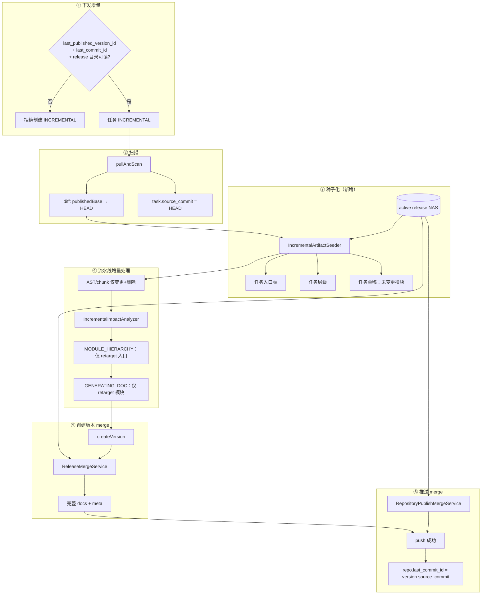

# 增量任务：Diff 边界与推送 Merge 方案

> **状态**：Design（已评审，待实现）  
> **记录日期**：2026-07-02  
> **关联**：`INCREMENTAL` 任务、`ci_repository.last_commit_id`、`ci_task.source_commit`、`last_published_version_id`、NAS `releases`  
> **前置**：commit 基线改造（任务扫描写 `source_commit`；推送/回滚写 `last_commit_id`）已完成

---

## 1. 背景与问题

### 1.1 业务诉求

1. **增量 diff 边界**：增量任务必须基于**仓库当前已发布知识对应的源代码 commit**，与**配置分支上的最新 HEAD** 做 diff。
2. **推送 merge**：增量任务生成的产物在推送时，必须与**当前仓库已有发布产物 merge**，不得全量替换导致未变更模块丢失。

### 1.2 现状缺口（改造前 / 部分仍待实现）

| 维度 | 改造前 | commit 基线改造后 | 本方案目标 |
|------|--------|-------------------|------------|
| diff 旧端 | 每次扫描更新 `last_commit_id` | `last_commit_id` = 发布基线 | 加固门禁 + 分支校验 |
| 任务 commit | 无落库 | `task.source_commit` | 不变 |
| 任务内产物 | 新任务孤岛，仅变更部分 | 同左 | **种子化 + merge** |
| 推送 | `applyFromTask` 全量替换 | 基线 commit 同步 | **DB + NAS merge** |

### 1.3 典型故障场景（本方案要消除）

- 全量 v1 推送 30 个模块 → 增量 task2 只生成 3 个变更模块 → task2 推送后仓库只剩 3 个模块。
- 未推送就发增量 → 静默降级全量，用户误以为在做增量。
- 源码删除文件 → 已发布文档/层级仍残留。

---

## 2. 已确认设计决策

| # | 决策项 | 结论 |
|---|--------|------|
| D1 | Merge 权威来源 | **`last_published_version_id` 对应的 NAS `releases` 目录**（与知识浏览、纠错一致） |
| D2 | 任务内种子化时机 | **`pullAndScan` 之后、`MODULE_HIERARCHY` 之前** |
| D3 | 删除文件语义 | **merge 时同步剔除**（层级 classPaths、入口、模块文档） |
| D4 | 增量任务门禁 | **必须有 PUSHED 版本 + `last_commit_id` 非空**，否则拒绝创建 |
| D5 | 索引类文件 | **merge 完成后基于完整模块集全量重算** |

---

## 3. 目标行为

### 3.1 增量 diff（需求 1）

```
git diff  <repo.last_commit_id>^{tree}  HEAD^{tree}
```

- **旧端（publishedBase）**：`ci_repository.last_commit_id`，仅在推送成功或发布回滚时更新。
- **新端（head）**：clone `ci_repository.branch` 后的 HEAD，写入 `ci_task.source_commit`。
- **扫描阶段不写** `repo.last_commit_id`。
- **变更集**：`IncrementalContext.changedPaths` / `deletedPaths` 驱动下游 AST、chunk、影响分析、层级/文档 retarget。

### 3.2 推送 merge（需求 2）

- 增量任务在流水线内**只生成变更部分**（影响分析 retarget 的入口/模块）。
- **createVersion** 与 **push** 时，以 active release 为底，合并任务产物，得到**完整知识版本**再发布。
- 对外（NAS / Git / 仓库配置表）永远是**合并后的全量**，不是任务局部快照。

---

## 4. 端到端数据流



### 4.1 字段职责（改造后稳定语义）

| 字段 | 语义 | 写入时机 |
|------|------|----------|
| `ci_task.source_commit` | 本任务扫描的代码 HEAD | `pullAndScan` 成功 |
| `ci_knowledge_version.source_commit` | 版本对应的源代码 commit | `createVersion`（读 task） |
| `ci_repository.last_commit_id` | 已发布知识基线 commit | 推送成功 / 发布回滚 |
| `ci_repository.last_published_version_id` | 当前生效知识版本 | 推送成功 / 发布回滚 |

---

## 5. 模块设计

### 5.1 `IncrementalTaskGate`（新建）

**挂载点**：`DecompileTaskServiceImpl.createIncrementalTask`（及可选 `startTask` 二次校验）。

**校验项**：

1. `repo.last_published_version_id` 非空。
2. 对应 `ci_knowledge_version.status = PUSHED`。
3. `repo.last_commit_id` 非空。
4. （建议）`version.source_commit` 与 `repo.last_commit_id` 一致；不一致则**拒绝**并提示运维修复（避免基线漂移）。
5. `RepositoryActiveKnowledgeResolver` 解析的 `releaseDir` 存在且可读。
6. （建议）`version.source_branch` 与 `repo.branch` 一致；不一致则拒绝增量。

**失败文案示例**：

> 该仓库尚无已推送的知识版本，或发布基线不可用。请先完成全量任务推送后再创建增量任务。

**前端**：增量创建页展示 `publishedBaseCommit`（`last_commit_id` 短 hash）、`branch`、生效版本号。

---

### 5.2 扫描层（小补强）

**已有**（commit 基线改造）：

- diff 旧端 = `repo.last_commit_id`；新端 = HEAD。
- `task.source_commit` 落库；`repo.last_commit_id` 扫描时不写。

**本方案补强**：

- 创建 INCREMENTAL 前走 `IncrementalTaskGate`。
- 流水线日志固定输出：`publishedBase`、`sourceCommit`、`scanMode`、`changed`/`deleted` 计数。
- 分支不一致拒绝（见 5.1）。

**全量降级策略**（diff 失败 / 无 git 句柄）：

- 创建阶段已被 gate 挡住（正常路径必有基线）。
- 若运行中 diff 失败（force-push / rebase）：流水线标记 `DEGRADED_FULL`，**建议禁止推送**或强制转 INITIAL 重跑，避免用不完整 merge 覆盖 release。

---

### 5.3 `IncrementalArtifactSeeder`（新建，核心）

**时机**：`pullAndScan` 完成之后、`MODULE_HIERARCHY` 之前。

**建议子步骤顺序**：

1. 解析 `ActiveKnowledgeContext`（versionId、releaseDir、taskId）。
2. 读取 `IncrementalContext`（changed/deleted）；预计算 `docRetargetModuleIds` / `hierarchyRetargetEntries` 可在影响分析之后补种子化草稿——**推荐两阶段**：
   - **Phase A（MODULE_HIERARCHY 前）**：种子化层级 + 入口 + 全量未删除模块草稿。
   - **Phase B（影响分析后、GENERATING_DOC 前）**：从任务草稿中移除即将 retarget 的模块草稿文件，避免 AI 跳过但留下旧种子内容冲突。  
   *实现时可合并为一次 seeder，内部按 impact 过滤。*

**输入**：

- `activeReleaseDir`：`storageProperties.releaseDir(sysId, repoId, versionNum)`。
- `IncrementalContext`。
- `taskId` / `repositoryId`。

**种子化规则**：

| 产物 | 来源 | 写入目标 | 规则 |
|------|------|----------|------|
| 模块层级 | `releases/.../artifacts/module-hierarchy.json` 或 `ci_repository_module_hierarchy` | `ci_module_hierarchy_node`（taskId） | 反序列化后 `replaceHierarchy`；`deletedPaths` 触发 classPaths prune |
| 入口清单 | `artifacts/entrypoints.json` 或 `ci_repository_entrypoint` | `ci_entrypoint`（taskId） | 复用 `TaskArtifactCloneService.seedEntrypointsFromRepository`；删除文件对应入口 prune |
| 模块草稿 | `releases/.../docs/code-insight/modules/*.md` | 任务 `DraftWorkspace` + 存储 | 复制为 `AI_GENERATED` 或 `PENDING_REVIEW`；**跳过**将 retarget 的模块；**不复制**已 prune 模块 |
| 源码工作区 | 本次 clone | `temp_repos/task_{id}` | 已是全量树，不种子化 |

**删除语义（D3：prune_on_merge）**：

- `deletedPaths` 中 `.java` → FQCN → 从层级 `function.classPaths` 剔除。
- 模块下无有效 function → 移除 module 节点。
- 对应模块 markdown 不进入任务草稿。
- 入口表中 `filePath` 命中 deleted → 删除该入口行。

**与 ENTRYPOINT_REVIEW 的关系**：

- discover 新入口与种子入口 **merge**（新增进 review；已删除 prune）。
- 增量任务仍走 ENTRYPOINT_REVIEW 断点（若启用）。

---

### 5.4 流水线阶段（沿用影响分析）

| 阶段 | 增量行为 |
|------|----------|
| `pullAndScan` | diff + `source_commit`；不写仓库基线 |
| `persistAstForTask` / `chunk` | 仅 changed + deleted 文件 |
| `IncrementalImpactAnalyzer` | 反向 BFS + retarget 集合（已实现，见 `incremental-hierarchy-doc-plan.md`） |
| `MODULE_HIERARCHY` | 在**种子化后的完整树**上，仅对 `hierarchyRetargetEntries` 重跑 AI |
| `GENERATING_DOC` | 在**种子化草稿**上，仅对 `docRetargetModuleIds` 重跑 AI |
| `ENTRYPOINT_REVIEW` | discover ∪ 种子入口，删除 prune |

**不改变**：`hierarchy.persistAll` 仍为 task 维度 `deleteByTaskId + insert`（任务内全量落库，但 DTO 内容已是种子 + patch）。

---

### 5.5 `ReleaseMergeService`（新建）

**挂载点**：`KnowledgeServiceImpl.createVersion`（**仅** `task.type = INCREMENTAL`）。

**步骤**：

1. 读取 active release：`docs/code-insight/` 下全部模块与 meta。
2. 读取任务工作区：CONFIRMED / 待确认草稿（createVersion 前通常为 CONFIRMED 流程，合并逻辑应覆盖工作区内所有将进版本的草稿状态策略——**以 CONFIRMED 为准**，与现网一致）。
3. **Merge 规则**：

| 路径 | 规则 |
|------|------|
| `modules/*.md` | 任务有对应模块草稿 → 用任务版；否则沿用 release；prune 模块 → 不写入 |
| `meta/knowledge-version.json` | 新版本元数据；`commitId` = `task.source_commit` |
| `meta/module-map.yaml` | merge 后**全量重算** |
| `module-index.md` | merge 后**全量重算**（`KnowledgeIndexService`） |
| `api-index.md` / `database-index.md` / `dependency-index.md` | merge 后**全量重算**（基于合并后模块 + 任务工作区 AST） |
| `architecture-overview.md` 等 | 基于合并后模块集**全量重算** |

4. 输出到 `task_{id}/docs/code-insight/`（与现 createVersion 输出布局一致）。
5. `version.source_commit = task.source_commit`。

**INITIAL 任务**：不走 merge，保持现有全量 createVersion 逻辑。

**产出**：`MergeReport`（见 §6）写入日志 / `ci_operation_log`。

---

### 5.6 `RepositoryPublishMergeService`（改造 `applyFromTask`）

**现状**：`replaceRepositoryEntrypoints` / `replaceRepositoryHierarchy` 全量替换为 task 快照。

**目标**：以 **`ci_repository_*` 当前发布行 + task 增量 patch** 合并（与 NAS merge 结果一致）。

| 配置 | Merge 规则 |
|------|------------|
| `ci_repository_entrypoint` | task 行覆盖同 className/filePath；新增 insert；deleted/prune 删除；其余保留 |
| `ci_repository_module_hierarchy` | 按 `node_id` + `level` patch；删除模块 prune；其余保留 |
| `entry_scan_config` / prompt IDs | 以 task 快照覆盖（配置随任务走） |
| `last_published_version_id` / `last_published_task_id` | 更新为当前版本/任务 |
| `last_commit_id` | `version.source_commit` |

**NAS**：

- `exportArtifactsToRelease` 写入 merge **后**的 `docs` + `artifacts`。
- `ci_repository_publish_snapshot` 存 merge **后** JSON（回滚真相源）。

**推送失败**：不更新仓库配置与基线（保持现语义）。

---

## 6. 建议数据结构

```java
/** 增量 merge 输入 */
record IncrementalMergeContext(
    Long repositoryId,
    Long activeVersionId,
    String activeVersionNum,
    Path activeReleaseDir,
    Long taskId,
    String taskSourceCommit,
    String publishedBaseCommit,
    Set<String> changedPaths,
    Set<String> deletedPaths,
    Set<String> docRetargetModuleIds,
    Set<String> hierarchyRetargetEntryKeys
) {}

/** merge 结果摘要（审计 / 前端展示） */
record MergeReport(
    int modulesKeptFromRelease,
    int modulesUpdatedFromTask,
    int modulesPruned,
    int entrypointsKept,
    int entrypointsUpdated,
    int entrypointsPruned,
    String publishedBaseCommit,
    String taskSourceCommit
) {}
```

---

## 7. 回滚一致性

发布回滚（`rollbackToVersion`）已支持：

- `last_published_version_id` → 目标版本
- `last_commit_id` → 目标版本 `source_commit`
- 入口/层级 → 目标版本 snapshot

本方案每次推送写入的 snapshot 为 **merge 后完整态**，回滚无需特殊逻辑。

---

## 8. 实施分期

| 阶段 | 内容 | 依赖 |
|------|------|------|
| **P0** | `IncrementalTaskGate`；分支/基线一致性校验；流水线日志；本文档 + README/CLAUDE 增量语义表 | commit 基线改造 ✅ |
| **P1** | `IncrementalArtifactSeeder`（层级 + 入口 + 草稿 + prune） | P0 |
| **P2** | `ReleaseMergeService` 接入 `createVersion`（INCREMENTAL） | P1 |
| **P3** | `RepositoryPublishMergeService` 改造 `applyFromTask` + NAS artifacts；`MergeReport` 审计 | P2 |
| **P4** | 前端：增量创建门禁、merge 摘要卡片、任务详情 publishedBase | P3 |

---

## 9. 边界与风险

| 场景 | 处理 |
|------|------|
| release 目录缺失 | gate 拒绝创建增量 |
| 模块重命名（DELETE+ADD） | prune 旧模块；新路径进 retarget / 新草稿 |
| diff 运行中失败 | `DEGRADED_FULL`；**禁止推送**或转 INITIAL |
| Mock / 本地路径扫描 | 无真实 PUSHED release，gate 拒绝 |
| 并发推送同一仓库 | 沿用 Redis 推送锁；merge 前重新读取 active version |
| 历史仓库基线漂移 | gate 校验 `version.source_commit == repo.last_commit_id` |
| 种子草稿与 AI 新稿冲突 | retarget 模块在 GENERATING_DOC 前删除种子文件 |

---

## 10. 测试计划（实现阶段）

| 用例 | 断言 |
|------|------|
| 无 PUSHED 版本创建 INCREMENTAL | 拒绝 |
| 全量推送后增量 diff | `changedPaths` = `publishedBase..HEAD` |
| 增量仅改 3 模块 | createVersion 后 `modules/` 仍含 v1 全部模块 |
| 推送后 `ci_repository_module_hierarchy` | 未变更模块节点保留 |
| deleted java | 对应模块文档/层级/入口 prune |
| 回滚到 v1 | 基线 commit + 产物恢复 v1 |
| INITIAL createVersion | 不走 merge，行为不变 |

---

## 11. 参考代码位置

```
backend/src/main/java/com/company/codeinsight/modules/
├── scanner/service/impl/CodeScannerServiceImpl.java      # diff、source_commit
├── task/service/impl/DecompileTaskServiceImpl.java       # 流水线、createIncrementalTask
├── knowledge/service/impl/KnowledgeServiceImpl.java      # createVersion（待接 merge）
├── repository/publish/service/impl/RepositoryPublishServiceImpl.java  # applyFromTask（待改 merge）
├── knowledge/browse/RepositoryActiveKnowledgeResolver.java
├── knowledge/remediation/TaskArtifactCloneService.java   # seedEntrypoints 可复用
├── hierarchy/service/impl/ModuleHierarchyServiceImpl.java
├── ai/service/impl/AiSummaryServiceImpl.java
└── callchain/.../IncrementalImpactAnalyzer*.java         # 影响分析（已实现）

docs/
├── incremental-hierarchy-doc-plan.md                     # 影响分析 / retarget
└── incremental-release-merge-plan.md                     # 本文档
```

---

## 12. 一句话结论

**增量 =「发布基线 commit → 分支 HEAD」的代码 diff +「active release → 任务变更」的知识 merge；任务内只算变更，对外永远发布合并后的完整知识。**
