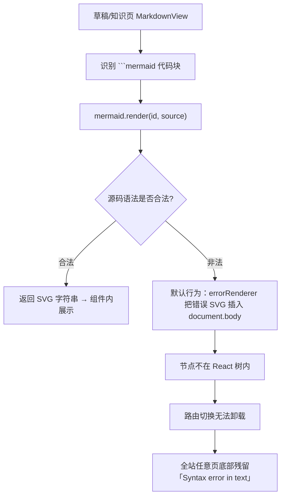

# Mermaid 语法错误 SVG 污染全站页面 — 整改方案

> **状态：已实施**（2026-07-17）  
> **主文件**：`frontend/src/components/MarkdownView.tsx`  
> **现象**：任意页面往下滚动可见 `Syntax error in text` / `mermaid version 11.16.0`，即使该页未使用 Markdown/Mermaid。

---

## 一、问题现象

| 项 | 描述 |
|---|---|
| 表现 | 页面内容区底部出现 Mermaid 默认错误图：`Syntax error in text` + `mermaid version 11.16.0` |
| 范围 | **全站**（含扫描入口复核等无 Markdown 的页面）；滚动到底部可见；可叠多份 |
| 非预期 UI | 不是组件自定义的「Mermaid 渲染失败」卡片，而是 Mermaid 库自带的错误 SVG |
| 复现路径 | 先打开含非法/不完整 ` ```mermaid ` 的草稿预览或知识文档 → 再切到其它路由 → 错误图仍留在页面底部 |

---

## 二、根因分析



### 2.1 技术要点

1. **唯一调用点**：前端仅 `MarkdownView`（`mermaid@11.16.0`）会渲染 Mermaid，用于：
   - 草稿工作台预览（`pages/drafts/workspace.tsx`）
   - 知识文档浏览（`pages/knowledge/index.tsx`）
2. **默认错误渲染**：Mermaid 11 在 `mermaid.render` 失败时，若未开启 `suppressErrorRendering`，会把错误图 **直接写入 DOM**（常挂在 `body`），而不是仅通过 Promise reject 交给调用方。
3. **React 管不到**：这些节点由库侧 `appendChild` 产生，路由/`Outlet` 卸载不会清理 → 表现为「每个页面都有」。
4. **触发内容**：文档中存在非法 Mermaid（未闭合节点、缺 diagram 类型、编辑中半成品、空块等）即可触发；触发一次后 residual 可持续存在直到整页刷新。

### 2.2 为何自定义 catch 挡不住

`MarkdownView` 原先已有 `.catch` →「Mermaid 渲染失败」UI，但：

- 库仍会 **先** 把错误 SVG 插入 DOM；
- Promise 抛错与 DOM 注入是两条路径；
- 未配置 `suppressErrorRendering: true` 时，注入无法关闭。

官方方案见 [mermaid PR #4359](https://github.com/mermaid-js/mermaid/pull/4359)（`suppressErrorRendering`，v11+）。

---

## 三、整改目标

| 目标 | 验收标准 |
|---|---|
| 禁止 DOM 泄漏 | 非法 Mermaid 不再在 `body` 留下 `Syntax error in text` SVG |
| 错误可控 | 仅在文档预览区域内展示「Mermaid 渲染失败」+ 源码 |
| 不污染路由 | 切到入口复核 / 仪表盘等无 MD 页面，底部无 Mermaid 错误图 |
| 合法图不受影响 | 合法 flowchart/sequence 等仍正常渲染 |

---

## 四、实施方案（已落地）

### 4.1 改动文件

| 文件 | 改动 |
|---|---|
| `frontend/src/components/MarkdownView.tsx` | 初始化 + 渲染生命周期加固 |

### 4.2 关键改动

**A. 初始化开启抑制错误 SVG**

```ts
mermaid.initialize({
  startOnLoad: false,
  suppressErrorRendering: true, // 失败只抛错，不写 body
  // ...既有 theme / themeVariables
});
```

**B. 渲染后/失败/卸载时清理临时节点**

```ts
function cleanupMermaidTempNodes(renderId: string) {
  document.getElementById(renderId)?.remove();
  document.getElementById(`d${renderId}`)?.remove();
  document.querySelectorAll(`[id^="d${renderId}"]`).forEach((el) => el.remove());
}
```

在 `render` 的 `then` / `catch` / `useEffect` cleanup 中均调用。

**C. 空块与 id 安全**

- 空 ` ```mermaid ` → 直接本地错误文案，不调用 `mermaid.render`
- `renderId` 对 `idHint` 做字符净化，避免选择器异常

**D. 源码 trim 对齐**

`extractMermaidBlocks` 与 `code` 渲染器统一 `trim()`，保证 `idHint` 稳定。

### 4.3 不做的事

- 不改后端 AI 提示词强制「只产出合法 Mermaid」（内容质量另题；本方案只管渲染侧隔离）
- 不引入新依赖
- 不改布局 / 路由

---

## 五、验证清单

| # | 步骤 | 期望 |
|---|---|---|
| 1 | 硬刷新前端（清掉已泄漏的旧 DOM） | 底部无残留错误图 |
| 2 | 打开含 **非法** Mermaid 的草稿/知识文档 | 仅在文档区出现「Mermaid 渲染失败」，控制台可有 reject；`document.body` 无 `Syntax error in text` 文本节点/SVG |
| 3 | 不刷新，切到「扫描入口复核」并滚到底 | **无** Mermaid 错误图 |
| 4 | 打开含 **合法** Mermaid 的文档 | 图表正常 SVG 渲染 |
| 5 | DevTools：搜 `Syntax error in text` | 除当前错误卡片文案外，body 级 residual 为 0 |

快速自检（浏览器 Console）：

```js
[...document.querySelectorAll('svg')].filter((s) =>
  (s.textContent || '').includes('Syntax error in text')
).length
// 期望：0（或仅落在 .ci-md-mermaid 内且我们未再渲染该 SVG）
```

开启 `suppressErrorRendering` 后，非法图应走自定义 UI，上述 length 应为 `0`。

---

## 六、回滚

若需回滚：还原 `MarkdownView.tsx` 中 `suppressErrorRendering` / `cleanupMermaidTempNodes` / 空块短路径即可。  
回滚后旧泄漏问题会复现，仅作紧急对比用。

---

## 七、后续可选增强（非本次范围）

| 项 | 说明 |
|---|---|
| AI 产出侧校验 | 文档生成后对 Mermaid 块做 `mermaid.parse` 预检，不合法则降级为代码块 |
| 编辑防抖 | 草稿预览对 Mermaid 块 debounce，减少半成品频繁 render |
| 单测 | 对 `cleanupMermaidTempNodes` / 空块分支做组件测（需 jsdom + mermaid mock） |

---

## 八、变更记录

| 日期 | 说明 |
|---|---|
| 2026-07-17 | 定位全站 residual DOM 泄漏；落地 `suppressErrorRendering` + 临时节点清理；本文档落库 |
