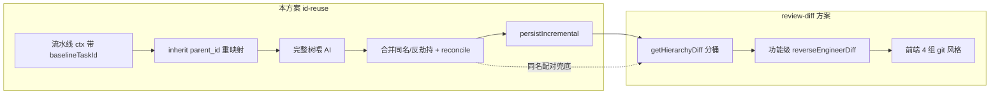
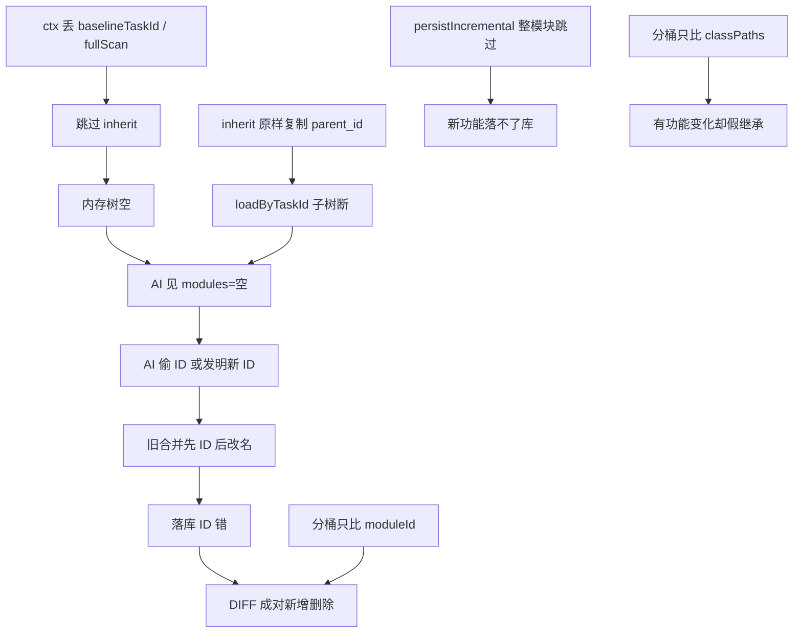
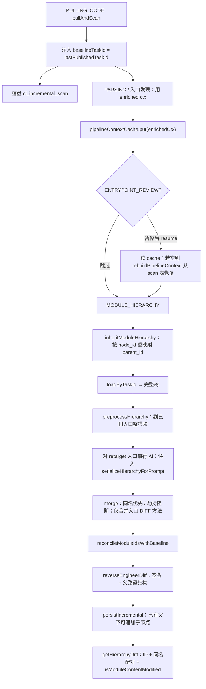

# 增量模块层级 ID 复用与空树防护（完整方案）

> **管什么**：INCREMENTAL 下模块层级如何稳定复用基线 `node_id`、如何把完整旧树喂给 AI、如何合并/落库、以及 DIFF 分桶如何与 ID 对齐。  
> **不管什么**：复核页 4 桶 UI 布局、签名提示词文案细节、git 风格展示组件 → 见 [module-hierarchy-review-diff-design.md](./module-hierarchy-review-diff-design.md)。  
> **入口「内容变更」**（同签名 `bodyHash` → `modified`）→ 独立方案 [entrypoint-method-content-diff-design.md](./entrypoint-method-content-diff-design.md)。  
> 关联：[incremental-baseline-design.md](./incremental-baseline-design.md)、[module-hierarchy-design.md](./module-hierarchy-design.md)。  
> **状态：全文方案已实施**（2026-07；含 §四 空树 / `baselineTaskId` 断链修复）。  
> **实施核对**：按类符号清单见 **§九** 与 **附录 B**；易漏辅助方法细节见 §四.4 / §五.1.1 / §六.5.1 / §六.6 / §七.2.1 / §八.1～8.2。

---

## 〇、文档边界与执行顺序

两份文档**不要合成一篇大杂烩**，按流水线前后分工；交叉点都在 `getHierarchyDiff`。



| | 本方案 | [review-diff](./module-hierarchy-review-diff-design.md) |
|---|---|---|
| **问题域** | 数据对不对：ctx / 继承 / AI 输入 / 合并 / 落库 ID | 展示对不对：4 桶、颜色、功能 `+`/`~` |
| **主文件** | `DecompileTaskServiceImpl`、`BaselineInheritanceService`、`merge`/`reconcile`、`persistIncremental` | `getHierarchyDiff`、`HierarchyReviewWorkspace`、`analyze_prompt` 签名段 |
| **交叉** | 同名配对、`isModuleContentModified`、结构 DIFF 规则写在本方案；实现落在 `getHierarchyDiff` | §3.1 分桶以本方案 §八 为准 |

### 推荐联调顺序

| 步骤 | 做什么 |
|---|---|
| 1 | 重启后端（含本方案全部代码） |
| 2 | （可选）`POST /api/prompts/sync-from-resource?promptType=MODULARIZE` |
| 3 | INCREMENTAL 重跑至 MODULE_HIERARCHY，或复核页「重新提炼」 |
| 4 | 查日志：继承 `rows>0`、第一次 `[AI-HIERARCHY-TEMP]` **非** `{"modules":[]}`、`ctx=... baselineTaskId=<正数>` |
| 5 | 打开 DIFF：同名业务进变更/继承，不成对新增+删除；有 `+`/`~` 的模块在「本次变更」 |

**已坏历史任务**：可不重跑，靠 §八 同名配对先把 DIFF 看对；要修落库 id 必须重跑 MODULE_HIERARCHY。

---

## 一、目标语义（终态）

| 场景 | 期望 |
|---|---|
| 同业务名延续（如「商品管理」） | 沿用基线 `moduleId`；模块进 **本次变更** 或 **基线继承**（视内容是否变）；功能级可有 `+`/`~` |
| 真新增（如「系统监控」） | 本次新增；功能均为 `+` |
| 真删除（入口/类确删） | 本次删除 |
| AI 偷用旧 ID 挂新业务 | 合并阻断劫持，旧 ID 业务名不变 |
| AI 同名却发新 ID | 合并 / reconcile 改回基线 ID |
| 入口方法 `unchanged` | **禁止**因 AI 输出改挂载 / 改名 / 删节点 |
| 增量第一次喂 AI | prompt 中 `module_hierarchy.json` 必须是**继承+预处理后的完整基线树**，禁止空 `{"modules":[]}` |
| 已删入口对应模块 | DB 同步逻辑删；其 `node_id` **禁止**被新业务占用；DIFF 删除桶可见、新增业务用新 id |

**禁止**：

- 同名成对「新增 + 删除」
- 「新增」桶内再打跨基线 `~改`
- 有功能 `+`/`~` 的模块落在「基线继承」且顶栏 `~0`
- INCREMENTAL 走 `fullScan` + `persistAll` 冲掉基线树
- 入口复核后续跑时 `baselineTaskId=null` 导致跳过继承
- 预处理只踢内存导致 AI 占用已删模块 id、DIFF 看不到新业务名

---

## 二、现象与根因总览

### 2.1 用户可见现象

| 现象 | 典型样例 |
|---|---|
| DIFF 成对新增+删除 | 「商品管理」同时 `mK7qP` 新增 + `mQ8nR` 删除 |
| ID 劫持 | 基线 `mK7pQ` 订单 → AI 写成系统管理仍占 `mK7pQ` |
| 同名新 ID | 基线 `mQ8nR` 商品 → AI 输出 `mX7bY` 商品 |
| 新增桶内又有 `~改` | 模块当「新」，功能按签名对基线标 `modified` |
| 有 `+`/`~` 却进「基线继承」 | 模块桶只比 `classPaths` |
| 未变方法被搬家且仍灰 | AI 整 Controller 重划；结构 DIFF 未比父路径 |
| **第一次喂 AI 空树** | `[AI-HIERARCHY-TEMP] ... json={"modules":[]}` |

### 2.2 根因分层（从数据到展示）



| # | 层 | 问题 | 后果 |
|---|---|---|---|
| A | **流水线 ctx** | `ScanResult` 裸 ctx 无 `baselineTaskId`；缓存写错；`rebuildPipelineContext` 退回 `fullScan` | `buildAndPersist` 跳过 inherit / 预处理 → **空树喂 AI** |
| B | **继承** | 旧 SQL 原样复制 `parent_id`（基线自增 PK） | 子树挂不上，AI 只见空壳 |
| C | **Prompt** | 曾去掉 `class_paths` | 「类路径命中复用」失效 |
| D | **合并** | 先认 ID 再改名 | ID 劫持；同名兜底拦不住 |
| E | **落库** | `persistIncremental` 父已存在则整棵跳过 | 复用旧 id 后新 FUNCTION 落不了 |
| F | **重跑入口** | `rebuildModuleHierarchy` 曾走 `fullScan`+`persistAll` | 冲掉基线树 |
| G | **DIFF** | 只比 moduleId；新增桶仍用跨基线功能着色；模块桶只比 classPaths；结构不比父路径 | 成对增删、新增里 `~`、假继承、搬家无标记 |
| H | **预处理 ID 占用** | 已删入口模块只踢内存、DB/`node_id` 仍在；AI 占用旧 id；persist 不改名 | JSON 有「系统监控」但 DIFF `newMod=0`、界面无该名 |
| I | **空 modules 误伤** | 类已在 hierarchy 的 class_paths；提示词「命中不输出」；有方法 DIFF 仍回 `{ "modules": [] }` | Product 方法变更未合并进树 |

---

## 三、INCREMENTAL 模块层级端到端流程（完整）



### 3.1 `buildAndPersist` 硬门禁

```text
effective = ctx == null ? fullScan() : ctx

IF effective.isIncremental() AND baselineTaskId != null:
    inheritModuleHierarchy(taskId, baselineTaskId)
    loadByTaskId → hierarchy
    preprocessHierarchy(...)
ELSE:
    // INCREMENTAL 若走到这里 = 事故：空树或冲库
    不 inherit、不预处理

对 toProcess 每个入口:
    // toProcess：有 IncrementalImpact 时仅 hierarchyRetarget；否则按 changedPaths
    methodDiffBySig = buildEntrypointMethodDiffStatus(...)
    AI(call) ← serializeHierarchyForPrompt(hierarchy)   // 必须非空（有基线时）
    mergeEntryResult(..., methodDiffBySig)             // 跳过全部 unchanged 的功能
    purgeDeletedMethodSignatures(...)

reconcileModuleIdsWithBaseline
reverseEngineerDiff
persistIncremental  // 禁止 INCREMENTAL 误走 persistAll
```

---

## 四、流水线上下文：`baselineTaskId` 必须贯通（空树防护）

> 实测（2026-07 task=6）：PARSING / 入口阶段 `baselineTaskId=1`，MODULE_HIERARCHY 变成 `baselineTaskId=null` → 无继承日志、第一次 AI `len=14` / `{"modules":[]}`。  
> **不是预处理剔光**：预处理与 inherit 同一门禁，`baselineTaskId==null` 时两者都不跑。

### 4.1 正确数据流

| 阶段 | 正确行为 |
|---|---|
| `CodeScannerService.pullAndScan` | 产出 `IncrementalContext.incremental(changed, deleted)`（**尚无** baselineTaskId） |
| `runPipeline` 注入 | `baselineTaskId = repo.lastPublishedTaskId`，重建 enriched `IncrementalContext` |
| `ci_incremental_scan.persist` | 写入 `baseline_task_id` / changed / deleted / commits |
| `pipelineContextCache` | **必须**缓存 enriched ctx：`PipelineContext.fromScan(projectDir, scanResult, incrementalCtx)` |
| resume 后 `buildAndPersist` | 使用 `pctx.ctx()`，且 `baselineTaskId != null` |
| 缓存丢失 | `rebuildPipelineContext` 从 `ci_incremental_scan`（必要时补 `lastPublishedTaskId`）恢复；INCREMENTAL 缺基线 **抛错**，禁止 `fullScan` |
| 复核页「重新提炼」 | `resolveContextForHierarchyRebuild`：同上；`changed` 为空则用全部已启用入口路径 |

### 4.2 已修缺陷清单

| Bug | 旧行为 | 新行为 |
|---|---|---|
| 入缓存用裸 ScanResult | resume 后 `baselineTaskId=null` | `fromScan(..., enrichedCtx)` |
| `rebuildPipelineContext` | 只认工作区 → `fullScan()` | 从 `ci_incremental_scan` 恢复；INCREMENTAL 禁止 fullScan |
| `rebuildModuleHierarchy` | `buildAndPersist(taskId, dir)` → fullScan + persistAll | `resolveContextForHierarchyRebuild` + `buildAndPersist(..., rebuildCtx, null)` |

### 4.4 实施代码细节（`DecompileTaskServiceImpl`，防遗漏）

> 改流水线时**必须**同时改齐下列符号，漏一处就会空树喂 AI。

| 符号 | 签名 / 位置 | 必做逻辑 |
|---|---|---|
| `PipelineContext` | `record PipelineContext(File projectDir, IncrementalContext ctx, String baselineCommitId, String headCommitId, String scanMode)` | 缓存/恢复都带这 5 项 |
| `fromScan` | `static PipelineContext fromScan(File projectDir, ScanResult scanResult, IncrementalContext enrichedCtx)` | **第三个参数必须用注入后的 enrichedCtx**；`enrichedCtx != null ? enrichedCtx : scanResult.getIncrementalContext()` |
| `fullScan` | `static PipelineContext fullScan(File projectDir)` | **仅 INITIAL**；INCREMENTAL 禁止退回此路径 |
| `pipelineContextCache` | `static Map<Long, PipelineContext>` | `put` 时用 `fromScan(projectDir, scanResult, incrementalCtx)`（enriched） |
| 注入点（`runPipeline`） | 在 `pullAndScan` 之后 | `baselineTaskId = repo.getLastPublishedTaskId()` → `IncrementalContext.incremental(changed, deleted, baselineTaskId)` → 用该 ctx 写 cache + persist scan |
| `rebuildPipelineContext` | `private PipelineContext rebuildPipelineContext(DecompileTask task)` | INCREMENTAL：从 `ci_incremental_scan` 取 changed/deleted/`baselineTaskId`；缺 baseline 时补 `repo.lastPublishedTaskId`；仍空 → **抛 BusinessException**；缺 scan 行 → **抛错**；禁止 `fullScan` |
| `resolveContextForHierarchyRebuild` | `private IncrementalContext resolveContextForHierarchyRebuild(DecompileTask task)` | INITIAL → `fullScan()`；INCREMENTAL：同上恢复 baseline；`changed` 为空时用全部已启用入口 `filePath`；返回 `IncrementalContext.incremental(changed, deleted, baselineTaskId)` |
| `rebuildModuleHierarchy` | 复核页「重新提炼」入口 | `buildAndPersist(id, projectDir, resolveContextForHierarchyRebuild(task), null)` — **禁止**无 ctx 的双参重载 |

**INITIAL 例外**：`rebuildPipelineContext` 对非增量任务仍可走 `fullScan` / scan 行重建，与 INCREMENTAL 门禁分离，改代码时不要把两者揉成一条分支。

### 4.3 验收日志（空树防护）

| 期望 | 不应出现 |
|---|---|
| `ctx=IncrementalContext{..., baselineTaskId=<正数>}` | `baselineTaskId=null` 且仍跑增量 AI |
| `INCREMENTAL 任务从基线继承整树 ... rows=<正数>` | 无继承日志却直接 `[AI-HIERARCHY-TEMP]` |
| 第一次 `module_hierarchy.json` 含基线 modules | `len=14` + `{"modules":[]}` |
| resume：`pipelineContext 已从 ... 重建 ... baselineTaskId=` | 静默 fullScan 继续跑 |

---

## 五、基线继承与 Prompt 输入

### 5.1 `inheritModuleHierarchy`

**文件**：`BaselineInheritanceService`  
**签名**：`public int inheritModuleHierarchy(Long currentTaskId, Long baselineTaskId)`  
**废弃**：`ModuleHierarchyNodeMapper.inheritFromBaseline`（原样复制 `parent_id`）标 `@Deprecated`，**禁止再调用**。

1. 幂等：`deleteByTaskId(currentTaskId)`（逻辑删）
2. 读基线全部活行，按 level 分 MODULE / SUB / FUNCTION；建 `byOldPk: oldPk → ModuleHierarchyNode`
3. 先插 MODULE（`parent_id=null`）→ `batchInsert` → `loadNodeIdToPk(taskId, MODULE)` 得 `modulePkByNodeId`
4. 再插 SUB：`resolveNewParentPk(src.parentId, byOldPk, modulePkByNodeId)`；解析失败 → **跳过该行 + warn**，不中断整次继承
5. 再插 FUNCTION：父映射用 `subPkByNodeId`；同样失败则跳过 + warn
6. `loadByTaskId` 必须能挂出完整子树，才能序列化进 prompt

#### 5.1.1 辅助方法（改继承时必须一起改）

```text
loadNodeIdToPk(taskId, level) → Map<nodeId, newPk>
  SELECT 本任务该 level 活行 → node_id → id

resolveNewParentPk(oldParentPk, byOldPk, newPkByNodeId) → Long | null
  oldParentPk == null → null
  parent = byOldPk.get(oldParentPk)
  parent == null 或 node_id 空 → null
  return newPkByNodeId.get(parent.node_id)   // 基线父 PK → 父 node_id → 本任务新 PK

copyNodeForInherit(src, currentTaskId, newParentPk, now) → ModuleHierarchyNode
  复制字段：systemId / level / nodeId / name / keywords / classPaths /
            methodSignatures / confirmed / sourceEntryClass
  taskId = currentTaskId；parentId = newParentPk；created/updated = now
  // 注意：复制的是 node_id（稳定句柄），不是基线自增 PK
```

**易漏点**：

| 遗漏 | 后果 |
|---|---|
| 仍调 `@Deprecated inheritFromBaseline` | 子树 `parent_id` 指向基线 PK → `loadByTaskId` 空壳 |
| 只插 MODULE 不重映射 SUB/FUNCTION | AI 只见模块名、无功能 |
| 父解析失败时整事务失败 | 基线偶发脏数据会卡死增量；现行为是 skip+warn |
| 未 `deleteByTaskId` 就 insert | 重跑 MODULE_HIERARCHY 双份节点 |

### 5.2 预处理 `preprocessHierarchy`

在 inherit + load 之后：

- 整模块 `classPaths` 仅含「基线有、本次无」的入口类 → 从内存树剔除（避免 AI 在 prompt 里看到已删业务）
- 部分入口被删 → 从 FUNCTION.`classPaths` 去掉已删类名

**注意**：预处理**不会**在空输入上「误删成空」——若 inherit 没跑，树本就是空的。

#### 5.2.1 已删模块 ID 占用（2026-07 补，防「系统监控」失踪）

**缺陷（实测 task=6）**：预处理只从**内存**去掉「订单管理/`mK7pQ`」，DB 继承行仍在 → AI 输出 `"id":"mK7pQ","module_name":"系统监控"` 时内存无同 ID，合并当成新建并占用该 id → `persistIncremental` 见 DB 已有 `mK7pQ` 则 `newModules=0` 且**不改名** → DIFF `newMod=0`，界面看不到「系统监控」，只剩旧名订单进变更。

**规则**：

| 步骤 | 行为 |
|---|---|
| 1 | 预处理剔除的模块树：收集全部 `node_id`（module/sub/function）→ **`reservedDeletedNodeIds`** |
| 2 | **同步逻辑删**本任务 DB 中这些 `node_id`（`deleteByTaskIdAndNodeIds`），使 DIFF 能出现「本次删除」 |
| 3 | 合并时把 reserved 并入 `existing*Ids`；新建若撞 reserved → `generateUnique`，日志 `ID_RESERVED_FROM_DELETED` |
| 4 | 禁止新业务复用「已删入口模块」的旧 id（即使 prompt 里已看不见该模块） |

**代码级实现**（`ModuleHierarchyServiceImpl.buildAndPersist` §1.5）：

```text
reservedDeletedNodeIds = new HashSet<>()
IF effective.isIncremental() && baselineTaskId != null:
    currentNames  ← loadEnabledEntries(taskId).className
    deletedNames  ← baselineEntry.className NOT IN currentNames
    preprocessedDeleted ← preprocessHierarchy(hierarchy, currentNames, deletedNames)
    FOR each deletedMod IN preprocessedDeleted:
        collectModuleTreeNodeIds(deletedMod, reservedDeletedNodeIds)   // module+sub+function 全 id
    IF reservedDeletedNodeIds 非空:
        nodeMapper.deleteByTaskIdAndNodeIds(taskId, reservedDeletedNodeIds)
        log "预处理逻辑删已删入口模块树 … reservedNodeIds=N dbRows=M"
    log "预处理 … deletedEntries=N preprocessedDeletedModules=N"
```

- `preprocessHierarchy(hierarchy, currentEntryClassNames, deletedEntryClassNames) → List<ModuleDto>`：返回被剔除的模块列表（供收集 reserved）；准则：`collectFunctionClassPaths(m) ∩ current` 为空 **且** `∩ deleted` 非空 → 整模块剔除；部分删 → 只从 `fn.classPaths` 去掉已删类名。
- `collectModuleTreeNodeIds(ModuleDto, Set<String> out)`：递归 module → sub → function，把 `id` 塞入 `out`（子树空时也收 module id）。
- `deleteByTaskIdAndNodeIds`（mapper）：`UPDATE ci_module_hierarchy SET is_deleted=1 WHERE task_id=? AND is_deleted=0 AND node_id IN (…)`。
- `reservedDeletedNodeIds` 向后透传给 `mergeEntryResult → mergeIncrementIntoHierarchy → resolve*ForMerge`（见 §六.1/六.2）。

**跨层级占用（易漏）**：`mergeIncrementIntoHierarchy` 把 `reservedDeletedNodeIds` **同时** `addAll` 进 `existingModuleIds` / `existingSubModuleIds` / `existingFunctionIds` 三个集合。即已删模块的 `m*`/`s*`/`f*` 任一 id，在任一层级新建时都会撞 reserved → `generateUnique`，日志区分：

| 条件 | 日志 tag |
|---|---|
| `candidateId`/`rawId` ∈ reserved | `ID_RESERVED_FROM_DELETED` |
| 仅与树上已有 id 冲突（非 reserved） | `ID_COLLISION` |

**验收**：入口确删订单 + 新增 SystemController → DIFF「本次删除」含订单；「本次新增」含系统监控（**新** m\*）；不得 `mK7pQ` 改挂系统监控且 `newMod=0`。日志可见 `ID_RESERVED_FROM_DELETED`。

### 5.3 `serializeHierarchyForPrompt`

| 字段 | 是否进 prompt |
|---|---|
| `id` / `module_name` / `sub_module_name` / `function_name` / `keywords` | ✅ |
| `functions[].class_paths` | ✅（非空才写） |
| `method_signatures` | ❌（省 token；方法变更靠入口 DIFF 提示，见 §5.5） |

占位符：`{module_hierarchy.json}`。串行处理时共享同一内存树：后一个入口能看到前一个入口 merge 后的结果。

### 5.4 提示词（辅助，代码为准）

**文件**：`backend/src/main/resources/analyze_prompt.md`

- 「ID 所有权（禁止劫持）」：旧 ID 不得改挂新业务；同名优先复用旧 ID；新业务新 ID
- 「类路径已命中 ≠ 可空输出」：入口有方法增删改时必须输出功能增量（见 §5.5）
- 自检：`ID 未劫持` / `同名旧 ID` / `新业务新 ID` / `有方法变更时非空 modules`
- 生效：`POST /api/prompts/sync-from-resource?promptType=MODULARIZE`（已建任务快照不自动更新）

### 5.5 入口方法 DIFF 时禁止空 `modules`（2026-07 补）

**缺陷（实测）**：ProductController 已继承在「商品管理」下，`class_paths` 已命中 → 提示词「类路径命中 → 不输出」+ 允许 `{ "modules": [] }` → AI 回空数组（`rawContentLen=29`），尽管有 `listInStockProducts` 等新方法。Java 源码已注入（`promptEst≈5k`），**不是缺代码**。

**规则**：

| 条件 | 行为 |
|---|---|
| 入口相对基线存在方法 `new` / `modified` | 调用前向 prompt **追加变更清单**；校验 **拒绝** `modules` 为空或缺失；重试提示要求输出功能增量 |
| 仅有 `deleted`（无 new/modified） | 可空 `modules`（由 `purgeDeletedMethodSignatures` 清理） |
| 无方法变更（或无基线可比） | 仍允许 `{ "modules": [] }`（真无增量） |
| 提示词 | 「类路径命中」只表示**复用已有模块/子模块 id**，**不**表示方法级变更可省略；已有功能的 unchanged 方法可不复述 |

**代码级实现**（`ModuleHierarchyServiceImpl.callAiForEntry`）：

```text
// 入口循环内（buildAndPersist §4）
methodDiffBySig ← buildEntrypointMethodDiffStatus(taskId, baselineTaskId, entry.className)
inc ← callAiForEntry(task, entry, prompt, projectDir, config, hierarchy, methodDiffBySig)
```

`callAiForEntry` 流程：

```text
javaCode ← readEntrySource(...)
IF 空 → [AI-SKIP] reason=no readable source; return null

promptInput ← render(promptTemplate, javaCode, businessKnowledge, hierarchyJson)
IF 有未替换占位符 → [AI-SKIP] reason=unresolved; return null

hasMethodDiffHint   ← hasEntrypointMethodChanges(methodDiffBySig)   // new/modified/deleted 任一
rejectEmptyModules  ← hasNewOrModifiedMethodDiff(methodDiffBySig)   // 仅 new/modified
IF hasMethodDiffHint:
    promptInput += "\n\n" + buildMethodDiffPromptHint(methodDiffBySig)
    log [AI-HINT] rejectEmptyModules=true

aiPayload ← callWithRetry(
    validator = response -> {
        IF 空 / "{}" → fail("empty response")
        cleaned ← extractJsonPayload(response)
        tree ← readTree(cleaned)
        IF rejectEmptyModules && isEmptyModulesPayload(tree):
            → fail("empty modules while entrypoint has new/modified methods")
        → ok(cleaned)
    },
    retryHint = original + "[系统提示] …" +
        (rejectEmptyModules ? "禁止输出 { \"modules\": [] }；必须在已有 id 下输出功能增量" : "")
)

IF aiPayload 空/"{}" → return null
result ← readTree(aiPayload)
IF rejectEmptyModules && isEmptyModulesPayload(result):
    log [AI-FAIL] reason=empty modules after retries
    return null
return result
```

辅助方法：

- `hasEntrypointMethodChanges`：`values()` 含 `new`/`modified`/`deleted` → true。
- `hasNewOrModifiedMethodDiff`：`values()` 含 `new`/`modified` → true（纯 deleted 不触发拒空，由 purge 处理）。
- `isEmptyModulesPayload`：`tree` 非对象 / `modules` 缺失 / 非数组 / 数组空 → true。
- `buildMethodDiffPromptHint`：按短签名（跳过含 `#` 的长键）分组 new/modified/deleted；全空则回退用全部 key。文本：
  > `[系统增量提示] 本入口相对基线存在方法变更。即使 module_hierarchy.json 的 class_paths 已命中，也必须输出非空 modules 增量：在已有模块/子模块 id 下给出 new/modified 对应的功能节点；禁止输出 { "modules": [] }。`
  > `- new: …` / `- modified: …` / `- deleted（程序会 purge，无需编造删除节点）: …`

`buildEntrypointMethodDiffStatus` 返回 `Map<签名, 状态>`，同时写入短签名与 `Class#method` 长签名两个 key（`putMethodDiffStatus`），供 AI 输出的两种格式都能命中。

**提示词**（`analyze_prompt.md`，生效需 `POST /api/prompts/sync-from-resource?promptType=MODULARIZE`）：

- 「匹配与复用流程 §第1步」：类路径命中 → **复用已有 id**，**不**等于「可不输出」；方法有 new/modified 时**必须**在已有 id 下输出功能增量。
- 「边界场景」新增一行：`类路径已命中，但方法有 new/modified → 必须输出功能增量；禁止 { "modules": [] }`。
- 自检清单新增：`有方法变更时非空`。

**验收**：Product 有方法 DIFF 时不得一检通过 `{ "modules": [] }`；日志可见 `[AI-HINT] rejectEmptyModules=true` 或重试；合并后新方法进树 / DIFF 可见。

---

## 六、合并、Reconcile 与落库（含同 ID 全部分歧）

> 核心原则：**名称决定业务身份，ID 只是稳定句柄。**  
> 同名优先于同 ID；同 ID 若名称冲突 = 劫持，**绝不改写旧节点业务名**。

### 6.1 合并总流程（`mergeIncrementIntoHierarchy`）

```text
existingModuleIds / existingSubModuleIds / existingFunctionIds ← 当前树全量 id（全局）
knownFunctionIdsAtStart ← existingFunctionIds 快照
reservedDeletedNodeIds  ← 预处理收集的已删模块树 node_id（见 §5.2.1），全程透传

for each AI module:
  candidateId = normalizeAiNodeId(rawId, 'm', existingModuleIds ∪ reservedDeletedNodeIds)
  module = resolveModuleForMerge(..., reservedDeletedNodeIds)
  setModuleName / mergeKeywords
  for each AI sub:
    candidateSubId = normalizeAiNodeId(rawSubId, 's', ... ∪ reservedDeletedNodeIds)
    sub = resolveSubModuleForMerge(..., reservedDeletedNodeIds)   // 同名范围 = 本模块内
    for each AI function:
      若 method_signatures 全部为入口 unchanged → 跳过（§七）
      candidateFnId = normalizeAiNodeId(rawFnId, 'f', ... ∪ reservedDeletedNodeIds)
      fn = resolveFunctionForMerge(..., reservedDeletedNodeIds)   // 同名范围 = 本子模块内
      if fn.id ∉ knownFunctionIdsAtStart → newlyCreatedFunctionIds.add
      setFunctionName / mergeClassPaths / mergeMethodSignatures
```

`newlyCreatedFunctionIds`：仅**本次新建**的功能 id，供 `mergeEntryResult` 注入入口 `classPaths`（复用旧功能不重复灌）。
`reservedDeletedNodeIds`：与 `existing*Ids` 并集参与 `normalizeAiNodeId` / `generateUnique` 去重；新建模块/子模块/功能若 AI 给的 id 落入该集合 → 生成新 id，日志 `ID_RESERVED_FROM_DELETED`。

### 6.2 同 ID / 同名决策表（模块）

**方法**：`resolveModuleForMerge(hierarchy, existingModuleIds, candidateId, rawModId, modName)`

| 顺序 | 条件 | 动作 | 日志 |
|---|---|---|---|
| 1 | `modName` 命中已有 `moduleName`（任意 id） | **返回已有模块**，忽略 AI 的新/旧 id | `NAME_REMAP module aiId=… → reuse=…` |
| 2a | `candidateId` 或 `rawModId` 命中，且 `!namesConflict(已有名, modName)` | **复用该 ID 节点**；若 raw 为 6 位且已归一成 5 位 → 改 map key | 6→5 重命名 info |
| 2b | ID 命中，且 `namesConflict`（同 ID、不同名） | **不改旧模块**；`generateUnique('m')` 建新模块挂 AI 名 | `ID_HIJACK_BLOCKED module … → newId=…` |
| 3 | 名称未命中、ID 未命中 | `new ModuleDto` + `candidateId` 入 map | — |

**同 ID 三种结果（务必分清）**：

| AI 输出 | 树上已有 | 结果 |
|---|---|---|
| 同 ID + 同名（或 AI 名为空） | 该 ID | **复用**（合法延续 / 允许补名） |
| 同 ID + **不同名** | 该 ID（如 `mK7pQ` 订单） | **劫持阻断**：旧节点不动；新业务用新 ID |
| 不同 ID + 同名 | 同名模块（如 `mQ8nR` 商品） | **NAME_REMAP**：丢掉 AI 新 ID，落到已有 id |

**`namesConflict(existing, ai)`**：

- AI 名为空 → `false`（不视为劫持，允许补名）
- 已有名为空 → `false`
- 否则 trim 后不相等 → `true`

### 6.3 `normalizeAiNodeId`（超长 → 5 位）

**签名**：`private String normalizeAiNodeId(String aiId, char prefix, Set<String> existingIds)`  
规范：`prefix` + **4** 位 base62 = **总长 5**。AI 常按字面输出更长（如 6 位 `mA1b2C`）。

```text
IF aiId 空 → 原样返回
IF length == 5 且首字符 == prefix → 原样返回
IF length > 5:                          // 注意：不是「仅 6 位」，>5 都截
  truncated = substring(0, 5)
  IF truncated 前缀正确 且 ∉ existingIds → 返回 truncated
→ generateUnique(prefix, existingIds)   // 格式不对或截断后冲突
```

合并时：若树上仍是 raw 超长 id、candidate 为 5 位且名称不冲突 → **就地改 key**（`remove(raw)` + `put(candidate)`），避免同业务双 id。

**`resolve*ForMerge` 完整签名**（改合并时四个都要带 reserved）：

```text
resolveModuleForMerge(hierarchy, existingModuleIds, candidateId, rawModId, modName, reservedDeletedNodeIds)
resolveSubModuleForMerge(module, existingSubModuleIds, candidateId, rawSubId, subName, reservedDeletedNodeIds)
resolveFunctionForMerge(sub, existingFunctionIds, candidateId, rawFnId, fnName, reservedDeletedNodeIds)
mergeEntryResult(hierarchy, entry, JsonNode, methodDiffBySig, reservedDeletedNodeIds)
mergeIncrementIntoHierarchy(hierarchy, JsonNode, newlyCreatedFunctionIds, methodDiffBySig, reservedDeletedNodeIds)
```

### 6.4 子模块 / 功能 Resolve（与模块同构 + 额外约束）

**同名范围**：子模块只在**当前父模块**内；功能只在**当前父子模块**内。

| 顺序 | 条件 | 动作 |
|---|---|---|
| 1 | 父范围内名称命中 | `NAME_REMAP` 复用 |
| 2a | 父范围内 ID 命中且名称不冲突 | 复用（含 6→5） |
| 2b | 父范围内 ID 命中且名称冲突 | `ID_HIJACK_BLOCKED` → 新 `s*` / `f*` |
| 3 | ID 已在**其它**模块/子模块的全局 `existing*Ids` 中 | `generateUnique` 后新建（跨父冲突） |
| 4 | 否则 | 用 candidateId 新建 |

对实测 JSON：

| AI 输入 | 合并结果 |
|---|---|
| `mK7pQ` + 系统管理 | 劫持阻断 → **新** `m*`；`mK7pQ` 仍为订单管理 |
| `sP3wR`/`fL9xN` 挂在新「系统」下 | 与订单侧全局 id 冲突 → 重新生成；或误进订单模块则本模块内劫持拆新 |
| `mX7bY` + 商品管理 | `NAME_REMAP` → **`mQ8nR`** |
| 商品下新功能名 | 同名复用旧 f；新名则新建 f 并进 `newlyCreatedFunctionIds` |

### 6.5 `reconcileModuleIdsWithBaseline`（AI 后、落库前兜底）

时机：全部入口 AI 循环结束 → `reverseEngineerDiff` / `persistIncremental` 之前。  
作用：合并阶段漏网的「同名新 ID」强制改回基线 id，避免 DIFF 成对新增+删除。

```text
rebuilt = {}

// 1) 同 ID 且名称不冲突 → 先入座，并对齐子树同名 id
for m in current:
  if baseline[m.id] 存在且 !namesConflict →
      reconcileSubFunctionIdsWithBaseline(m, baseline[m.id])
      rebuilt[m.id] = m

// 2) 其余按 moduleName 命中基线
for m in current (未消费):
  if 基线有同名 bm:
    if rebuilt 已有 bm.id:          // 继承空壳已在 + AI 又建了同名新 id
      POST_AI_ID_REMAP merge → mergeModuleChildrenByName(keep, drop)
    else:
      POST_AI_ID_REMAP → m.id = bm.id；对齐 sub/function 同名 id
  else:
    rebuilt 原样保留（真新增）
```

| 情况 | 动作 |
|---|---|
| 当前 id 已是基线 id，名称一致 | 入座 + 子树同名改 id |
| 当前 id 是基线 id，名称冲突 | **不入座**（交给步骤 2 按名处理或当新模块） |
| 当前新 id，名称命中基线，且基线 id 已在 rebuilt | **merge 子树**进已有基线节点，丢弃新 id |
| 当前新 id，名称命中基线，基线 id 尚未入座 | **改 id** 为基线 id |
| 名称无基线 | 保留（真新增） |

子模块 / 功能：`reconcileSubFunctionIdsWithBaseline` / `reconcileFunctionIdsWithBaseline` 按同名改回基线 `node_id`。

#### 6.5.1 子树合并辅助（reconcile 撞车时必调）

当「继承空壳已占基线 id + AI 又建了同名新 id」时，不能只丢弃新 id，必须把新 id 下的子树并入保留节点：

```text
mergeModuleChildrenByName(into, from):
  merge keywords
  for fromSub in from.subModules:
    intoSub = findSubModuleByName(into, fromSub.name)
    IF intoSub == null → into.subModules.put(fromSub.id, fromSub)   // 整棵挂入
    ELSE → mergeSubModuleChildrenByName(intoSub, fromSub)

mergeSubModuleChildrenByName(into, from):
  merge keywords
  for fromFn in from.functions:
    intoFn = findFunctionByName(into, fromFn.name)
    IF intoFn == null → into.functions.put(fromFn.id, fromFn)
    ELSE → intoFn.classPaths / methodSignatures addAll fromFn

reconcileSubFunctionIdsWithBaseline(currentMod, baselineMod):
  rebuiltSubs = {}
  for sm in currentMod.subModules:
    bsm = findSubModuleByName(baselineMod, sm.name)
    IF bsm != null && bsm.id != sm.id:
      IF rebuiltSubs 已有 bsm.id → mergeSubModuleChildrenByName(existing, sm); continue
      sm.id = bsm.id; reconcileFunctionIdsWithBaseline(sm, bsm)
    ELSE IF bsm != null → reconcileFunctionIdsWithBaseline(sm, bsm)
    IF rebuiltSubs 撞 sm.id → merge；ELSE put
  currentMod.subModules = rebuiltSubs

reconcileFunctionIdsWithBaseline：同构（同名改 id / 撞车 merge classPaths+signatures）
```

**易漏点**：只做 `m.setId(bm.id)` 不调 `mergeModuleChildrenByName` → 新功能挂在被丢弃的临时模块上，落库丢失。

### 6.6 `persistIncremental`

**签名**：`private void persistIncremental(Long taskId, Long systemId, ModuleHierarchy hierarchy, List<EntryPoint> toProcess)`

**禁止**「父 MODULE 已在 DB 则整棵 `continue`」。  
**禁止** INCREMENTAL 误走 `persistAll`（`deleteByTaskId` + 只写内存树）。  
**注意**：旧 javadoc 若仍写「前置 `deleteByTaskIdAndSourceEntryClass`」——该路径**已取消**（见 §7.2），以本节算法为准。

```text
IF hierarchy.modules 空 → return

existingNodeIds ← 本任务全部活行的 node_id（含基线继承）

// MODULE：只插新 id
for m in modules:
  IF m.id ∈ existingNodeIds → skip
  ELSE batchInsert MODULE（parent_id=null）
modulePkByNodeId ← loadTaskNodeIdToPk(taskId, MODULE)

// SUB：父可以是基线已有；只插新 sub id
for m, sm:
  parentPk = modulePkByNodeId.get(m.id)
  IF parentPk == null → skip（父未落库）
  IF sm.id ∈ existingNodeIds → skip
  ELSE insert SUB（parent_id = parentPk）
subPkByNodeId ← loadTaskNodeIdToPk(taskId, SUB_MODULE)

// FUNCTION：父 sub 可以是基线已有；只插新 function id
for m, sm, fn:
  parentPk = subPkByNodeId.get(sm.id)
  IF parentPk == null → skip
  IF fn.id ∈ existingNodeIds → skip
  ELSE insert FUNCTION（含 classPaths / methodSignatures）

log persistIncremental done. newModules=… newSubModules=… newFunctions=…
```

辅助：`loadTaskNodeIdToPk(taskId, level)`；`firstToProcessClassName(toProcess)` 仅作 `sourceEntryClass` 标记。  
同名强制复用旧 MODULE id 后，**新 FUNCTION 必须能插进已有父下**——这是本方法存在的核心原因。

---

## 七、入口 DIFF 约束合并（结构 / 内容）

入口内容变更见 [entrypoint-method-content-diff-design.md](./entrypoint-method-content-diff-design.md)。本方案只约定模块侧如何消费。

### 7.1 三层 DIFF 语义

| 层 | 变了什么 | 标记 | 说明 |
|---|---|---|---|
| 签名 | 方法签名增删 | `+` / `-` | 入口 + 模块 |
| **内容** | 同签名、方法体变了 | `~` | 入口 `bodyHash`；允许模块改该签名 |
| **结构** | 同签名、换了模块/子模块挂载 | `~` | `reverseEngineerDiff` 比父路径 |

### 7.2 合并只碰入口 DIFF 方法

| 入口方法状态 | 模块合并允许 |
|---|---|
| `new` / `modified` | 可新建/更新功能、改挂载、改 signatures |
| `deleted` | `purgeDeletedMethodSignatures` 摘掉该签名 |
| `unchanged` | **忽略 AI 对该签名的迁移**；保留基线父与功能 id |

实现要点：

1. 合并前：`buildEntrypointMethodDiffStatus(taskId, baselineTaskId, className)`（短签名 + `Class#method` 双 key；含 `bodyHash` → `modified`）  
2. **取消**按 `sourceEntryClass` 整入口清空 FUNCTION  
3. 功能节点若 signatures **全部** `unchanged` → `SKIP_AI_FUNCTION_UNCHANGED` 跳过  
4. Prompt 可提示「只输出变更方法」，以代码过滤为准  

#### 7.2.1 跳过 / 查找辅助（merge 循环内必用）

```text
shouldSkipAiFunctionForUnchangedOnly(fnNode, methodDiffBySig) → boolean
  sigs = fnNode.method_signatures
  IF 非数组或空 → return false          // 无签名不拦（兼容旧 AI 输出）
  for each sig:
    st = lookupMethodDiffStatus(methodDiffBySig, sig)
    IF st != "unchanged" → return false
  return 至少见过一个非空 sig           // 全部 unchanged 才跳过
  // merge 循环：if skip → log SKIP_AI_FUNCTION_UNCHANGED; continue

lookupMethodDiffStatus(map, sig) → String | null
  map.get(sig) ?? map.get(shortMethodSignature(sig))

putMethodDiffStatus(map, className, methodView, status):
  同时 put 短签名 与 Class#method 长签名 → 同一 status

shortMethodSignature(sig):
  去掉 Class# 前缀，只留 methodName(ParamTypes)

purgeDeletedMethodSignatures(hierarchy, methodDiffBySig):
  收集 status=deleted 的短签名集合
  从各 fn.methodSignatures removeIf 命中
  IF fn.signatures 变空 → 删除该 FUNCTION 节点；log PURGE_DELETED_FUNCTION
```

**明确不做（曾草案、未落地）**：合并后再把「仅含 unchanged 却已搬家」的节点主动移回基线父路径。现以 **跳过 AI 节点** 保证继承树不动；若跳过失效再另开缺陷。

**与 DIFF 的分工**：`reverseEngineerDiff` **不**把已删功能写进树；模块级删除靠 `getHierarchyDiff` 未配对基线；方法级删除靠 `purge`。

### 7.3 结构 / 改名 DIFF（`reverseEngineerDiff`）

基线索引：`signature → FunctionDto` + `signature → moduleName/subModuleName`。

同签名时：

| 条件 | `fn.diffStatus` |
|---|---|
| 基线无该签名 | `new` |
| 功能名不同（如「库存调整」→「库存更新」） | `modified` |
| 父路径 `module/sub` 不同（搬家） | `modified` |
| 否则 | `unchanged` |

任一功能为 `new/modified/deleted` → 经 `isModuleContentModified` 升格模块进「本次变更」。

---

## 八、DIFF 分桶规则（读路径，供 review-diff 对齐）

实现：`ModuleHierarchyServiceImpl.getHierarchyDiff`。  
**注意两套逻辑叠加**：模块分桶看配对 + 内容；功能着色看 `reverseEngineerDiff`。若模块进了「新增」而功能仍按基线签名打 `~`，观感矛盾——故有 §8.3 `markAllFunctionsNew`。

### 8.1 `getHierarchyDiff` 总流程

**签名**：`public ModuleHierarchyDiffDto getHierarchyDiff(Long taskId)`  
**前置**：仅 `task.type == INCREMENTAL` 且 `repo.lastPublishedTaskId != null`；否则返回空 4 桶。

```text
current  ← loadByTaskId(taskId)
baseline ← loadByTaskId(baselineTaskId)
reverseEngineerDiff(current, baseline)     // 每次请求现场重算，不读落库 diffStatus

currentToBaselineId ← pairModulesForDiff(currentMods, baselineMods)
matchedBaselineIds  ← values of currentToBaselineId

for m in currentMods:
  bm = baseline[currentToBaselineId.get(m.id)]
  cp = copyModuleTree(m)
  IF bm == null:
    markAllFunctionsNew(cp); cp.diffStatus = "new"       → newHierarchy
  ELSE IF isModuleContentModified(m, bm):
    cp.diffStatus = "modified"                             → modifiedHierarchy
  ELSE:
    cp.diffStatus = "unchanged"                            → inheritedHierarchy

for bm in baselineMods:
  IF bm.id ∉ matchedBaselineIds:
    cp = copyModuleTree(bm); cp.diffStatus = "deleted"     → deletedHierarchy
```

### 8.2 模块配对算法（`pairModulesForDiff`，易漏细节）

**签名**：`private Map<String,String> pairModulesForDiff(currentMods, baselineMods)`  
**返回**：`currentModuleId → baselineModuleId`

```text
1) ID 精确配对
   for m in current:
     IF baseline.containsKey(m.id) → pair(m.id, m.id); matchedBaseline.add(m.id)

2) 未配对基线按 normalizeModuleNameKey(trim(name)) 分组
   unmatchedBaselineByName: nameKey → List<ModuleDto>

3) 未配对当前按 id 字典序排序（平局稳定）

4) for m in unmatchedCurrent（有序）:
     candidates = unmatchedBaselineByName.get(nameKey(m))
     best = pickBestNameMatch(m, candidates)
     IF best != null:
       candidates.remove(best)
       pair(m.id, best.id); matchedBaseline.add(best.id)
       log DIFF_NAME_PAIR current=… baseline=… name=…

pickBestNameMatch(current, candidates):
  curPaths = collectFunctionClassPaths(current)
  选 jaccard(curPaths, candidate.classPaths) 最大者
  平局 → id 字典序最小

jaccard(a, b):
  双方皆空 → 1.0
  一方空 → 0.0
  否则 |∩| / |∪|
```

辅助：`normalizeModuleNameKey`（trim，空 → null）；`copyModuleTree` / `newEmptyHierarchy`（分桶用深拷贝，避免改脏内存树）。

### 8.3 `isModuleContentModified`（配对成功后）

**签名**：`private boolean isModuleContentModified(ModuleDto current, ModuleDto baseline)`

任一成立 → **本次变更**，否则 → **基线继承**：

1. `collectFunctionClassPaths(current)` ≠ `collectFunctionClassPaths(baseline)`  
2. `collectFunctionMethodSignatures(current)` ≠ `collectFunctionMethodSignatures(baseline)`  
3. `hasFunctionStatus(current, {new, modified, deleted})` 为真  

### 8.4 新增桶着色

未配对进「本次新增」的模块：`markAllFunctionsNew`（统一 `+`），**禁止**跨基线 `~改`。  
配对进变更的模块：保留 `reverseEngineerDiff` 的 `+`/`~`。

### 8.5 明确不做

| 手段 | 原因 |
|---|---|
| 只改提示词 | AI 仍可能发新 ID |
| 只改前端分桶 | 落库 ID 仍错 |
| DIFF 完全按名称替代 ID | 同名多模块误配；应「先 ID，再同名兜底」 |
| 依赖 build 阶段缓存的 diffStatus | `getHierarchyDiff` 每次现场 `reverseEngineerDiff` |

---

## 九、改动文件清单（含符号级，防遗漏）

> 实施/评审时按本表勾选；只改「主方法」漏辅助方法 = 常见回归源。完整签名与伪代码见 §四.4 / §五.1.1 / §六～八 及 **附录 B**。

| 文件 | 必须齐套的符号 |
|---|---|
| `DecompileTaskServiceImpl` | `PipelineContext` record；`fromScan(..., enrichedCtx)`；`fullScan`；`pipelineContextCache`；注入 `baselineTaskId`；`rebuildPipelineContext`；`resolveContextForHierarchyRebuild`；`rebuildModuleHierarchy` |
| `BaselineInheritanceService` | `inheritModuleHierarchy`；`loadNodeIdToPk`；`resolveNewParentPk`；`copyNodeForInherit` |
| `ModuleHierarchyNodeMapper` | `inheritFromBaseline` `@Deprecated`（禁止调用）；`deleteByTaskId`；`deleteByTaskIdAndNodeIds`；`batchInsert` |
| `ModuleHierarchyServiceImpl` — 主流程 | `buildAndPersist`；`preprocessHierarchy`；`collectModuleTreeNodeIds`；`serializeHierarchyForPrompt`；`callAiForEntry`；`persistIncremental`；`loadTaskNodeIdToPk`；`getHierarchyDiff` |
| 同上 — 空 modules | `hasEntrypointMethodChanges`；`hasNewOrModifiedMethodDiff`；`isEmptyModulesPayload`；`buildMethodDiffPromptHint` |
| 同上 — 合并 | `mergeEntryResult`；`mergeIncrementIntoHierarchy`；`resolveModuleForMerge` / `resolveSubModuleForMerge` / `resolveFunctionForMerge`；`normalizeAiNodeId`；`namesConflict`；`shouldSkipAiFunctionForUnchangedOnly`；`lookupMethodDiffStatus`；`putMethodDiffStatus`；`shortMethodSignature` |
| 同上 — reconcile | `reconcileModuleIdsWithBaseline`；`reconcileSubFunctionIdsWithBaseline`；`reconcileFunctionIdsWithBaseline`；`mergeModuleChildrenByName`；`mergeSubModuleChildrenByName`；`findModuleByName` / `findSubModuleByName` / `findFunctionByName` |
| 同上 — DIFF | `pairModulesForDiff`；`pickBestNameMatch`；`jaccard`；`normalizeModuleNameKey`；`isModuleContentModified`；`markAllFunctionsNew`；`copyModuleTree`；`newEmptyHierarchy`；`collectFunctionClassPaths`；`collectFunctionMethodSignatures`；`hasFunctionStatus`；`reverseEngineerDiff`；`purgeDeletedMethodSignatures` |
| `IncrementalContext` | `incremental(changed, deleted, baselineTaskId)`；`fullScan()`；`getBaselineTaskId()` |
| `IncrementalScanPersistenceService` | persist / findByTaskId / deserializePaths（含 `baseline_task_id`） |
| `analyze_prompt.md` | ID 所有权；类路径命中≠可空；有方法变更时非空 modules；自检清单 |
| 入口侧（关联，本方案不改） | `bodyHash` / 内容 `modified` → 见独立入口方案 |

**明确不在本方案改动范围（勿误当 ID 复用必改）**：

| 符号 | 说明 |
|---|---|
| `persistMethodBindingsFromIncrement` / call-graph whitelist | 方法-功能绑定副作用，不影响 node_id |
| `backfillMethodSignaturesFromEntrypoints` | 签名回填，仅影响 DIFF 展示数据 |
| `serializeHierarchyToJson` + PromptViewDtos | 旧路径会剥 `class_paths`；AI 必须走 `serializeHierarchyForPrompt` |
| `HierarchyReviewWorkspace` 4 桶 UI | → [module-hierarchy-review-diff-design.md](./module-hierarchy-review-diff-design.md) |

---

## 十、验收矩阵

### 10.1 空树 / ctx

| 期望 | 不应出现 |
|---|---|
| 继承 rows>0；首次 prompt 含基线 modules | `baselineTaskId=null`；`{"modules":[]}` |
| resume / 重启后仍能恢复基线 | 静默 fullScan 冲库 |

### 10.2 ID 与落库

| 期望 | 不应出现 |
|---|---|
| 同 ID + 同名 → 复用该节点 | 同 ID 合法延续却被拆成新 id |
| 同 ID + 不同名 → `ID_HIJACK_BLOCKED`，旧业务名不变 | 订单被改成系统管理（劫持写穿） |
| 不同 ID + 同名 → `NAME_REMAP` / `POST_AI_ID_REMAP` 落到基线 id | 并列 `mX7bY` 商品 + 删除 `mQ8nR` |
| 6 位历史 id 归一 5 位后仍挂同一节点 | 6 位与 5 位双 id 并存 |
| 跨模块撞 s/f id → 重新生成 | 子树挂错父模块 |
| 日志可见 `ID_HIJACK_BLOCKED` / `NAME_REMAP` / `POST_AI_ID_REMAP` | 静默改名 / 冲库 |

### 10.3 DIFF

| 期望 | 不应出现 |
|---|---|
| 商品（有功能 +/-/~）→ **本次变更**，顶栏 `~≥1` | 成对新增删除；继承桶挂 `+`/`~` 且 `~0` |
| 系统监控 → 本次新增（新 m\*，功能均为 `+`） | JSON 有系统监控但 DIFF 无；或占用已删订单的 `mK7pQ` |
| 订单入口确删 → 本次删除 | `deletedMod=0` 且订单 id 被新业务占用 |
| 入口灰的方法 → 模块仍挂基线父路径 | 未变方法被 AI 搬家仍灰 |
| 换父路径 → 功能 `~`，模块进变更 | 搬家无 DIFF 标记 |

### 10.4 运维命令

```bash
# 同步默认模块提取提示词（新任务生效）
POST /api/prompts/sync-from-resource?promptType=MODULARIZE

# 重启后端后：INCREMENTAL 重跑 MODULE_HIERARCHY，或复核页「重新提炼」
```

---

## 十一、实施状态

| 能力 | 状态 |
|---|---|
| 继承 parent_id 按 node_id 重映射 | ✅ |
| serialize 保留 class_paths；提示词 ID 所有权 | ✅ |
| 合并同名优先 / 劫持阻断；persistIncremental 可追加 | ✅ |
| reconcile 强制回基线 ID | ✅ |
| rebuild / rebuildPipelineContext 禁 fullScan；cache 写 enriched ctx | ✅ |
| 预处理已删模块：DB 逻辑删 + reserved 禁复用 id | ✅ |
| 入口方法 DIFF 时拒空 modules + 提示词修订 | ✅ |
| DIFF 同名配对；新增桶去跨基线 `~`；`isModuleContentModified` | ✅ |
| 结构 DIFF；合并仅入口 DIFF 方法；取消整入口清空 | ✅ |
| 入口 bodyHash 内容 DIFF | ✅（独立文档） |
| 单测：喂入实测 JSON 断言 | ⏳ 可选 |

---

## 十二、一句话总览

> **流水线必须把 `baselineTaskId` 贯到 MODULE_HIERARCHY；继承按 `node_id` 重映射让 AI 看见完整旧树；预处理已删模块同步逻辑删并把 id 列入 reserved；合并「同名优先、同 ID 同名复用、同 ID 异名劫持拆新、reserved/跨父撞 ID 重生」+ reconcile 改回旧 ID；落库可在已有父下追加；合并只碰入口 DIFF 方法；DIFF 先 ID 再同名配对，有内容/结构变化进「本次变更」——复核页才既不空树乱发明、也不假增删/假继承。**

---

## 附录 A、旧章节号对照（交叉引用迁移）

重写前按「轮次」编号；外部文档若仍写旧号，按下表解读：

| 旧号 | 主题 | 现号 |
|---|---|---|
| §〇 | 与 review-diff 边界 | §〇 |
| §一～二 | 现象 / 根因 | §二 |
| §三～五 | 继承 / 合并一轮二轮 | §五～六 |
| §九 | 同名配对、rebuild 堵口、新增桶去 `~` | §四（堵口）+ §六.5（reconcile）+ §八 |
| §十 | `isModuleContentModified` | §八.2 |
| §十一 | 结构 DIFF + 仅合并入口 DIFF 方法 | §七 |
| （新增） | 空树 / `baselineTaskId` 断链 | §四 |
| （新增） | 预处理已删模块 ID 占用 | §五.2.1 |
| （新增） | 方法 DIFF 时空 modules | §五.5 |
| （新增） | 实施代码细节 / 符号清单 | §四.4、§五.1.1、§六.5.1、§六.6、§七.2.1、§八.1～8.2、§九、附录 B |

---

## 附录 B、按类实施核对清单（防遗漏）

实施或 Code Review 时按类勾选。细则正文见对应章节；本附录只列「改这个类时容易漏的点」。

### B.1 `DecompileTaskServiceImpl`（§四）

- [ ] `fromScan` 三参重载存在，且 cache `put` 用 enrichedCtx
- [ ] `runPipeline` 注入 `baselineTaskId` 后重建 `IncrementalContext`，再写 cache + `ci_incremental_scan`
- [ ] `rebuildPipelineContext`：INCREMENTAL 缺 baseline / 缺 scan → 抛错，禁止 `fullScan`
- [ ] `resolveContextForHierarchyRebuild`：`changed` 空时填全部启用入口路径
- [ ] `rebuildModuleHierarchy` 调用 `buildAndPersist(..., rebuildCtx, null)`

### B.2 `BaselineInheritanceService`（§五.1）

- [ ] 只走 `inheritModuleHierarchy`，不调 `@Deprecated inheritFromBaseline`
- [ ] 分层 insert：MODULE → SUB → FUNCTION
- [ ] `resolveNewParentPk`：旧父 PK → 父 node_id → 本任务新 PK
- [ ] 父解析失败：skip + warn，不整批失败
- [ ] `copyNodeForInherit` 复制 node_id / classPaths / methodSignatures 等字段

### B.3 `ModuleHierarchyServiceImpl` — 预处理 / reserved（§五.2.1）

- [ ] `preprocessHierarchy` 返回被删模块列表
- [ ] `collectModuleTreeNodeIds` 收集 module+sub+function 全 id
- [ ] `deleteByTaskIdAndNodeIds` 同步逻辑删 DB
- [ ] `reservedDeletedNodeIds` 传入 `mergeEntryResult` → `mergeIncrementIntoHierarchy`
- [ ] reserved **同时**并入三个 `existing*Ids`；撞 reserved 打 `ID_RESERVED_FROM_DELETED`

### B.4 `ModuleHierarchyServiceImpl` — AI 空 modules（§五.5）

- [ ] `hasMethodDiffHint`（含 deleted）与 `rejectEmptyModules`（仅 new/modified）分离
- [ ] validator + 重试后双重拒空
- [ ] `buildMethodDiffPromptHint` 写入 prompt
- [ ] 日志：`[AI-HINT]` / `[AI-FAIL] empty modules after retries` / `[AI-HIERARCHY-TEMP]`

### B.5 `ModuleHierarchyServiceImpl` — 合并 / reconcile / persist（§六）

- [ ] `resolve*ForMerge` 四参含 `reservedDeletedNodeIds`
- [ ] 同名优先 → ID 复用 → 劫持阻断 → 新建
- [ ] `normalizeAiNodeId`：`length > 5` 截断（非仅 6 位）
- [ ] `shouldSkipAiFunctionForUnchangedOnly`：空 signatures → **不**跳过
- [ ] `reconcile` 撞车时调 `mergeModuleChildrenByName`，不只改 id
- [ ] `persistIncremental`：按 node_id 跳过已有，**允许**在已有父下插新子节点
- [ ] INCREMENTAL 禁止 `persistAll`

### B.6 `ModuleHierarchyServiceImpl` — DIFF（§八）

- [ ] `getHierarchyDiff` 每次 `reverseEngineerDiff` + `pairModulesForDiff`
- [ ] 配对：先 ID，再同名 + Jaccard + id 字典序
- [ ] `isModuleContentModified` 含 classPaths / signatures / 功能 diffStatus
- [ ] 未配对模块 `markAllFunctionsNew`
- [ ] 未配对基线 → deleted 桶

### B.7 提示词 / Mapper / Context

- [ ] `analyze_prompt.md` 同步到 DB（`POST .../sync-from-resource?promptType=MODULARIZE`）
- [ ] Mapper：`deleteByTaskIdAndNodeIds` SQL 幂等逻辑删
- [ ] `IncrementalContext.incremental(..., baselineTaskId)` 工厂被流水线实际调用
