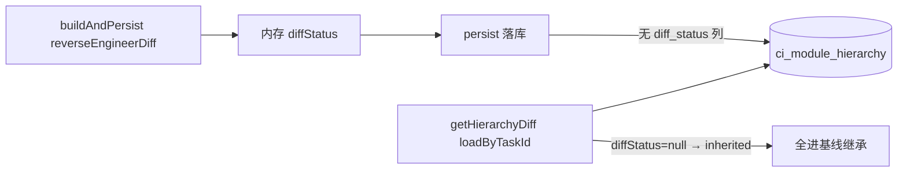

# 模块层级复核 DIFF 视图方案

> **管什么**：MODULE_HIERARCHY_REVIEW 的 DIFF 4 桶、功能级着色、前端 git 风格、方法签名准确性（§九）。  
> **不管什么**：基线继承 `parent_id`、合并同名/反劫持、rebuild 冲库、落库 id 对齐 → 见 [module-hierarchy-id-reuse-fix.md](./module-hierarchy-id-reuse-fix.md)。  
> 模式：与 [entrypoint-review-diff-design.md](./entrypoint-review-diff-design.md) 对齐（git 风格 + 有改动的在前 + 基线折叠）。  
> **两方案关系与联调顺序**：见 id-reuse 文首 **§〇**（推荐先读）。

---

## 一、依赖

| 依赖 | 状态 |
|---|---|
| INCREMENTAL 方案（数据层 baselineTaskId / sourceEntryClass） | ✅ 完成 |
| module-hierarchy 方案（AI 串行 + 共享 hierarchy） | ✅ 完成 |
| Phase 4 B2（ModuleDto/FunctionDto 加 sourceEntryClass） | ✅ 完成 |
| 入口复核 diff（4 类 git 风格 + 折叠模式） | ✅ 完成 |

## 二、复用的 diff 能力

| 已有 | 说明 |
|---|---|
| `ModuleDto.sourceEntryClass` 字段 | FUNCTION 节点级 diff 标识 |
| `GET /tasks/{id}/module-hierarchy/diff` 端点 | 已有 3 类（new / inherited / deleted），**无 modified** |
| 入口复核 4 组 git 风格模式 | 颜色 + Badge + 折叠直接复用 |

## 三、方案

### 3.1 diff 4 类（按 module 粒度）

| 分类 | 识别方法 | 颜色 | Badge |
|---|---|---|---|
| **新增模块** | 基线无 + 本次有 | 蓝色 #1890ff | `[+]` |
| **变更模块** | 基线有 + 本次有，且 classPaths **或** 方法签名集合不同，**或** 功能级存在 new/modified/deleted | 橙色 #fa8c16 | `[~]` |
| **继承模块** | 基线有 + 本次有 + 入口类/方法签名/功能名均无相对变化 | 绿色 #52c41a | 无 |
| **删除模块** | 基线有 + 本次无 | 红色 #ff4d4f | `[-]` |

> **模块分桶看内容是否变**（含功能级）；**桶内**仍用 `reverseEngineerDiff` 给功能打 `+`/`~`/`-` 着色。  
> 分桶细则与「假继承」修复见 [id-reuse §八.2](./module-hierarchy-id-reuse-fix.md)。同名成对新增/删除见 [id-reuse §八.1](./module-hierarchy-id-reuse-fix.md)（落库侧见 §四 / §六）。

### 3.2 视觉

```
Segmented: [全量视图] [DIFF 视图]

diff 统计条：+2 新增  ~1 变更  -1 删除  =47 基线

━━━ 本次新增 (2) ━━━━━━━━━━━━━━━━━━━━━━━
┃ blue │ [+] m0A1B 用户管理              ← 模块级 Badge
┃      │   └─ sXy9Z 用户注册

━━━ 本次变更 (1) ━━━━━━━━━━━━━━━━━━━━━━━
┃orange│ [~] mK7pQ 房管局业务              ← 模块名变化
┃      │   └─ sP3wR 房管局授权

━━━ 本次删除 (1) ━━━━━━━━━━━━━━━━━━━━━━━
┃ red  │ [-] mO5p6 旧模块                  ← 模块名删除线
┃      │   └─ sQ7r8 旧子模块

━━━ 基线继承 (47) ▸ 折叠 ━━━━━━━━━━━━━━━━
┃ green│ mD5e6 订单管理                    ← 无 Badge
```

### 3.3 列表 + 树形两种视图

| 视图 | DIFF 模式 |
|---|---|
| **列表** | 4 组分组，每组下子模块可点击展开 |
| **树形** | 4 个顶级分组节点，子节点带 diff Badge |

## 四、后端改动

### 4.1 `ModuleHierarchyDiffDto` 加 `modifiedHierarchy`

**文件**：[`ModuleHierarchyDiffDto.java`](backend/src/main/java/com/company/codeinsight/modules/hierarchy/dto/ModuleHierarchyDiffDto.java)

```java
@Data
public class ModuleHierarchyDiffDto {
    private ModuleHierarchy newHierarchy;        // 本次新增模块
    private ModuleHierarchy modifiedHierarchy;  // 基线有 + FUNCTION classPaths 不同 ← 新增
    private ModuleHierarchy inheritedHierarchy; // 类+子全不变
    private ModuleHierarchy deletedHierarchy;   // 本次删除
}
```

### 4.2 `ModuleDto` 加 `diffStatus` 字段

**文件**：[`ModuleDto.java`](backend/src/main/java/com/company/codeinsight/modules/hierarchy/model/ModuleDto.java)

```java
public class ModuleDto {
    // ... 现有字段 ...
    /** v1: 模块级 diff（new / modified / unchanged / deleted） */
    private String diffStatus;
}
```

### 4.2 预处理：剔除被删入口对应的整模块

`inheritModuleHierarchy` 后，**先做预处理**——基于入口 diff 列表把"基线有但本次无"的入口对应的整模块从 DTO 中剔除，让 AI 看到干净的初始化层级，避免 AI 复用已删模块的 id。

**伪代码**：

```java
private List<ModuleDto> preprocessHierarchy(
        ModuleHierarchy hierarchy,
        Set<String> currentEntryClassNames,
        Set<String> deletedEntryClassNames) {
    List<ModuleDto> deletedModules = new ArrayList<>();
    Iterator<Map.Entry<String, ModuleDto>> it = hierarchy.getModules().entrySet().iterator();
    while (it.hasNext()) {
        ModuleDto m = it.next().getValue();
        Set<String> moduleClassPaths = collectFunctionClassPaths(m);
        if (moduleClassPaths.isEmpty()) continue;
        // 整模块入口被全删（基线有入口但本次都没有）→ 整模块剔除
        boolean hasAnyDeleted = moduleClassPaths.stream()
            .anyMatch(deletedEntryClassNames::contains);
        if (hasAnyDeleted && moduleClassPaths.stream()
                .noneMatch(currentEntryClassNames::contains)) {
            m.setDiffStatus("deleted");
            deletedModules.add(m);
            it.remove();  // AI 看不到这个模块
            continue;
        }
        // 部分入口被删 → FUNCTION.classPaths 中剔除已删除的入口类
        for (SubModuleDto sm : m.getSubModules().values()) {
            for (FunctionDto fn : sm.getFunctions().values()) {
                if (fn.getClassPaths() == null) continue;
                boolean hasDeleted = fn.getClassPaths().stream()
                    .anyMatch(deletedEntryClassNames::contains);
                if (hasDeleted) {
                    fn.getClassPaths().removeAll(deletedEntryClassNames);
                }
            }
        }
    }
    return deletedModules;
}
```

`buildAndPersist` 调用（line 179 后）：

```java
ModuleHierarchy hierarchy = loadByTaskId(taskId);
// 预处理：剔除已删除入口对应的整模块
if (effective.isIncremental() && effective.getBaselineTaskId() != null) {
    Set<String> currentNames = entrypointReviewService.loadEnabledEntries(taskId)
        .stream().map(EntryPoint::getClassName).filter(Objects::nonNull).collect(toSet());
    Set<String> deletedNames = entrypointMapper.selectByTaskId(effective.getBaselineTaskId())
        .stream().map(EntrypointEntity::getClassName)
        .filter(n -> !currentNames.contains(n)).collect(toSet());
    preprocessedDeletedModules = preprocessHierarchy(hierarchy, currentNames, deletedNames);
}
```

**保留原 `deleteByTaskIdAndSourceEntryClass` 调用但加 level 过滤**（保留 SQL 方法，添加 level='FUNCTION'）。

### 4.3 反向检索：AI 输出后精确判定每个 FUNCTION 的 diffStatus

AI 自由输出后，按 methodSignature 配对基线 vs 当前——这是后置反向检索，不依赖 AI 知道哪些被删。

```java
private void reverseEngineerDiff(ModuleHierarchy currentHier, ModuleHierarchy baselineHier) {
    // 1. 按 methodSignature 索引 baseline FUNCTION
    Map<String, FunctionDto> baselineBySig = new HashMap<>();
    Map<String, String> baselineSigToModId = new HashMap<>();
    for (ModuleDto bm : baselineHier.getModules().values()) {
        for (SubModuleDto bs : bm.getSubModules().values()) {
            for (FunctionDto bf : bs.getFunctions().values()) {
                for (String sig : bf.getMethodSignatures()) {
                    baselineBySig.put(sig, bf);
                    baselineSigToModId.put(sig, bm.getId());
                }
            }
        }
    }
    // 2. 按 methodSignature 索引当前 FUNCTION + 判定 diffStatus
    Map<String, String> currentSigToModId = new HashMap<>();
    for (ModuleDto m : currentHier.getModules().values()) {
        for (SubModuleDto sm : m.getSubModules().values()) {
            for (FunctionDto fn : sm.getFunctions().values()) {
                for (String sig : fn.getMethodSignatures()) {
                    currentSigToModId.put(sig, m.getId());
                    if (!baselineBySig.containsKey(sig)) {
                        fn.setDiffStatus("new");
                    } else if (!fn.getFunctionName().equals(baselineBySig.get(sig).getFunctionName())) {
                        fn.setDiffStatus("modified");
                    } else {
                        fn.setDiffStatus("unchanged");
                    }
                }
            }
        }
    }
    // 3. 标记 deleted FUNCTION（基线有 + 当前无）—— 虚拟节点不落 DB，标到 deletedHierarchy
    for (Map.Entry<String, String> e : baselineSigToModId.entrySet()) {
        if (!currentSigToModId.containsKey(e.getKey())) {
            // 创建虚拟 deleted FUNCTION 节点（不落 DB，但供 getHierarchyDiff 展示）
            FunctionDto bf = baselineBySig.get(e.getKey());
            deletedFunctions.computeIfAbsent(e.getValue(), k -> new ArrayList<>()).add(bf);
        }
    }
}
```

`buildAndPersist` 中调用：

```java
// AI 输出 + merge 后
reverseEngineerDiff(hierarchy, baselineHierarchy);  // baselineHierarchy 前面已加载
```

### 4.4 (修订) 主导 group：一个模块只进一个 group

**问题**：原实现按 sub_module 拆分到不同 group，导致一个模块的多个 sub_module 各自进不同 group（mP7rT 出现在 inherited + new 两个组）。

**修复**：按"模块下 FUNCTION 集合的合并状态"选主导 group：

| 合并状态 | 主导 group |
|---|---|
| 有 deleted function | **deleted** |
| 有 new function（无 deleted） | **new** |
| 有 modified function（无 deleted/new） | **modified** |
| 全部 unchanged | **inherited** |

```java
// v1 重构（修订）：一个模块只进一个 group
for (ModuleDto m : current.getModules().values()) {
    boolean hasNew = false, hasMod = false, hasUnchanged = false, hasDel = false;
    List<SubModuleDto> moduleSubs = new ArrayList<>();
    for (SubModuleDto sm : m.getSubModules().values()) {
        for (FunctionDto fn : sm.getFunctions().values()) {
            String s = fn.getDiffStatus();
            if ("new".equals(s)) hasNew = true;
            else if ("modified".equals(s)) hasMod = true;
            else if ("deleted".equals(s)) hasDel = true;
            else hasUnchanged = true;
        }
        moduleSubs.add(sm);
    }
    if (moduleSubs.isEmpty()) continue;

    // 选主导 group：deleted > new > modified > inherited
    String group = hasDel ? "deleted" :
                  hasNew ? "new" :
                  hasMod ? "modified" : "inherited";

    ModuleHierarchy target = /* 按 group 选 */;
    ModuleDto cp = copyModule(m);
    for (SubModuleDto sm : moduleSubs) {
        SubModuleDto smCp = copySubModule(sm);
        // 保留所有 function（含 diffStatus），让前端按颜色区分
        for (FunctionDto fn : sm.getFunctions().values()) {
            smCp.getFunctions().put(fn.getId(), fn);
        }
        cp.getSubModules().put(smCp.getId(), smCp);
    }
    target.getModules().put(m.getId(), cp);
}
```

**结果**：1 个模块只出现 1 次。函数按 diffStatus 在模块下展示，前端按颜色区分（new=蓝 / modified=橙 / deleted=红删除线 / unchanged=灰）。

### 4.5 `getHierarchyDiff` 改用 FUNCTION.diffStatus 分组

```java
// 对 inheritedHierarchy 中每个模块判断"是否变更"
ModuleHierarchy modifiedHier = new ModuleHierarchy();
modifiedHier.setTaskId(taskId);
modifiedHier.setSystemId(systemId);
for (ModuleDto m : inheritedHier.getModules().values()) {
    ModuleDto baselineMod = baselineById.get(m.getId());
    if (baselineMod == null) continue;
    Set<String> currentFp = collectClassPaths(m);
    Set<String> baselineFp = collectClassPaths(baselineMod);
    if (!currentFp.equals(baselineFp)) {
        m.setDiffStatus("modified");
        modifiedHier.getModules().put(m.getId(), m);
    } else {
        m.setDiffStatus("unchanged");
    }
}
// 从 inheritedHier 中移除移走的模块
for (String movedId : modifiedHier.getModules().keySet()) {
    inheritedHier.getModules().remove(movedId);
}
// 设 new / deleted 状态
markAll(newHier, "new");
markAll(deletedHier, "deleted");
```

`collectClassPaths(ModuleDto)` 辅助方法：

```java
private Set<String> collectClassPaths(ModuleDto m) {
    Set<String> fp = new HashSet<>();
    if (m.getSubModules() == null) return fp;
    for (SubModuleDto sm : m.getSubModules().values()) {
        if (sm.getFunctions() == null) continue;
        for (FunctionDto fn : sm.getFunctions().values()) {
            if (fn.getClassPaths() != null) fp.addAll(fn.getClassPaths());
        }
    }
    return fp;
}
```

**工作量**：~50 行。

## 五、前端改动

**只改 1 个文件**：[`HierarchyReviewWorkspace.tsx`](frontend/src/pages/tasks/HierarchyReviewWorkspace.tsx)

| 改动 | 行数 |
|---|---|
| 修复 useEffect 依赖（加 `task?.type`） | ~3 |
| 静态 import `getModuleHierarchyDiff` | ~1 |
| `diffClassified` useMemo（4 组分类） | ~20 |
| DIFF 模式渲染（4 组分组 + 折叠） | ~80 |
| DIFF 模式 + 树形视图（`diffTreeData`） | ~50 |

### 5.1 复用入口复核的 diff 模式

- 同样 4 组颜色（蓝/橙/红/绿）
- 同样 4 个 Badge（`[+]` / `[~]` / `[-]` / 无）
- 同样有改动的在前、基线折叠

### 5.2 改动量

约 155 行。

## 六、阶段 6：知识复核 diff（后续）

模块层级完成后，知识复核用相同模式：
- `DraftTreeDiffDto` 已有 3 类（new / inherited / deleted），**无 modified**
- `KnowledgeDraft` 加 `diffStatus` 字段
- 草稿树节点 diff Tag 颜色 + 折叠

## 七、工作量

| Phase | 内容 | 行数 |
|---|---|---|
| 1 | 后端 `ModuleHierarchyDiffDto` + `ModuleDto.diffStatus` + `getHierarchyDiff` 拆分 modified | ~50 |
| 2 | 前端 useEffect 修复 + 静态 import | ~5 |
| 3 | 前端 DIFF 模式渲染 | ~155 |
| 4 | 编译验证 | — |
| **总计** | | **~210 行** |

## 八、验证

```bash
# 编译
cd backend && mvn -DskipTests compile
cd frontend && npm run build

# 端到端（需要本地 PG + Redis）
# 1. 跑一条 INCREMENTAL 任务（含 retarget 模块）
# 2. 模块层级复核页切到 DIFF 视图
# 3. 验证：4 组颜色 + Badge + 折叠
```

## 九、准确性与 DIFF 缺陷修订（单文档全集）

> 本节覆盖：方法签名归属准确性、DIFF 误分类、DIFF 展示重复。代码改动只以本文档为准。

### 9.1 `method_signatures` 准确性

同一功能**允许**挂多个相关方法签名（例如「登录」= `login(...)` + `buildToken(...)`）。实际常见错误是**准确性**而非数量：入口类方法全集被复制到**每一个**功能节点（UI 上同 Controller 下多个功能显示相同「方法签名·N」）。

污染来源：

| 来源 | 说明 |
|---|---|
| AI 输出 | 提示词未硬约束「按功能筛方法」，模型易把 Controller 全集写进每个 `functions[].method_signatures` |
| 程序 backfill | `mergeEntryResult` 对新建功能在签名为空时调用 `backfillFunctionMethodSignatures`，把入口 `methods_json` **全集**灌入 |

**提示词**（[`analyze_prompt.md`](../backend/src/main/resources/analyze_prompt.md)）增加「`method_signatures` 归属规则」：

- 按功能筛方法，不按类抄全集
- 1 功能 → N 相关方法 ✅；同一方法原则上只挂一个功能
- 同 `class_paths` 拆多功能时各功能签名不得完全相同
- 宁缺毋滥

变更后需 `POST /api/prompts/sync-from-resource?promptType=MODULARIZE` 同步 DB 默认提示词；**已创建任务快照不自动更新**。

**程序侧**：`mergeEntryResult` 保留 `fn.getClassPaths().add(entry.getClassName())`，**删除**对新建功能调用 `backfillFunctionMethodSignatures`。`backfillMethodSignaturesFromEntrypoints` 仅在 `classPaths` 与 `methodSignatures` **皆空**时兜底。绑定表仍由 AI 笛卡尔积 + 调用图交叉校验驱动。

### 9.2 DIFF 误分类：`getHierarchyDiff` 全进「基线继承」

| 现象 | 根因 |
|---|---|
| 基线没有的模块出现在「基线继承」 | `reverseEngineerDiff` 只写内存 `diffStatus`；**未落库**。`getHierarchyDiff` 重载后全部 `null` → `else` 当成 unchanged → 全进 inherited |
| DIFF 下列出相同方法签名多行 | 前端每功能只显 `methodSignatures[0]`；签名被整类污染时兄弟功能首条相同（见 §9.1） |
| 删除功能依赖实例字段 | `deletedFunctionsForDiff` / `preprocessedDeletedModules` 为单例瞬态字段，跨请求/重启不可靠 |



**修订（演进后）**：每次请求现场重算，不依赖 build 内存状态：

1. `loadByTaskId(current)` + `loadByTaskId(baseline)` + 同名配对（[id-reuse §八.1](./module-hierarchy-id-reuse-fix.md)）
2. 基线无 → `new`；基线有当前无 → `deleted`；配对后 `isModuleContentModified` → `modified`，否则 `inherited`（[id-reuse §八.2](./module-hierarchy-id-reuse-fix.md)）
3. 同请求内 `reverseEngineerDiff` 打功能级 `diffStatus` 供着色；**不落库**
4. 真新增桶：`markAllFunctionsNew`，避免跨基线误标 `~`

### 9.3 前端 DIFF 展示

[`HierarchyReviewWorkspace.tsx`](../frontend/src/pages/tasks/HierarchyReviewWorkspace.tsx)：

- **主文案**：`functionName`
- **次要**：单签名直接附带；多签名显示数量

模块级四分类以 id-reuse §八 为准；本篇负责 UI 与签名准确性。

> 增量任务下同模块因 ID 未复用而成对「新增+删除」：见 [module-hierarchy-id-reuse-fix.md](./module-hierarchy-id-reuse-fix.md)。

---

## 十、一句话

> **DIFF 视图 = 功能签名归属准确 + 请求时按配对/内容变化分 4 桶 + 桶内功能着色 + git 风格 UI；ID 是否稳定交给 id-reuse 方案。**
