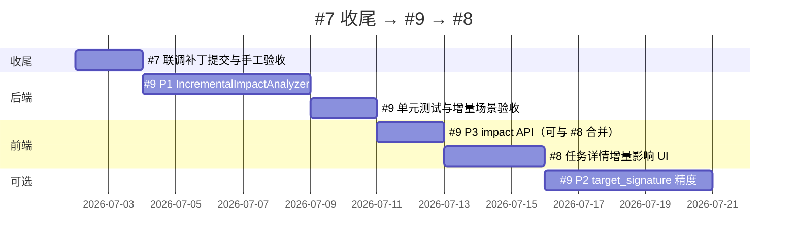

# 路线图：#7 收尾 → #9 → #8

> **记录日期**：2026-07-02  
> **前置**：#7 知识查询（7.0–7.4）功能主体已落地，见 [knowledge-query-split-plan.md](./knowledge-query-split-plan.md)  
> **关联**： [incremental-hierarchy-doc-plan.md](./incremental-hierarchy-doc-plan.md)、[README.md](../README.md)「后续演进」第 4、5 条

---

## 总览

| 编号 | 名称 | 一句话 | 状态 |
|------|------|--------|------|
| **#7** | 知识查询与纠错 | 三页只读 + 纠错重跑 + 发布版直写 | 主体完成；联调补丁与测试待收尾 |
| **#9** | 增量影响分析（后端） | 非入口类变更经调用链反查，决定层级/文档谁要重跑 AI | **待实施**（先做） |
| **#8** | 增量扫描 UI 化 | 任务详情展示影响面摘要、模块命中数、可选基线选择 | **待实施**（依赖 #9） |

**执行顺序（强制）：**

```
#7 收尾（联调补丁入库） → #9 P1 后端 → #9 验收 → #8 前端/API → #9 P2/P3（按需）
```

**#8 依赖 #9 的原因：** UI 要展示的「本次增量更新了 N 个模块」「影响链 trace」必须来自后端 `IncrementalImpact` 的稳定输出；在 #9 未产出结构化影响面之前做 #8，只能展示 git diff 文件数，无法回答业务语义。

---

## #7 收尾清单（进入 #9 前的闸门）

功能已在代码中，但以下项未完全闭环：

| 项 | 说明 | 当前状态 |
|----|------|----------|
| 纠错任务调度 | `TaskQueueDispatcher`：`PENDING` → 按 `resume_from` 跳 `AI_ANALYZING` / `GENERATING_DOC` | 工作区已改，**未提交** |
| 状态机 | `TaskStateMachineServiceImpl` 允许上述跳转 | 工作区已改，**未提交** |
| 续跑幂等 | `DecompileTaskServiceImpl` 纠错阶段避免重复 `transitTo` | 工作区已改，**未提交** |
| 提示词绑定 | 任务创建回退到**仓库级** `modularize/document_prompt_id` | 工作区已改，**未提交** |
| Schema | `trigger_source` 扩至 VARCHAR(40) | 工作区已改，**未提交** |
| NAS 直写路径 | `KnowledgeReleaseEditService` 路径规范化 | 工作区已改，**未提交** |
| 自动化测试 | 纠错 / 知识查询 API 无专项测试 | 缺失 |
| 已知 MVP 限制 | scope 外模块不回填、无独立审批台等 | 文档保留，不阻塞 #9 |

**建议：** 提交 #7 联调补丁并做一次手工验收（入口纠错 → 层级纠错 → 文档重跑 → 批准直写）后，再开 #9。

---

## #9 — 增量影响分析（后端）

**对应文档：** [incremental-hierarchy-doc-plan.md](./incremental-hierarchy-doc-plan.md) **P1**  
**对应 README：**「后续演进」第 4 条 — 基于 method-calls 扩展影响分析

### 要解决的问题

增量任务修改**非入口类**（如 `UserService`）时，若 diff 未命中入口文件、且 `function.classPaths` 未直接列出该类，当前流水线会**跳过**对应模块文档重生成。期望：经 `ci_method_call` **反向 BFS** 找到入口 → 映射模块 → 仅重生成模块说明文档。

### P1 交付物（#9 最小可验收范围）

| # | 交付物 | 包路径 / 文件 |
|---|--------|----------------|
| 1 | `MethodCallReverseGraphService` | `modules/callchain/service/` |
| 2 | `IncrementalImpact` 模型 + `IncrementalImpactAnalyzer` | `modules/callchain/` 或 `modules/scanner/` |
| 3 | `ModuleHierarchyServiceImpl` 接入 `hierarchyRetargetEntries` | 替代纯 `isPathChanged(entry.filePath)` |
| 4 | `AiSummaryServiceImpl` 接入 `docRetargetModuleIds` | 与现有 `moduleTouchedByChange` **取并集** |
| 5 | 流水线日志 | `DecompileTaskServiceImpl` / `TaskExecutionLogger` 输出影响面摘要 |
| 6 | 单元测试 | mock `ci_method_call`：非入口变更 → 文档模块命中 |

### 算法要点（默认）

- 反向 BFS 深度上限：**15**
- 反查失败降级：**是** — `classPaths` 直接命中仍纳入 `docRetargetModuleIds`
- 调用时机：`PARSING_CODE`（callchain 落库）之后、`MODULE_HIERARCHY` 之前，结果经 `TaskPipelineContext` 传递
- **不与 P2 一并做**：P1 先用现有 MVP 级 `target_signature`，P2 再提精度

### 验收标准

1. 构造增量任务：仅改 Service 类、Controller 不在 diff → 文档阶段重生成该 Service 所属模块（经反向链命中）。
2. 改入口类文件 → 层级 AI 重跑 + 文档模块纳入。
3. 流水线日志可见：`入口重算 N`、`反向命中 M 模块`、`降级 K`。
4. 全量 / 无 baseline 降级路径行为不变。

### #9 后续分期（不阻塞 #8，可并行排期）

| 分期 | 内容 |
|------|------|
| **P2** | 完整 `target_signature`、方法级 seed、可配置 `reverse-bfs-max-depth` |
| **P3** | `ImpactTrace` 持久化或 API 暴露（为 #8 富展示做准备；P1 可先只写日志 + 内存结构） |

---

## #8 — 增量扫描 UI 化

**对应文档：** [incremental-hierarchy-doc-plan.md](./incremental-hierarchy-doc-plan.md) **P3** + [README.md](../README.md)「后续演进」第 5 条  
**依赖：** #9 P1 至少产出可查询的影响面（建议 #9 P3 的 API 与 #8 同步设计，可合并为一个迭代）

### 要解决的问题

用户创建/跟进 `INCREMENTAL` 任务时，只能看到 changed/deleted 文件数，看不到**业务影响**（哪些模块会被重跑 AI、影响链是什么）。

### 目标 UI（建议）

| 位置 | 能力 |
|------|------|
| 任务详情 | 增量摘要卡：`changed N 文件 / deleted M 文件 / 重算层级入口 K / 重生成文档模块 L` |
| 任务详情 | 可展开 `ImpactTrace` 列表（例：`UserService#save → UserController#list → 模块「用户管理」`） |
| 任务创建（可选） | 增量基线：展示 `lastCommitId`，高级选项覆盖基线（需产品确认） |
| 执行日志 | 与后端流水线日志对齐，支持复制/导出 |

### API 建议（#9 P3 + #8 联调）

```
GET /tasks/{id}/incremental-impact
```

响应字段示例：

```json
{
  "incremental": true,
  "changedPaths": ["..."],
  "deletedPaths": ["..."],
  "hierarchyRetargetEntryCount": 2,
  "docRetargetModuleIds": ["mXxXx", "mYyYy"],
  "traces": [
    {
      "changedFqcn": "com.example.UserService",
      "path": "UserService#save → UserController#list",
      "moduleId": "mXxXx",
      "moduleName": "用户管理",
      "kind": "REVERSE_BFS"
    }
  ],
  "degradedModuleCount": 1
}
```

### 验收标准

1. 增量任务在详情页展示模块级影响，与流水线实际重跑范围一致。
2. Mock / 真实任务均可；全量任务不展示或展示「全量扫描」。
3. 文案与 [CLAUDE.md](../CLAUDE.md) 增量语义表一致。

---

## 明确不属于 #8 / #9 的事项

| 主题 | 文档 | 说明 |
|------|------|------|
| 集群多节点 | [cluster-readiness.md](./cluster-readiness.md) | 独立运维演进，与增量语义正交 |
| 生产认证 / SSO | README 后续演进 §1 | 安全基建 |
| 前端大包拆分 | README 后续演进 §3 | 性能优化 |
| 知识查询 MVP 限制 | knowledge-query-split-plan 已知限制 | 可作为 #7.5 另开，不挡 #9 |
| Git 推送策略修补 | 历史 code review 缺口 | 与 NAS 发布链路分开 |

---

## 推荐里程碑



---

## 决策记录

| 日期 | 决策 |
|------|------|
| 2026-07-02 | #7 主体完成；下一迭代先做 **#9 后端影响分析**，再做 **#8 UI** |
| 2026-07-02 | #9 P1 不与 P2 合并；P1 用 MVP 调用链 + className 过滤 + 降级并集 |
| 2026-07-02 | #8 依赖 #9 的结构化输出，避免 UI 与流水线判定两套逻辑 |

---

## 参考代码（#9 改动入口）

```
backend/src/main/java/com/company/codeinsight/modules/
├── scanner/model/IncrementalContext.java
├── hierarchy/service/impl/ModuleHierarchyServiceImpl.java   # toProcess 逻辑 ~L155
├── ai/service/impl/AiSummaryServiceImpl.java                # moduleTouchedByChange ~L745
├── callchain/service/impl/MethodCallGraphServiceImpl.java   # 正向 BFS，需对称扩展
├── callchain/entity/MethodCall.java
├── task/service/impl/DecompileTaskServiceImpl.java          # 流水线插入影响分析
└── entrypoint/service/EntrypointReviewService.java          # loadEnabledEntries
```
