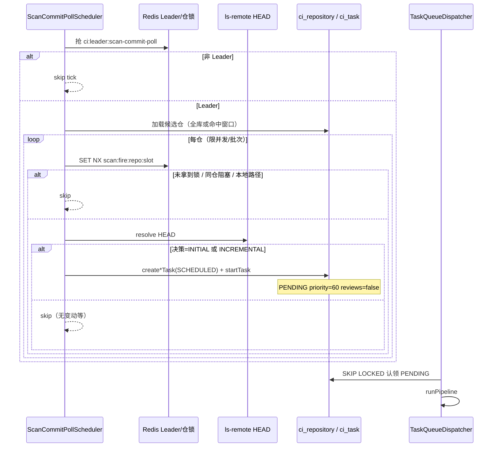

# 定时 Commit 轮询扫描 · 详细设计

> **管什么**：定时探测仓库远端 HEAD，与已发布基线比对后按规则下发 INITIAL / INCREMENTAL 任务。  
> **不管什么**：增量 diff / 基线继承 / 推送语义（见既有增量方案）；Webhook 归并排队（本方案废弃该设计）。  
> **关联**：[incremental-task-strict-gate.md](./incremental-task-strict-gate.md)、[incremental-baseline-design.md](./incremental-baseline-design.md)、[repo-git-connectivity-design.md](./repo-git-connectivity-design.md)、`ScanWindowScheduler`、`TaskQueueDispatcher`。  
> **状态：已实施**（2026-08-05）。Webhook 方案见 [webhook-incremental-scan-window-design.md](./webhook-incremental-scan-window-design.md) → **废弃**。

---

## 〇、目标一句话

**按全局 cron 或扫描窗口轮询远程仓；`ls-remote` 取 HEAD 与 `last_commit_id` 比对；无基线全量、有变动增量；验证开关可强制「无变动也全量」；创建即入队，自动任务跳过人工复核。**

---

## 一、已确认决策

| # | 决策 | 结论 |
|---|---|---|
| D1 | 全量 / 增量判定 | **A**：无 PUSHED 基线 → INITIAL；有基线且 HEAD≠`last_commit_id` → INCREMENTAL。另增 **验证开关**（见 §3.2） |
| D2 | 扫描范围 | **A**：新增 **全局扫描开关**——开=全局 cron 扫全部远程仓；关=走 `ci_scan_window` 按时段。须控间隔 + Leader 防重 |
| D3 | 创建后是否启动 | **A**：`create*Task` 后立即 `startTask` → `PENDING` |
| D4 | 复核开关 | **B**：自动任务 `requireEntrypointReview=false`、`requireHierarchyReview=false` |
| D5 | 同仓阻塞 | 有进行中 / 待审任务 → **本轮跳过**（不排队 DRAFT） |
| D6 | 本地路径 | **禁止**：定时路径一律跳过本地路径仓 |
| D7 | Webhook 方案 | **废弃**（不再实施「窗口只放行 WEBHOOK DRAFT」） |
| D8 | 多节点 | Leader 执行探测+建任务；扩展 `ls-remote` 返回 HEAD commit |
| D9 | `trigger_source` | **保留 `SCHEDULED`** |

---

## 二、现状与缺口

### 2.1 已具备

| 能力 | 位置 | 说明 |
|---|---|---|
| 扫描窗口配置 | `ci_scan_window` + `/scan-windows` | 仓级星期 bitmask + 时:分 + enabled |
| 调度 tick | `ScanWindowScheduler#tick` | 默认每分钟；Redis 分钟锁 + `lastFiredAt` |
| 增量硬门禁 | `validateIncrementalBaselineGate` | 须已发布基线 + 非本地路径 |
| 待复核门禁 | `validateNoPendingReviewTasks` | 同仓 `PENDING_REVIEW` / `REVIEWING` 拒建 |
| Git 连通性 | `RepoGitConnectivityService` | 已有超时 `ls-remote`，但**只返回 boolean** |
| 任务认领 | `TaskQueueDispatcher` | SKIP LOCKED + 本机并发闸 |

### 2.2 缺口

| # | 缺口 | 后果 |
|---|---|---|
| A | 定时路径无脑 `createInitialTask` | 无 commit 比对、无增量 |
| B | `ls-remote` 不返回 HEAD | 无法做「有无变动」判断 |
| C | 无全局扫全仓模式 | 只能按窗口逐仓开火 |
| D | 无「验证模式」强制全量 | 无变动时无法压测/验全量流水线 |
| E | 自动任务复核默认 true | 定时任务卡在人工断点 |
| F | 文档仍写 ScheduleExecutor / Webhook 放行 | 与实现脱节 |

---

## 三、核心规则

### 3.1 增量基线（与现门禁对齐）

**有基线** ≔ `ci_repository.last_published_version_id != null` **且** `last_commit_id` 非空。

比对：`远端 HEAD` vs `last_commit_id`（发布时源码 commit，见 `RepositoryPublishService`）。

### 3.2 下发决策矩阵

| 有基线 | HEAD vs last_commit_id | 验证开关 | 动作 |
|:---:|:---:|:---:|---|
| 否 | （任意可达 HEAD） | * | **INITIAL** + start |
| 是 | 相同 | **关** | **跳过**（无变动） |
| 是 | 相同 | **开** | **INITIAL** + start（验证全量） |
| 是 | 不同 | * | **INCREMENTAL** + start |
| — | ls-remote 失败 / 无 HEAD | * | **跳过**（记日志；可选刷新连通性） |
| 本地路径 | — | * | **跳过**（D6） |
| 同仓阻塞 | — | * | **跳过**（D5） |

> 验证开关**只影响「有基线且 HEAD 无变化」**：打开时强制 INITIAL，关闭时不下发。  
> 验证开关**不改变**「有变动 → INCREMENTAL」与「无基线 → INITIAL」。

### 3.3 同仓阻塞（D5）

本轮跳过，若该仓存在任一非终态任务，建议集合：

```
DRAFT, PENDING, PULL_QUEUED, PULLING_CODE, PARSE_QUEUED, PARSING_CODE,
ENTRYPOINT_REVIEW, AI_ANALYZING, MODULE_HIERARCHY, MODULE_HIERARCHY_REVIEW,
BASELINE_DOC_INHERIT, GENERATING_DOC, PENDING_REVIEW, REVIEWING,
CONFIRMED, PUSHING, RESUME_QUEUED
```

终态（可再下发）：`FAILED` / `CANCELLED` / `ARCHIVED` / `PUSHED`。

创建期仍走现有 `validateTaskSource`（含 `git_reachable`）与提示词绑定校验；失败记日志并释放该仓本轮锁，不中断整轮。

### 3.4 自动任务属性

| 字段 | 值 |
|---|---|
| `trigger_source` | `SCHEDULED` |
| `require_entrypoint_review` | `false` |
| `require_hierarchy_review` | `false` |
| `priority` | 60（沿用 SCHEDULED 默认） |
| 启动 | 创建后立即 `startTask` |

---

## 四、两种扫描模式（D2）

### 4.1 全局开关

| 配置键（建议） | 含义 | 默认 |
|---|---|---|
| `code-insight.scan.global-poll-enabled` | 开=扫全部远程仓；关=仅窗口仓 | `false`（兼容现状：先按窗口） |
| `code-insight.scan.force-full-on-unchanged` | 验证开关：有基线无变动仍 INITIAL | `false` |
| `code-insight.scan.cron` | 调度 cron（两种模式共用 tick） | `0 */5 * * * *` |
| `code-insight.scan.enabled` | 调度总开关 | `true` |
| `code-insight.scan.daily-coverage-enabled` | 按自然日覆盖；失败/超时不记完成，后续 tick 重试 | `true` |
| `code-insight.scan.poll-concurrency` | 单轮 ls-remote 并发（宜小） | `2` |
| `code-insight.scan.poll-batch-size` | 单轮最多处理仓数 | `30` |
| `code-insight.scan.max-sweep-seconds` | 单轮墙钟；到点停新波次，当前波次等完不 cancel | `300` |
| `code-insight.scan.probe-timeout-seconds` | 单次 ls-remote 超时 | `30` |
| `code-insight.scan.probe-max-attempts` | 超时类重试次数 | `3` |
| `code-insight.scan.probe-retry-backoff-ms` | 重试退避基数 | `2000` |

`global-poll-enabled` / `force-full-on-unchanged` / 日覆盖与探测参数 **仅配置文件或阿波罗**，无管理 API、无页面开关；调度 tick 直接读 `ScanProperties`。

`enabled` / `cron` 存 `ci_system_config`（键 `scan.scheduler.enabled` / `scan.scheduler.cron`，schema 种子默认 `true` / `0 */5 * * * *`），经 `SystemConfigService` 读写（Redis `ci:config:kv:*` 仅缓存）；yml/`SCAN_*` 仅在库中尚无该 key 时作 bootstrap。编排 API `/scan/orchestration/*` 与旧 `/scan-windows/scheduler/*` 写入 PG。启动时若仍有旧独立 Redis 键 `scan:scheduler:enabled|cron`，迁入 PG 后删除。

### 4.1.1 日覆盖与稳健性（1000 仓）

- Redis Set `scan:probe:done:{yyyyMMdd}`：当日已完成探测的仓（成功拿到 HEAD、本地路径、或明确失败）。
- **超时 / inconclusive：不入 Set** → 后续 tick 必再探。
- 探测与下发解耦：HEAD 比对后无变动 / 同仓阻塞只跳过下发，仍记「已探测」。
- 集群：仅 Leader 探测；覆盖状态在 Redis，Leader 切换不丢进度。
- 推荐配置（慢但稳，约一天内扫完并补齐）：

```yaml
code-insight:
  scan:
    global-poll-enabled: true
    daily-coverage-enabled: true
    cron: "0 */5 * * * *"      # 全天每 5 分钟
    poll-batch-size: 30
    poll-concurrency: 2
    max-sweep-seconds: 300
    probe-timeout-seconds: 30
    probe-max-attempts: 3
```

粗算：`1000/30 × 5min ≈ 3h` 理想一轮；失败仓靠 coverage 在当日后续 tick 自动补齐。

### 4.2 模式 A：全局轮询（`global-poll-enabled=true`）

```text
Leader tick
  → 分页/分批加载全部仓库（跳过本地路径）
  → 受 batch-size / concurrency / max-sweep-seconds 约束
  → 对每仓：幂等锁 → ls-remote HEAD → 决策矩阵 → create+start
  → 超时未扫完的仓留待下轮（按 id 游标或 last_polled_at，可选）
```

**防内存飙升**：禁止单 tick 全量并行 clone；只做轻量 `ls-remote`；并发与 batch 封顶；墙钟到点停止。

**防重复执行**：

1. Leader 锁：`ci:leader:scan-commit-poll`（SET NX + TTL，心跳续约，参考 `RepoGitCheckScheduler`）
2. 仓级分钟锁：`scan:fire:{repoId}:{yyyyMMddHHmm}`（TTL 2m，沿用）
3. D5 同仓非终态跳过

### 4.3 模式 B：扫描窗口（`global-poll-enabled=false`）

行为对齐现 `ScanWindowScheduler` 的「谁到点」过滤，但**开火逻辑改为 §3.2 决策矩阵**（不再无脑 INITIAL）：

```text
tick → listEnabled windows → 匹配星期/时/分
  → 同 Leader + 仓级锁
  → ls-remote → 决策 → create+start
```

未配置窗口或窗口未命中的仓：**不探测、不下发**。

---

## 五、端到端流程



---

## 六、实现要点

### 6.1 HEAD 解析

扩展 `RepoGitConnectivityService`（或抽 `GitRemoteHeadResolver`）：

- 复用现有凭证 / 超时线程模型
- `Git.lsRemoteRepository()` 解析默认分支 HEAD（优先 `HEAD` 符号引用 → 目标 commit；否则约定分支如 `master`/`main`——**实施时与仓库配置的扫描分支对齐**，若仓上有 `branch` 字段则优先该分支）
- 返回：`Optional<String> headCommit` + 可达性；超时仍标 inconclusive，**不误标不通、不下发**

连通性落库：探测成功可顺带刷新 `git_reachable=1`；失败策略与现 Git check 一致（明确失败写 0，超时保持原状）。

### 6.2 调度器形态

推荐：**改造 `ScanWindowScheduler` → `ScanCommitPollScheduler`**（或保留类名、重写 `tick`），统一两种模式，避免双调度抢同一批仓。

伪代码：

```text
tick():
  if !enabled: return
  if !tryLeaderLock(): return
  candidates = globalPoll ? loadAllRemoteRepos(batch) : loadWindowMatchedRepos()
  parallel(concurrency) for repo in candidates:
    if localPath: skip
    if !tryRepoSlotLock: skip
    if hasBlockingTask(repo): skip
    head = resolveHead(repo)
    if head empty: skip
    hasBaseline = publishedVersionId && lastCommitId
    if !hasBaseline:
      createInitial + start
    else if head == lastCommitId:
      if forceFullOnUnchanged: createInitial + start
      else: skip
    else:
      createIncremental + start
```

### 6.3 创建 API

复用现有：

- `createInitialTask(..., false, false, "SCHEDULED")` + `startTask`
- `createIncrementalTask(..., false, false, "SCHEDULED")` + `startTask`

注意：当前 `createInitialTask` 带 `triggerSource` 的重载可能把 `requireEntrypointReview` 写死为 `TRUE`——实施时须核对并改为支持 `false`（D4）。

增量仍走 `validateIncrementalBaselineGate`；决策矩阵已保证有基线才走增量，本地路径已在调度层跳过。

### 6.4 废弃 Webhook 设计

1. 将 `docs/webhook-incremental-scan-window-design.md` 顶部状态改为 **废弃**，并指向本文。
2. 不实现 WEBHOOK `trigger_source`、窗口 FIFO 放行、弃早确认流。
3. 公司侧 Webhook TODO 保持未接；若日后重开另立新稿。

### 6.5 文档同步（实施阶段）

- `CLAUDE.md` / `README.md`：删除过时 `ScheduleExecutor` / `ci:leader:schedule-executor` 描述；改为本方案 + `TaskQueueDispatcher`。
- `CHANGELOG`：记录行为变更（定时从「窗口到点全量」→「commit 轮询 + 全量/增量」）。

### 6.6 配置入口

| 项 | 入口 |
|---|---|
| `global-poll-enabled` / `force-full-on-unchanged` / 分批参数 | **仅** `application.yml` / 环境变量 / 阿波罗 |
| 既有 cron / enabled | 保留 `/scan-windows/scheduler/*`（编排页） |
| 编排页 | **不**暴露全局轮询与验证全量开关 |

---

## 七、配置示例

```yaml
code-insight:
  scan:
    enabled: true
    cron: "0 */5 * * * *"          # 建议生产 ≥5 分钟，避免频繁 ls-remote
    global-poll-enabled: false     # false=窗口模式；true=全库轮询
    force-full-on-unchanged: false # 验证开关：无变动也下发 INITIAL
    poll-concurrency: 3
    poll-batch-size: 40
    max-sweep-seconds: 120
    leader-lock-ttl-seconds: 90
```

环境变量（建议进 `.env.example`）：

```text
SCAN_GLOBAL_POLL_ENABLED=false
SCAN_FORCE_FULL_ON_UNCHANGED=false
SCAN_CRON=0 */5 * * * *
```

---

## 八、测试计划

| # | 场景 | 期望 |
|---|---|---|
| T1 | 无基线 + HEAD 可达 | INITIAL、SCHEDULED、reviews=false、PENDING |
| T2 | 有基线 + HEAD 相同 + 验证关 | 不下发 |
| T3 | 有基线 + HEAD 相同 + 验证开 | INITIAL |
| T4 | 有基线 + HEAD 不同 | INCREMENTAL |
| T5 | 本地路径 | 跳过 |
| T6 | 同仓 PENDING_REVIEW | 跳过 |
| T7 | ls-remote 超时 | 跳过；不误标不通 |
| T8 | 双节点 | 仅 Leader 建任务；仓级锁防双发 |
| T9 | `global-poll=false` 窗口未命中 | 不探测 |
| T10 | `global-poll=true` | 无窗口仓也被探测（远程仓） |
| T11 | 创建失败（Git 未检测/提示词缺失） | 单仓失败不影响整轮 |

单测优先覆盖决策矩阵纯函数 + scheduler 分支；集成测依赖本地 PG/Redis/可 mock 的 HEAD resolver。

---

## 九、实施步骤（建议顺序）

1. **HEAD resolver**：扩展 ls-remote 返回 commit；单测分支解析。
2. **决策服务**：纯函数 `decide(hasBaseline, head, lastCommit, forceFull)` → SKIP / INITIAL / INCREMENTAL。
3. **改造调度器**：Leader 锁 + 双模式候选集 + 分批并发 + D5/D6 过滤 + create/start。
4. **修正 create* 复核参数**：确保 SCHEDULED 路径 reviews=false。
5. **配置与 API**：两开关 + Redis 持久化。
6. **废弃标注**：Webhook 设计稿状态更新；CLAUDE/README 纠偏。
7. **测试**：§八 矩阵。
8. **前端**：不增加两开关；仅配置文件/阿波罗。

---

## 十、非目标 / 明确不做

- 不把定时任务建成仅 DRAFT 等人工放行（D3=A）。
- 不做 INCREMENTAL 失败自动降级 INITIAL（硬门禁保持）。
- 不扫本地路径仓。
- 不实施 Webhook 排队 / FIFO 放行 / 删除 SCHEDULED。
- 定时路径不更新 `last_commit_id`（仍仅由发布流程推进基线；INCREMENTAL/INITIAL 流水线内既有逻辑不变）。

---

## 十一、确认摘要

| 项 | 值 |
|---|---|
| 基线定义 | PUSHED 版本指针 + `last_commit_id` |
| 无变动 | 验证关=跳过；验证开=INITIAL |
| 有变动 | INCREMENTAL |
| 无基线 | INITIAL |
| 模式 | 全局开关：全库 cron ↔ 窗口 |
| 启动 | 立即 PENDING |
| 复核 | 双 false |
| 阻塞 | 非终态跳过 |
| 本地路径 | 禁止 |
| 分布式 | Leader + 仓级分钟锁 |
| trigger | SCHEDULED |
| Webhook 稿 | 废弃 |
