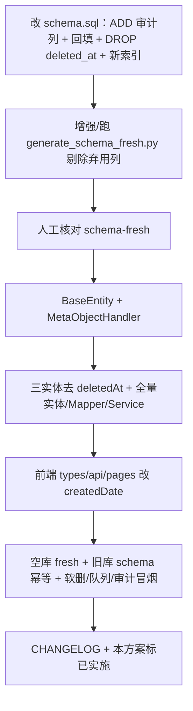

# 全表审计字段统一方案（is_deleted / created_by / updated_by / created_date / updated_date）

> 目标：所有业务表统一审计列；`schema.sql` 幂等升级；`schema-fresh.sql` 写最终形态；实体 / Mapper / MetaObjectHandler / 前端类型同步。  
> 关联：`backend/src/main/resources/db/schema.sql`、`schema-fresh.sql`、`common/model/BaseEntity.java`、`common/config/MyBatisPlusConfig.java`。  
> 状态：**已实施**（2026-07-15）。

---

## 一、已确认决策

| ID | 决策 |
|---|---|
| **A** | **废弃 `deleted_at`**。`ci_system` / `ci_repository` / `ci_user` 改为仅用 `is_deleted`；代码去掉 `@TableLogic(deleted_at)`；旧库回填后 `DROP COLUMN deleted_at` |
| **B** | API / Java / 前端 JSON 统一改为 `createdDate` / `updatedDate`（含筛参 `createdDateStart/End`） |
| **C** | 流水 / 日志表也挂统一 `BaseEntity`（含 `@TableLogic` on `isDeleted`） |
| **D** | `schema.sql` **永久保留**旧列 `created_at` / `updated_at`（只 ADD 新时间列 + 回填，不 RENAME/DROP 时间旧列） |
| **E** | 无登录态时 `created_by` / `updated_by` 一律 `'sys'`；后续接 Auth 再取当前用户 |

---

## 二、变更摘要

| 变更 | 类型 | 说明 |
|---|---|---|
| `is_deleted` | 新增 | `SMALLINT`（PG `int2`），默认 `0`，`0`=未删 / `1`=已删 |
| `created_by` | 新增 | `VARCHAR(100)`，默认 `'sys'` |
| `updated_by` | 新增 | `VARCHAR(100)`，默认 `'sys'` |
| `created_at` → `created_date` | 语义迁移 | 旧库 ADD + 回填，保留 `created_at`；新库只建 `created_date` |
| `updated_at` → `updated_date` | 语义迁移 | 同上；仅有 `created_at` 的表也补 `updated_date` |
| `deleted_at` | **废弃删除** | 仅原三表有；回填 `is_deleted` 后 DROP |

范围：**`schema.sql` / `schema-fresh.sql` 中全部 `CREATE TABLE` 表**（共 32 张业务表 + 审计列齐套，含当前无时间戳的 `ci_repository_publish_snapshot`）。

---

## 三、表清单与现状分类

| # | 表名 | 现有时间列 | 现有操作人 | 现有软删 |
|---|---|---|---|---|
| 1 | `ci_system` | created_at + updated_at | — | `deleted_at` → **改 is_deleted 后 DROP** |
| 2 | `ci_repository` | created_at + updated_at | — | `deleted_at` → **改 is_deleted 后 DROP** |
| 3 | `ci_prompt` | created_at + updated_at | — | — |
| 4 | `ci_scan_window` | created_at + updated_at | — | — |
| 5 | `ci_entry_scan_trial` | created_at + updated_at | — | — |
| 6 | `ci_task` | created_at + updated_at | — | — |
| 7 | `ci_file_snapshot` | 仅 created_at | — | — |
| 8 | `ci_ai_call_record` | 仅 created_at | — | — |
| 9 | `ci_draft_workspace` | created_at + updated_at | — | — |
| 10 | `ci_knowledge_draft` | created_at + updated_at | — | — |
| 11 | `ci_draft_revision` | 仅 created_at | — | — |
| 12 | `ci_draft_review_comment` | 仅 created_at | — | — |
| 13 | `ci_draft_source_reference` | 仅 created_at | — | — |
| 14 | `ci_knowledge_version` | 仅 created_at | — | — |
| 15 | `ci_knowledge_release_edit` | 仅 created_at | — | — |
| 16 | `ci_push_task` | 仅 created_at | — | — |
| 17 | `ci_token_usage_audit` | 仅 created_at | — | — |
| 18 | `ci_operation_log` | 仅 created_at | — | — |
| 19 | `ci_model` | created_at + updated_at | — | — |
| 20 | `ci_model_preset` | created_at + updated_at | — | — |
| 21 | `ci_method_call` | 仅 created_at | — | — |
| 22 | `ci_module_hierarchy` | created_at + updated_at | — | — |
| 23 | `ci_entrypoint` | created_at + updated_at | — | — |
| 24 | `ci_system_config` | 仅 updated_at | `updated_by VARCHAR(50)` | — |
| 25 | `ci_user` | created_at + updated_at | — | `deleted_at` → **改 is_deleted 后 DROP** |
| 26 | `ci_user_quota` | created_at + updated_at | — | — |
| 27 | `ci_repository_entrypoint` | created_at + updated_at | — | — |
| 28 | `ci_repository_module_hierarchy` | created_at + updated_at | — | — |
| 29 | `ci_repository_publish_snapshot` | 无（仅 published_at） | published_by | — |
| 30 | `ci_business_knowledge` | created_at + updated_at | `updated_by VARCHAR(64)` | — |
| 31 | `ci_method_function_binding` | created_at + updated_at | — | — |
| 32 | `ci_incremental_scan` | created_at + updated_at | — | — |

---

## 四、SQL 策略

### 4.1 原则

| 脚本 | 策略 |
|---|---|
| **`schema.sql`**（旧库幂等） | 时间旧列：只 `ADD` 新列 + 回填，**不** RENAME/DROP `created_at`/`updated_at`。软删：ADD `is_deleted` → 从 `deleted_at` 回填 → **`DROP COLUMN IF EXISTS deleted_at`** |
| **`schema-fresh.sql`**（新库） | CREATE 只含最终列：`created_date` / `updated_date` / `is_deleted` / `created_by` / `updated_by`；**无** `created_at`/`updated_at`/`deleted_at` |

生成：先改 `schema.sql`，再跑 `backend/scripts/generate_schema_fresh.py`，并剔除 fresh 中残留的弃用列（见 §4.5）。

### 4.2 每张表在 `schema.sql` 中的标准扩展模板

在既有 `CREATE TABLE`（**保留**原文中的 `created_at`/`updated_at` 定义）之后追加：

```sql
-- 审计字段扩展（幂等）
ALTER TABLE {table} ADD COLUMN IF NOT EXISTS created_date TIMESTAMP DEFAULT CURRENT_TIMESTAMP;
ALTER TABLE {table} ADD COLUMN IF NOT EXISTS updated_date TIMESTAMP DEFAULT CURRENT_TIMESTAMP;
ALTER TABLE {table} ADD COLUMN IF NOT EXISTS is_deleted   SMALLINT     DEFAULT 0 NOT NULL;
ALTER TABLE {table} ADD COLUMN IF NOT EXISTS created_by   VARCHAR(100) DEFAULT 'sys' NOT NULL;
ALTER TABLE {table} ADD COLUMN IF NOT EXISTS updated_by   VARCHAR(100) DEFAULT 'sys' NOT NULL;

UPDATE {table} SET created_date = COALESCE(created_date, created_at, CURRENT_TIMESTAMP);
UPDATE {table} SET updated_date = COALESCE(updated_date, updated_at, created_at, CURRENT_TIMESTAMP);

COMMENT ON COLUMN {table}.created_date IS '创建时间';
COMMENT ON COLUMN {table}.updated_date IS '更新时间';
COMMENT ON COLUMN {table}.is_deleted   IS '逻辑删除：0=未删除 1=已删除';
COMMENT ON COLUMN {table}.created_by   IS '创建人';
COMMENT ON COLUMN {table}.updated_by   IS '最后修改人';
```

**仅有 `created_at` 的表**：仍 ADD 全部 5 列；`updated_date` 用 `COALESCE(updated_date, created_at, CURRENT_TIMESTAMP)`。

**无时间列的表**（`ci_repository_publish_snapshot`）：ADD 5 列；可用 `published_at` 回填一次 `created_date`/`updated_date`。

**已有 `updated_by` 的表**（`ci_system_config`、`ci_business_knowledge`）：

```sql
ALTER TABLE ... ALTER COLUMN updated_by TYPE VARCHAR(100);
UPDATE ... SET updated_by = 'sys' WHERE updated_by IS NULL OR btrim(updated_by) = '';
ALTER TABLE ... ALTER COLUMN updated_by SET DEFAULT 'sys';
ALTER TABLE ... ALTER COLUMN updated_by SET NOT NULL;
-- 再 ADD created_by / is_deleted / created_date / updated_date（updated_by 已存在则跳过 ADD）
```

### 4.3 废弃 `deleted_at`（仅三表，schema.sql）

```sql
-- 1) 已通过标准模板 ADD is_deleted
-- 2) 回填历史软删
UPDATE ci_system SET is_deleted = 1 WHERE deleted_at IS NOT NULL;
UPDATE ci_repository SET is_deleted = 1 WHERE deleted_at IS NOT NULL;
UPDATE ci_user SET is_deleted = 1 WHERE deleted_at IS NOT NULL;

-- 3) 删除旧列与依赖索引
DROP INDEX IF EXISTS idx_user_role;  -- 原 WHERE deleted_at IS NULL，需重建
ALTER TABLE ci_system DROP COLUMN IF EXISTS deleted_at;
ALTER TABLE ci_repository DROP COLUMN IF EXISTS deleted_at;
ALTER TABLE ci_user DROP COLUMN IF EXISTS deleted_at;

-- 4) 重建用户角色索引（按 is_deleted）
CREATE INDEX IF NOT EXISTS idx_user_role ON ci_user (role) WHERE is_deleted = 0;
```

`CREATE TABLE IF NOT EXISTS` 原文中仍可暂时带 `deleted_at`（仅影响**首次**建表的极老路径）；段落末尾 `DROP COLUMN` 保证最终态无该列。更干净的做法：同步从三表 `CREATE TABLE` 正文中去掉 `deleted_at`（新库首次 CREATE 即无此列；旧库靠 DROP）。**推荐：CREATE 正文也去掉 `deleted_at`，与 fresh 一致。**

### 4.4 索引迁移（schema.sql）

现有依赖 `created_at` 的索引：

- `idx_task_queue ON ci_task (priority DESC, created_at ASC) WHERE status = 'PENDING'`
- `idx_audit_created_at ON ci_token_usage_audit (created_at)`
- `idx_op_created_at ON ci_operation_log (created_at)`

处理：

1. **新建**基于 `created_date` 的同语义索引（如 `idx_task_queue_by_created_date`、`idx_audit_created_date`、`idx_op_created_date`）。
2. **保留**旧 `created_at` 索引不删（满足「时间旧列不 DROP」；应用 SQL 全部切到 `created_date`）。
3. `idx_user_role` 按 §4.3 改为 `WHERE is_deleted = 0`。

### 4.5 `schema-fresh.sql` 与生成脚本

目标 CREATE 形态示例：

```sql
CREATE TABLE IF NOT EXISTS ci_task (
    ...
    is_deleted   SMALLINT     DEFAULT 0 NOT NULL,
    created_by   VARCHAR(100) DEFAULT 'sys' NOT NULL,
    updated_by   VARCHAR(100) DEFAULT 'sys' NOT NULL,
    created_date TIMESTAMP    DEFAULT CURRENT_TIMESTAMP NOT NULL,
    updated_date TIMESTAMP    DEFAULT CURRENT_TIMESTAMP NOT NULL
);
```

三表 **无** `deleted_at`。种子 DML（`ci_prompt` 等）列名改为 `created_date, updated_date`。

`generate_schema_fresh.py` 当前会合并 CREATE 原文 + ADD。若 CREATE 仍含 `created_at`，fresh 会双列并存。实施时：

- 在脚本增加弃用列剔除名单：`created_at`、`updated_at`、`deleted_at`；或  
- 生成后删掉 fresh 中所有表的这三列定义。

---

## 五、Java 代码改造

### 5.1 扩展 `BaseEntity`（核心）

```java
@Data
public class BaseEntity {

    @TableLogic(value = "0", delval = "1")
    @TableField(fill = FieldFill.INSERT)
    private Integer isDeleted;

    @TableField(fill = FieldFill.INSERT)
    private String createdBy;

    @TableField(fill = FieldFill.INSERT_UPDATE)
    private String updatedBy;

    @TableField(fill = FieldFill.INSERT)
    private LocalDateTime createdDate;

    @TableField(fill = FieldFill.INSERT_UPDATE)
    private LocalDateTime updatedDate;
}
```

- 已继承 `BaseEntity` 的实体：删除子类里重复的 `createdAt`/`updatedAt`；**删除** `deletedAt` 字段及 `@TableLogic`。
- 未继承者：优先改为 `extends BaseEntity`；否则就地改名为 `createdDate`/`updatedDate` 并补齐三字段。

### 5.2 `MetaObjectHandler`（`MyBatisPlusConfig`）

```java
// insert
strictInsertFill(..., "isDeleted", Integer.class, 0);
strictInsertFill(..., "createdBy", String.class, "sys");
strictInsertFill(..., "updatedBy", String.class, "sys");
strictInsertFill(..., "createdDate", LocalDateTime.class, LocalDateTime.now());
strictInsertFill(..., "updatedDate", LocalDateTime.class, LocalDateTime.now());

// update
strictUpdateFill(..., "updatedBy", String.class, "sys");
strictUpdateFill(..., "updatedDate", LocalDateTime.class, LocalDateTime.now());
```

预留 `currentUserOrSys()`；MVP 恒返回 `'sys'`。

### 5.3 原 `deleted_at` 三实体（必改）

| 实体 | 改动 |
|---|---|
| `SystemApplication` | 删除 `deletedAt` + `@TableLogic`；依赖基类 `isDeleted` |
| `CodeRepository` | 同上 |
| `UserAccount` | 同上 |

Service 注释从「写 `deleted_at`」改为「`removeById` → `is_deleted=1`」：

- `CodeRepositoryServiceImpl`
- `SystemApplicationServiceImpl`

任何 `WHERE deleted_at IS NULL` / `deletedAt == null` 的手写条件改为 `is_deleted = 0` / `isDeleted == 0`（优先交给 MP 自动追加）。

### 5.4 手写 SQL / Mapper

| 文件 | 改动 |
|---|---|
| `EntrypointMapper.java` | `created_at/updated_at` → `created_date/updated_date` |
| `MethodCallMapper.java` | 同上 |
| `ModuleHierarchyNodeMapper.java` | INSERT / UPSERT / inherit 复制列 |
| `MethodFunctionBindingMapper.java` | UPSERT 的 `updated_at` → `updated_date` |
| `TokenUsageAuditMapper.java` | 聚合 SQL `created_at` → `created_date` |

全局：`::getCreatedAt` → `::getCreatedDate`；`createdAtStart` → `createdDateStart`（Controller 入参同步）。

### 5.5 实体核对清单（补审计 / 改继承）

`CodeFileSnapshot`, `MethodCall`, `OperationLog`, `AiCallRecord`, `TokenUsageAudit`, `DraftReviewComment`, `PushTask`, `KnowledgeVersion`, `KnowledgeReleaseEditEntity`, `DraftRevision`, `DraftSourceReference`, `DraftWorkspace`, `KnowledgeDraft`, `ModuleHierarchyNode`, `MethodFunctionBinding`, `EntrypointEntity`, `IncrementalScanRecord`, `RepositoryEntrypointEntity`, `RepositoryModuleHierarchyNode`, `SystemConfig`, `RepositoryPublishSnapshot`，以及已继承基类的 `DecompileTask` / `DecompilePrompt` / `ScanWindowEntity` / `AiModel` / `AiModelPreset` / `UserQuota` / `BusinessKnowledge` / `EntryScanTrialEntity` / `CodeRepository` / `SystemApplication` / `UserAccount`。

`SystemConfig` / `BusinessKnowledge`：去掉与基类重复的 `updatedBy`/`updatedAt` 声明，统一用基类字段。

---

## 六、前端与 API 契约

- JSON：`createdAt` → `createdDate`，`updatedAt` → `updatedDate`。
- 查询参数：`createdAtStart` / `createdAtEnd` → `createdDateStart` / `createdDateEnd`。
- 触及：`frontend/src/types/index.ts`、`api/task.ts`、`api/draft.ts`、`pages/tasks/*`、`pages/logs`、`pages/systems/*`、`pages/token-audit`、`pages/knowledge/*` 等（以 grep `createdAt|updatedAt` 清零为门禁）。
- `isDeleted` / `createdBy` / `updatedBy`：TS 类型可选字段即可，管理端列表默认不展示。

---

## 七、特殊表注意点

1. **`ci_system_config`**：补全套审计列；`updated_by` 加宽到 100。
2. **`ci_business_knowledge`**：`updated_by` 加宽到 100；与 BaseEntity 合并。
3. **`ci_repository_publish_snapshot`**：补 5 列；保留 `published_at` / `published_by` 业务语义。
4. **流水表**（`ci_operation_log`、`ci_token_usage_audit`、`ci_ai_call_record` 等）：同样有 `is_deleted`；业务不主动逻辑删，查询由 MP 自动过滤 `is_deleted=0`。
5. **种子 / UPSERT**：`ci_prompt` INSERT、`ci_model` 的 `updated_at = CURRENT_TIMESTAMP` → `updated_date`。

---

## 八、实施步骤



1. 改 `schema.sql` 全表模板；三表 DROP `deleted_at`；索引与种子 DML。  
2. 生成并核对 `schema-fresh.sql`（无 `created_at`/`updated_at`/`deleted_at`）。  
3. `BaseEntity` + `MyBatisPlusConfig`。  
4. 领域实体 / Mapper / Service；三表软删切 `is_deleted`。  
5. 前端类型与引用。  
6. 验证：  
   - 空库 `schema-fresh` 启动；  
   - 旧库 `schema.sql` 二次启动幂等；  
   - 系统/仓库/用户软删后列表不可见；  
   - 任务队列排序、Token 按日聚合正常。  
7. `CHANGELOG.md`；本方案状态改为「已实施」。

---

## 九、门禁（实施完成定义）

- [ ] `schema.sql` / `schema-fresh.sql` 全表具备 5 审计列  
- [ ] `schema-fresh` 与三表 CREATE **无** `deleted_at`；旧库 DROP 后无该列  
- [ ] `schema-fresh` **无** `created_at`/`updated_at`（仅 `*_date`）  
- [ ] Java 无 `deletedAt` / `@TableLogic` 指向 `deleted_at`  
- [ ] 手写 SQL grep `created_at|updated_at|deleted_at` 清零（或仅出现在 schema.sql 旧列兼容段）  
- [ ] 前端 grep `createdAt|updatedAt` 清零（业务字段如 `publishedAt` 除外）  
- [ ] 软删 / 任务列表时间筛 / Token 审计冒烟通过  

---

## 十、风险与回滚

| 风险 | 缓解 |
|---|---|
| DROP `deleted_at` 后无法按删除时刻审计 | 接受；若需删除时间可二期加 `deleted_date`（本方案不加） |
| 未回填就 DROP，历史软删行重新可见 | **必须先** `UPDATE is_deleted=1 WHERE deleted_at IS NOT NULL` 再 DROP |
| 双时间列，代码只写新列 | 可接受；不做触发器同步 |
| 前端仍读 `createdAt` | grep 清零 + 联调 |

回滚：应用回退；DB 新列可留。`deleted_at` 一旦 DROP，回滚需从备份恢复该列（实施前建议本地库可重置）。

---

## 十一、工作量粗估

| 块 | 量级 |
|---|---|
| schema.sql + DROP deleted_at + 索引 + 种子 | 中 |
| schema-fresh 生成/剔列 | 小–中 |
| BaseEntity + Handler + 三表软删 | 小 |
| ~25 实体 + 5 Mapper + Service | 中–大 |
| 前端 types/api/pages | 中 |
| 联调 | 中 |
