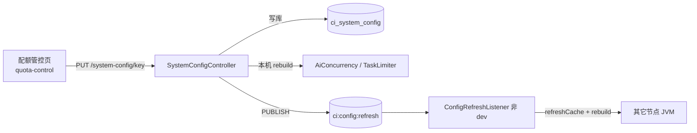
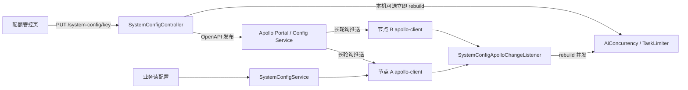

# `ci_system_config` → Apollo 迁移方案

> 目标：运行期系统配置从 PostgreSQL `ci_system_config` 迁到 Apollo；**页面仍可改配置**；集群多节点靠 **Apollo 变更监听** 同步；**删除 Redis Pub/Sub 配置广播**（`ci:config:refresh`）。  
> 关联：[`dual-team-migration-plan.html`](./dual-team-migration-plan.html) §4 Apollo；现状代码 `SystemConfigController` / `SystemConfigServiceImpl`。  
> 状态：**方案待确认**（未实施）。  
> **前置已完成**（2026-07）：公司环境不支持 Redis Pub/Sub，已按 [`system-config-redis-cache-plan.md`](./system-config-redis-cache-plan.md) 下线 `ConfigRefreshPublisher` / `ConfigRefreshListener`，改为 Redis 值缓存 `ci:config:kv:*`。本 Apollo 方案若推进，在该基线上改权威源即可，**无需再恢复 Pub/Sub**。

---

## 一、结论摘要

| 项 | 决策 |
|---|---|
| 配置权威源 | Apollo（namespace 见 §3） |
| 页面改配置 | 保留 `/basic/quota-control`；后端 `PUT /system-config/{key}` 改为写 Apollo，不再写 DB |
| 多节点同步 | Apollo `ConfigChangeListener`；**去掉** `ConfigRefreshPublisher` / `ConfigRefreshListener` / `RedisMessageListenerContainer`（若仅为此存在） |
| 本机热更新副作用 | 监听回调里 `rebuild` `ai.concurrency` / `task.concurrency`（替代原 Redis Listener） |
| `ci_system_config` | 迁移完成后废弃读路径；表可保留一段时间只读/停写，择机 DROP |
| Redis 其它能力 | Leader / 分布式 permits / 草稿锁等**不动**（与本方案无关；后续「统一缓存」另案） |

---

## 二、现状与问题

### 2.1 当前链路



| 组件 | 路径 | 作用 |
|---|---|---|
| 页面 | `frontend/src/pages/basic/quota-control/index.tsx` | 改全局限流 / AI 并发 |
| API | `GET/PUT /api/system-config` | 读写 `ci_system_config` |
| 缓存 | `SystemConfigServiceImpl` `ConcurrentHashMap` | 启动加载；写后本机 `refreshCache` |
| 广播 | `ConfigRefreshPublisher` → Redis channel `ci:config:refresh` | 通知其它节点刷缓存 |
| 订阅 | `ConfigRefreshListener`（`env≠dev`） | `refreshCache` + 按 key rebuild 并发闸门 |
| 容器 | `RedisClusterConfig#redisMessageListenerContainer` | 仅服务上述订阅 |

### 2.2 配置 Key 清单

| Key | 页面可见 | 后端消费方 | 默认建议 |
|---|---|---|---|
| `token.limit-enabled` | 是 | `QuotaCheckService`；**另** `AiSummaryServiceImpl` 用 `@Value` | `true` |
| `token.task-limit` | 是 | `AiSummaryServiceImpl` `@Value` | `100000` |
| `token.system-monthly-limit` | 是 | `AiSummaryServiceImpl` `@Value` | `1000000` |
| `ai.concurrency` | 是 | `AiConcurrencyService` ← `SystemConfigService` | `4` |
| `task.concurrency` | **否**（仅后端） | `TaskConcurrencyLimiter` ← `SystemConfigService` | `2` |

### 2.3 已知双源问题（本方案一并收敛）

- 页面写入 `ci_system_config` 的 `token.*`，但任务内 Token 阻断读的是 `AiSummaryServiceImpl` 的 `@Value("${code-insight.token.*}")`（启动时固化）。
- 迁移后：**所有运行期可读配置统一经 `SystemConfigService`（底层 Apollo）**；`AiSummaryServiceImpl` 去掉对上述三项的字段级 `@Value`，改为运行时 `getBoolean` / `getInt`。

---

## 三、目标架构



要点：

1. **读**：`SystemConfigService` 从 Apollo 客户端取当前值（不再维护自建 ConcurrentHashMap 刷库，或仅作薄封装）。
2. **写（页面）**：Controller 调 Apollo OpenAPI（或公司封装的配置发布 SDK）更新并发布；**不写 PostgreSQL**；**不发 Redis PUBLISH**。
3. **写（Portal）**：运维在 Apollo Portal 改同一 namespace，各节点同样走变更监听，与页面路径等价。
4. **副作用**：变更监听里对 `ai.concurrency` / `task.concurrency` 调用现有 `rebuild` / `rebuildGlobal`；写请求所在节点可同步 rebuild（与今日 Controller 行为一致），其它节点只依赖监听。

---

## 四、Apollo 落位约定

与双团队迁移方案对齐，建议独立 namespace（便于权限与发布）：

| 项 | 建议值 |
|---|---|
| AppId | 与 CodeInsight 应用一致（征信组资源岗申请） |
| Namespace | `code-insight.runtime`（properties） |
| 环境 | `DEV` / `TEST` / `PRO`（本地可用 `application-local` 旁路，见 §7） |

### 4.1 Key 映射（保持业务 key 不变）

Apollo 内直接使用与现网相同的业务 key（便于页面与代码零改名）：

```properties
token.limit-enabled = true
token.task-limit = 100000
token.system-monthly-limit = 1000000
ai.concurrency = 4
task.concurrency = 2
```

可选：若公司规范要求带前缀，可用 `code-insight.token.limit-enabled`，则在 `SystemConfigService` 做一层别名映射；**默认不改名**，降低页面与文档成本。

### 4.2 元数据（description / updatedBy）

Apollo 原生无「description / updatedBy」列语义：

| 字段 | 处理 |
|---|---|
| `description` | 前端可继续传；后端写入 Apollo 时忽略，或写入注释/旁路文档表；列表接口可用代码内静态 `CONFIG_META` 字典回填 label/help |
| `updatedBy` / `updatedDate` | 取 Apollo 发布信息（若 OpenAPI 可返回）；否则返回空，页面弱化展示 |
| 操作审计 | 写路径打 `ci_operation_log`：`action_type=SYSTEM_CONFIG_UPDATE`，body 含 key/value/operator |

---

## 五、页面操作配置变更（写路径）

### 5.1 前端

- 页面：`frontend/src/pages/basic/quota-control/index.tsx` **交互保持**（Switch / InputNumber → `putSystemConfig`）。
- API：`frontend/src/api/system-config.ts` 路径不变。
- 建议补齐：`task.concurrency` 表单项（与后端真实闸门一致），避免只能 Portal 改任务并发。

### 5.2 后端 `PUT /system-config/{key}`

伪流程：

```text
1. 校验 key ∈ 白名单（§2.2）；value 类型/范围校验（int≥0、boolean 等）
2. 调用 Apollo OpenAPI：创建或更新 item → 发布 namespace（或按公司规范「灰度/发布」）
3. 本机：对 ai.concurrency / task.concurrency 立即 rebuild（体验一致）
4. 写操作日志
5. 返回 success
# 不再：写 ci_system_config、convertAndSend(ci:config:refresh)
```

依赖：征信组提供 **Apollo OpenAPI 地址、token、appId、env、cluster、namespace、发布权限**（与双团队方案「资源与配置」岗一致）。

### 5.3 `GET /system-config` / `GET /{key}`

- 从 Apollo 当前生效配置组装 `SystemConfig` DTO（key/value + 静态 description）。
- 无 Apollo（本地旁路）时读本地 fallback 文件/环境变量（§7）。

---

## 六、Apollo 变更监听（替代 Redis 广播）

### 6.1 删除清单

| 删除/停用 | 说明 |
|---|---|
| `ConfigRefreshPublisher` | 整类删除 |
| `ConfigRefreshListener` | 整类删除 |
| `SystemConfigController` 内 `configRefreshPublisher.publish` | 删除调用 |
| `RedisClusterConfig#redisMessageListenerContainer` | **若无其它订阅者则整 Bean 删除**（当前仓库仅此一处） |

文档同步：`CLAUDE.md` / `cluster-shared-storage-design.md` 中「配置广播 `ci:config:refresh`」改为「Apollo ConfigChangeListener」。

### 6.2 新增监听器

建议类名：`SystemConfigApolloChangeListener`（`common/cluster` 或 `modules/quotacontrol`）。

行为对齐原 `ConfigRefreshListener.onMessage`：

```text
onChange(changeEvent):
  for each changed key:
    if key == ai.concurrency (或 *) → aiConcurrencyService.rebuild(getInt(...))
    if key == task.concurrency (或 *) → taskConcurrencyLimiter.rebuildGlobal(getInt(...))
  # token.* 无本地 Semaphore；下次检查自动读新值即可
  # 若 AiSummary 仍缓存字段则必须在此刷新 —— 本方案改为每次读 SystemConfigService，无需缓存
```

实现要点：

- 使用 Apollo Java Client：`ConfigService.getConfig(namespace).addChangeListener(...)`，或 Spring 生态 `@ApolloConfigChangeListener`。
- **dev 单机**：若启用 Apollo，同样挂监听；若走本地旁路（无客户端），则无监听，仅依赖 PUT 本机 rebuild（与今日 dev 不装 Redis Listener 等价）。
- 监听线程勿做阻塞长事务；rebuild 保持现有 `synchronized` 短临界区。

### 6.3 读路径改造 `SystemConfigService`

| 方法 | 新行为 |
|---|---|
| `getString/getInt/getBoolean` | 读 Apollo（或 Spring `Environment` 若 Apollo 已注入） |
| `putString` | 改为写 Apollo OpenAPI + 发布；**禁止写 DB** |
| `listAll` | 枚举白名单 key，批量从 Apollo 取值 |
| `refreshCache` | 删除或改为 no-op / 触发客户端强制拉取（一般不需要） |
| MyBatis `SystemConfig` / Mapper | 业务路径停用；实体可暂留避免大爆改，或改为纯 DTO |

---

## 七、本地 / 环境策略

| 环境 | 读 | 写（页面） | 监听 |
|---|---|---|---|
| 公司 TEST/PRO | Apollo | Apollo OpenAPI | 必须 |
| 本地 `code-insight.env=dev` | 优先 Apollo（若已配）；否则 `application-local` / 本地 properties 旁路 | 旁路写本地文件或仅内存（开发便利）；或禁用写并提示用 Portal | 有 Apollo 则挂；旁路则 PUT 本机 rebuild |
| 单测 | `application-test.yml` 静态值 / mock `SystemConfigService` | mock | 无 |

原则：**生产路径不读写 `ci_system_config`**；本地旁路不得误连生产 Apollo。

---

## 八、表与数据迁移

### 8.1 一次性导入

1. 从现网导出：`SELECT key, value, description FROM ci_system_config WHERE is_deleted = 0`（或等价）。
2. 录入 Apollo `code-insight.runtime`（TEST → 验证 → PRO）。
3. 与 §2.2 白名单 diff：缺 key 补默认；多余 key 评估后归档。

### 8.2 表废弃节奏

| 阶段 | 动作 |
|---|---|
| T0 方案确认 | Apollo namespace 就绪；OpenAPI 凭证到位 |
| T1 双写（可选，建议跳过） | 若需回滚保险可短暂双写；默认 **直接切读 Apollo** |
| T2 切流 | 代码上线：读/写 Apollo + 监听；删除 Redis 广播 |
| T3 停表 | 应用不再访问表；Bettle/schema 标记废弃 |
| T4 清理 | `DROP TABLE ci_system_config`（新库 `schema-fresh.sql` 同步删除） |

回滚：保留上一版 JAR + 重新启用 DB 实现分支（或 feature flag `code-insight.config-source=db|apollo`），Apollo 导入值可逆推回表。

---

## 九、代码改造清单（实施时）

### 后端

1. 引入 `apollo-client`（公司白名单 / BOM，见双团队方案 JAR 适配）。
2. 重写 `SystemConfigServiceImpl`（Apollo 读 + OpenAPI 写）。
3. 新增 `SystemConfigApolloChangeListener`。
4. 精简 `SystemConfigController`：去掉 Redis publish；保留本机 rebuild。
5. 删除 `ConfigRefreshPublisher`、`ConfigRefreshListener`；删除无用的 `RedisMessageListenerContainer` Bean。
6. `AiSummaryServiceImpl`：`token.*` 改为运行时读 `SystemConfigService`。
7. `schema.sql` / `schema-fresh.sql`：T3/T4 阶段处理表；注释更新。
8. 操作日志埋点。

### 前端

1. 配额页可选增加 `task.concurrency`。
2. 文案提示：配置由配置中心生效，集群约数秒内一致（以 Apollo 推送为准）。
3. API 契约不变则页面几乎无感。

### 文档

1. 更新 `CLAUDE.md` 集群条目、`cluster-shared-storage-design.md` 配置广播行。
2. 双团队方案 §4 可链到本文作为 runtime KV 细则。

---

## 十、验收标准

| # | 场景 | 期望 |
|---|---|---|
| 1 | 页面改 `ai.concurrency` | Apollo 可见新值；本机与其它节点 rebuild；并发上限按新值生效 |
| 2 | Portal 改 `task.concurrency` | 各节点监听触发 rebuild；无需打页面 |
| 3 | 页面改 `token.limit-enabled=false` | 用户额度检查与任务 Token 阻断均跳过（双源已统一） |
| 4 | 抓 Redis | **无** `PUBLISH ci:config:refresh` |
| 5 | 进程无 `RedisMessageListenerContainer` 订阅（若 Bean 已删） | 无相关订阅日志 |
| 6 | DB | 业务写路径零 UPDATE/INSERT `ci_system_config` |
| 7 | 杀一节点后改配置再拉起 | 新节点启动即拉到最新 Apollo 值 |

---

## 十一、风险与对策

| 风险 | 对策 |
|---|---|
| OpenAPI 发布延迟 / 权限失败 | PUT 失败直接报错；页面不假装成功；监控发布 API |
| Apollo 不可用 | 启动失败策略与公司规范对齐；本地旁路不影响开发 |
| 监听漏接 rebuild | 单测/联调覆盖 concurrency 两个 key；集群两实例对照 |
| 配置 key 漂移 | 白名单枚举 + listAll 只暴露白名单 |
| 误删 Redis 其它能力 | 仅删 Pub/Sub 广播相关类；permits/leader/锁保留 |

---

## 十二、与「统一缓存」边界

本方案**只**去掉「配置变更 Redis 广播」。  
草稿锁、Leader、`ci:permits:*` 等仍用现有 Redis / 后续统一缓存对接（见双团队迁移方案），不在本文范围。

---

## 十三、待确认项

| ID | 问题 | 建议默认 |
|---|---|---|
| A | Namespace 名是否用 `code-insight.runtime` | 是 |
| B | 业务 key 是否保持 `token.*` / `ai.concurrency` 不改名 | 是 |
| C | 是否做 DB↔Apollo 双写过渡期 | **否**，直接切流 + 可回滚 flag |
| D | 本地 dev 是否强制连 Apollo | 否，允许 properties 旁路 |
| E | 页面是否补 `task.concurrency` | 是 |
| F | `ci_system_config` DROP 时机 | 切流稳定一个迭代后 |

确认后按 §九 实施；本文状态改为「方案已确认，待实施」。
