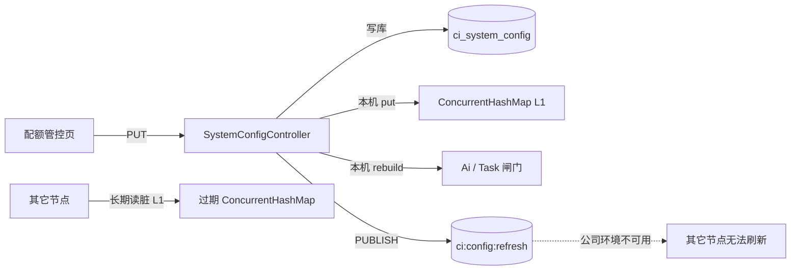
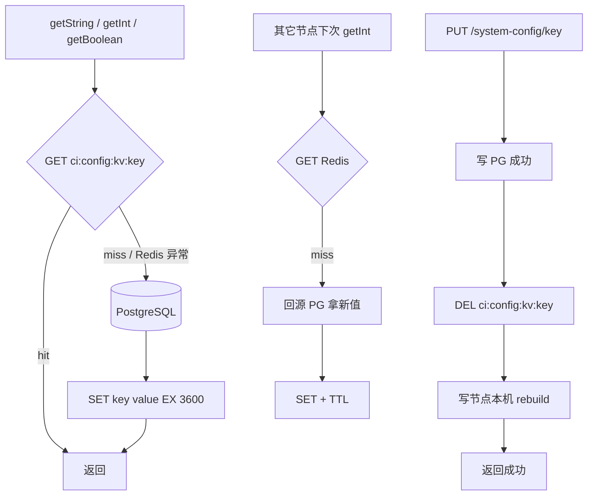

# `ci_system_config` Redis 值缓存整改方案

> 目标：运行期配置改为 **PostgreSQL 权威 + Redis 值缓存（读穿 / 写后失效）**；**去掉** 对 Redis Pub/Sub（`ci:config:refresh`）的依赖。  
> 背景：公司环境不支持 Redis 消息发布，现有集群配置广播不可用。  
> 关联：实施代码 `SystemConfigServiceImpl`；远期可选 [`system-config-apollo-migration-plan.md`](./system-config-apollo-migration-plan.md)。  
> 状态：**已实施**（2026-07-21）。

---

## 一、已确认决策

| 项 | 决策 |
|---|---|
| 权威源 | PostgreSQL `ci_system_config`（不变） |
| 运行时读缓存 | Redis String：`ci:config:kv:{key}` |
| JVM L1 `ConcurrentHashMap` | **去掉**（方案 A：无本地长缓存） |
| 写策略 | 写 PG 成功 → `DEL` Redis key（不写穿） |
| TTL | **1 小时**（兜底；主一致靠写后 DEL） |
| 双删 / 延迟二次 DEL | **不做** |
| Redis Pub/Sub | **同步下线**（删除 Publisher / Listener / 仅为其服务的 ListenerContainer） |
| `listAll` / 管理端 `GET /{key}` | 继续直读 PG |
| 写节点本机 `rebuild` | **保留**（`ai.concurrency` / `task.concurrency`） |
| 其它 Redis 能力 | Leader / 分布式 permits / 草稿锁等**不动** |

---

## 二、整改动机

### 2.1 现状问题



| 组件 | 路径 | 现状 |
|---|---|---|
| 运行时读 | `SystemConfigServiceImpl#getString` 等 | 只读 JVM `ConcurrentHashMap` |
| 启动加载 | `@PostConstruct` → `refreshCache()` | 全表灌内存 |
| 写 | `putString` | 写 PG + 本机 `cache.put` |
| 广播 | `ConfigRefreshPublisher` → `ci:config:refresh` | **公司环境不支持 PUBLISH** |
| 订阅 | `ConfigRefreshListener`（`env≠dev`） | 依赖 Pub/Sub；失效后多节点永久脏缓存 |

### 2.2 为何不用双删

经典双删（写前删 + 写后延迟再删）用于高并发读穿回填脏数据。本表：

- 写极少（管理页手工改）
- key 很少（个位数）
- 读 QPS 相对业务主路径不高

**写 PG → 单次 DEL + TTL 1h 兜底** 足够；不做双删与延迟二次 DEL。

---

## 三、目标架构



### 3.1 多节点对齐（无消息）

集群模式下：

- `AiConcurrencyService#tryAcquire`：**每次** `systemConfigService.getInt("ai.concurrency", …)` 取上限
- `TaskConcurrencyLimiter#tryAcquireCluster`：**每次** `getInt("task.concurrency", …)` 取上限

因此去掉 JVM L1 后，配置变更在其它节点的生效点是 **下一次读配置 / 抢许可**，无需 Pub/Sub。

单机 `dev`（本地 Semaphore）：仍依赖写节点 Controller 内的 `rebuild` 即时生效（与现网一致）。

### 3.2 一致性边界（需接受）

| 场景 | 行为 |
|---|---|
| 写成功、Redis DEL 成功 | 下一读 miss → PG 新值；最终一致延迟 ≈ 一次 Redis RTT |
| 写成功、DEL 失败 | 最坏旧值留到 TTL（1h）；打 error 日志，可人工 `DEL` |
| Redis 整挂 | 读降级直连 PG；写仍成功，DEL 失败仅记日志 |
| 读穿与写并发 | 极低概率短暂旧值回填；TTL 自愈；本表不引入双删 |

---

## 四、Redis 约定

| 项 | 值 |
|---|---|
| Key 模板 | `ci:config:kv:{key}` |
| 值类型 | String（与表 `value` 一致，已截断至 `DbStringLimits.CONFIG_VALUE`） |
| TTL | `Duration.ofHours(1)` |
| 读 miss | 回源 PG 后 `SET … EX 3600` |
| 写后 | 仅 `DELETE`，不写穿 |
| 降级 | Redis 异常：`get` 当 miss 走 PG；`delete`/`set` 打 debug/warn，不抛给业务 |

实现风格对齐现有 meta 缓存：`BusinessKnowledgeServiceImpl` 的 `getCache` / `putCache` / `evictCache`（异常降级、不挡主路径）。

**不缓存**：

- `listAll()`（管理列表）
- Controller `GET /{key}`（`getById`，管理详情）

---

## 五、接口与行为变更

### 5.1 `SystemConfigService`

| 方法 | 变更后行为 |
|---|---|
| `getString(key)` | Redis GET → miss 则 PG → SET Redis；无 JVM map |
| `getInt` / `getBoolean` | 仍基于 `getString` 解析 |
| `putString(...)` | 写 PG → `DEL ci:config:kv:{key}`；**不再** `cache.put` |
| `listAll()` | 仍直读 PG |
| `refreshCache()` | **删除接口方法**（或标 `@Deprecated` 空实现一迭代后删）。无全表灌内存场景 |

启动：`@PostConstruct init` / `refreshCache` **删除**，不再预热全表（首次 `get*` 时按需读穿即可）。若希望降低冷启动首读延迟，可选「启动异步预热」——**本方案默认不做**，保持简单。

### 5.2 `SystemConfigController#put`

保留顺序：

1. `putString`（内部：PG + DEL Redis）
2. 若 `ai.concurrency` → `aiConcurrencyService.rebuild(...)`
3. 若 `task.concurrency` → `taskConcurrencyLimiter.rebuildGlobal(...)`
4. **删除** `configRefreshPublisher.publish(key)` 及依赖注入

### 5.3 下线清单（Pub/Sub）

| 产物 | 动作 |
|---|---|
| `common/cluster/ConfigRefreshPublisher.java` | **整类删除** |
| `common/cluster/ConfigRefreshListener.java` | **整类删除** |
| `SystemConfigController` 中 Publisher 注入与 `publish` 调用 | **删除** |
| `RedisClusterConfig#redisMessageListenerContainer` | **若无其它订阅者则整 Bean / 类删除**（当前仓库仅 Listener 使用） |

验证：全仓检索 `ci:config:refresh`、`ConfigRefreshPublisher`、`ConfigRefreshListener`、`RedisMessageListenerContainer` 应为零引用（测试 mock 除外）。

---

## 六、实现要点（伪代码）

```text
// SystemConfigServiceImpl

static final String REDIS_KEY_PREFIX = "ci:config:kv:";
static final Duration REDIS_TTL = Duration.ofHours(1);

String getString(String key) {
  if (key == null) return null;
  String cached = redisGet(REDIS_KEY_PREFIX + key);  // 异常 → null
  if (cached != null) return cached;
  SystemConfig row = getById(key);                   // MyBatis / PG
  if (row == null || row.getValue() == null) return null;
  redisSet(REDIS_KEY_PREFIX + key, row.getValue(), REDIS_TTL);  // 异常忽略
  return row.getValue();
}

void putString(String key, String value, String description, String updatedBy) {
  // 现有：截断、insert/updateById
  persistToPg(...);
  redisDelete(REDIS_KEY_PREFIX + key);               // 异常记日志，不回滚 PG
}
```

注意：

- `getString` 返回的是库中文本；缺失 key 返回 `null`（与现语义一致）。
- 空字符串是否缓存：建议 **允许缓存空串**（若业务存在空值）；若与 meta 缓存「blank 当 miss」冲突，本配置表以「有行即缓存」为准，用 Redis 特殊占位或直接 SET 空串均可，**实施时选：有 `value` 字段则 SET，含空串；无行不 SET**。
- 写路径不要在 DEL 失败时回滚 PG（权威源已正确；缓存脏靠 TTL）。

---

## 七、测试计划

| # | 用例 | 期望 |
|---|---|---|
| 1 | 冷启动后首次 `getString` | Redis miss → PG → Redis 有 key 且 TTL≈1h |
| 2 | 二次 `getString` | 仅 Redis，无额外 SELECT（可用日志/埋点或集成测断言） |
| 3 | `putString` 后 | PG 新值；Redis key 不存在；再 `getString` 得新值并回填 |
| 4 | Redis 只读故障模拟 | `getString` 仍返回 PG 值；不抛未捕获异常 |
| 5 | 写后 DEL 失败模拟 | PG 已更新；服务返回成功；日志有 warn/error |
| 6 | 集群两节点（无 Pub/Sub） | 节点 A PUT；节点 B 下一次 `getInt` / tryAcquire 用新上限 |
| 7 | 改 `ai.concurrency` / `task.concurrency` | 写节点本机 rebuild 生效；对端靠读穿新 max |
| 8 | 回归 | `listAll`、管理端 GET、配额页 PUT 行为与前端不变 |
| 9 | 静态检查 | 无 `PUBLISH` / 无 `ci:config:refresh` 代码路径 |

单测建议：对 `SystemConfigServiceImpl` mock `StringRedisTemplate` + Mapper，覆盖 hit / miss / put+evict / Redis 异常降级。集成测需本地 PG + Redis（与现有后端测试约定一致）。

---

## 八、文档与周边同步（实施时一并改）

| 文档 / 说明 | 改法 |
|---|---|
| `CLAUDE.md` 集群段 | 「配置变更通过 Pub/Sub `ci:config:refresh` 广播」→「配置值缓存 Redis `ci:config:kv:*`，写后 DEL；无 Pub/Sub」 |
| `docs/cluster-shared-storage-design.md` | 配置广播行改为值缓存说明 |
| `CHANGELOG.md` | 记一条整改说明（实施提交时） |
| `docs/system-config-apollo-migration-plan.md` | 文首加注：Pub/Sub 已由本方案下线；Apollo 方案若推进，在「无 Pub/Sub + Redis KV」基线上改权威源为 Apollo |

前端：`quota-control` / `api/system-config.ts` **无需改**（API 契约不变）。

---

## 九、实施任务拆分

| 序号 | 任务 | 产出 |
|---|---|---|
| T1 | 重写 `SystemConfigServiceImpl`（Redis 读穿 + 写后 DEL；删 JVM map / `refreshCache`） | 服务实现 |
| T2 | 调整 `SystemConfigService` 接口（去掉或废弃 `refreshCache`） | 接口 |
| T3 | `SystemConfigController` 去掉 Publisher | Controller |
| T4 | 删除 `ConfigRefreshPublisher`、`ConfigRefreshListener`；清理 `RedisClusterConfig` | 下线 Pub/Sub |
| T5 | 单测 / 必要集成验证 | 测试 |
| T6 | 同步 CLAUDE / cluster 设计文档 / Apollo 方案注记 | 文档 |

建议提交粒度：T1–T4 一个功能提交；T5 可同提交；T6 可同提交或随文档提交。

---

## 十、验收标准

1. 运行时配置读路径：**Redis → miss 则 PG → 回填 Redis**；进程内无长期 `ConcurrentHashMap` 配置缓存。  
2. 写路径：**PG 更新成功后 DEL 对应 Redis key**；写节点仍 rebuild 并发闸门。  
3. 代码与配置中 **不再出现** `ci:config:refresh` / `ConfigRefreshPublisher` / `ConfigRefreshListener`。  
4. `RedisMessageListenerContainer` 若无其它订阅者则已删除。  
5. 公司禁 Pub/Sub 环境下，多节点靠读穿对齐；不依赖消息通道。  
6. Redis 故障时配置读仍可用（降级 PG）。

---

## 十一、与 Apollo 方案的关系

| | 本方案（当前） | Apollo 迁移方案（远期） |
|---|---|---|
| 权威源 | PostgreSQL | Apollo |
| 多节点同步 | Redis KV 读穿 | Apollo `ConfigChangeListener` |
| Pub/Sub | 删除 | 删除（已提前完成） |
| 页面改配置 | 仍写 PG | 改为写 Apollo |

本方案是 **公司禁 Pub/Sub 下的立即整改**；不阻塞、也不替代 Apollo。若后续切 Apollo，删除的是「读 PG / 写 PG / Redis KV」，Listener 改为 Apollo，**无需再恢复 Pub/Sub**。

---

## 十二、确认记录

| 问题 | 结论 | 日期 |
|---|---|---|
| 缓存形态 | A：无 JVM L1，仅 Redis→PG | 2026-07-21 |
| Pub/Sub | 同步下线 | 2026-07-21 |
| 写策略 | 写 PG 后单次 DEL；TTL 1h；无双删 | 2026-07-21 |
| `listAll` | 直读 PG | 2026-07-21 |
