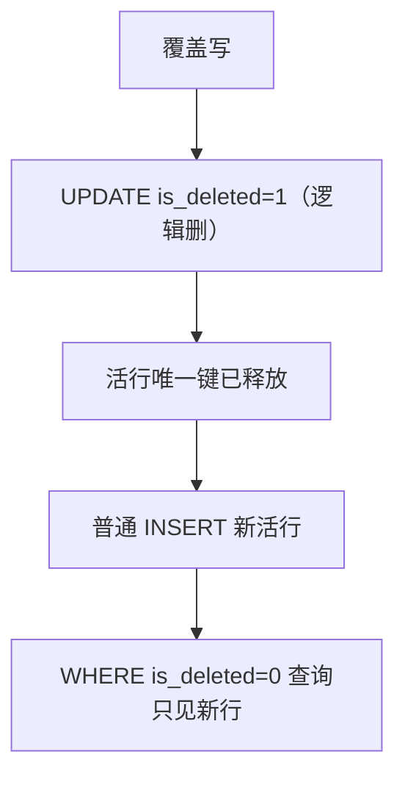

# 流水线覆盖写 × TableLogic：方案 B（部分唯一索引）

> 关联：[`schema-audit-fields-rename-plan.md`](./schema-audit-fields-rename-plan.md)  
> 前序：曾用方案 A（绝对 UK + upsert 恢复 `is_deleted=0`），**已放弃**。  
> **选定：方案 B** — `UNIQUE (…) WHERE is_deleted = 0` + **逻辑删后再 insert**  
> 状态：**已实施**（2026-07-16）

---

## 一、决策变更

| 方案 | 做法 | 结果 |
|---|---|---|
| A（已放弃） | 绝对 PK/UK 含软删行 + `ON CONFLICT … is_deleted=0` | 代码侧大量 upsert |
| **B（选定）** | **活行**唯一：`CREATE UNIQUE INDEX … WHERE is_deleted = 0` + 逻辑删 + 普通 insert | 覆盖写回到「先删后插」，无需为腾键写 upsert |

**禁止物理 `DELETE FROM`**（与此前一致）。



---

## 二、部分唯一索引 vs 复合唯一

**不要** `UNIQUE(task_id, is_deleted)`：`(task_id, 1)` 仍只能一行，软删历史无法堆积。

**正确**：

```sql
CREATE UNIQUE INDEX uk_xxx_active ON table_name (biz_cols…) WHERE is_deleted = 0;
```

同一业务键可有多条 `is_deleted=1` 历史行；任意时刻最多一条活行。

`PRIMARY KEY (task_id)` **不能**做成 partial。`ci_incremental_scan` 必须：

- 代理键 `id BIGSERIAL PRIMARY KEY`
- `task_id BIGINT NOT NULL` + `uk_incremental_scan_task_active ON (task_id) WHERE is_deleted = 0`

---

## 三、约束改造清单（已落地）

| 表 | 目标 |
|---|---|
| `ci_incremental_scan` | PK(`id`) + `uk_incremental_scan_task_active(task_id) WHERE is_deleted=0` |
| `ci_draft_workspace` | `uk_draft_workspace_task_active(task_id) WHERE is_deleted=0` |
| `ci_scan_window` | `uk_scan_window_repo_active(repository_id) WHERE is_deleted=0` |
| `ci_entrypoint` | `uk_entrypoint_task_class_active(task_id, class_name) WHERE is_deleted=0` |
| `ci_module_hierarchy` | `uk_module_hierarchy_task_node_active(task_id, node_id) WHERE is_deleted=0` |
| `ci_method_function_binding` | `uk_mfb_task_class_method_active(…) WHERE is_deleted=0` |
| `ci_repository_entrypoint` | `uk_repo_entrypoint_class_active(…) WHERE is_deleted=0` |
| `ci_repository_module_hierarchy` | `uk_repo_hierarchy_node_active(…) WHERE is_deleted=0` |
| `ci_business_knowledge` | `uk_business_knowledge_system_active(system_id) WHERE is_deleted=0` |
| `ci_user` | `uk_user_username_active(username) WHERE is_deleted=0` |
| `ci_user_quota` | `uk_user_quota_user_active(user_id) WHERE is_deleted=0` |

**不改（非软删覆盖写语义 / 种子幂等）：**

- `uk_ci_prompt_type_default_active`（已是 partial，语义不同）
- `uk_model_preset_identifier`、`uk_repo_publish_version`（发布/模板标识）

无业务 UK 的表（`ci_method_call` / `ci_file_snapshot` / draft refs）：维持逻辑删 + insert。

---

## 四、代码约定（已落地）

1. 覆盖写 = **逻辑删**（`UPDATE is_deleted=1` 或 MP `delete`）→ **plain `insert`**
2. **无** Mapper `ON CONFLICT … is_deleted=0` 的 upsert
3. `deleteByTaskId` / `deleteByRepositoryId` 等继续是 `@Update` 逻辑删，**不是** `DELETE FROM`
4. 基线 `INSERT…SELECT`：源端 `AND is_deleted=0`
5. `IncrementalScanRecord`：代理键 `id`（`IdType.AUTO`）；按 `task_id` 查活行
6. `generate_schema_fresh.py`：按 `ON <table>` 把 `uk_*_active` 归到对应表段落

Service 层方法名 `ScanWindowService.upsert` / `BusinessKnowledgeService.upsert` 仍表示「有则更新、无则插入」的业务保存语义，**不是** SQL `ON CONFLICT` upsert。

---

## 五、验证清单

- [ ] 同 task 重跑 PULLING_CODE：逻辑删后 insert，不报 `ci_incremental_scan` 唯一冲突
- [ ] 入口 / 模块层级 / binding / 仓库发布覆盖写：逻辑删 + insert 成功
- [ ] 扫描窗口删除后再保存成功
- [ ] 任务 purge 后再 GENERATING_DOC：工作区可 insert
- [ ] 同 username 软删用户后再建：不撞 `uk_user_username_active`
- [x] `rg "ON CONFLICT" backend/.../mapper`：覆盖写路径无「为软删恢复」的 upsert（种子/模板 ON CONFLICT 可保留）
- [x] `rg "DELETE FROM" backend/src/main/java`：业务表仍为 0

---

## 六、落地位置

| 项 | 位置 |
|---|---|
| 旧库迁移 | `schema.sql` 文末 partial unique 块（DROP 旧绝对 UK + `CREATE UNIQUE INDEX … WHERE is_deleted=0`） |
| 新库 | `schema-fresh.sql` 各表段内 `uk_*_active` |
| 辅助脚本 | `backend/scripts/apply_partial_unique_indexes.py`、`generate_schema_fresh.py` |
