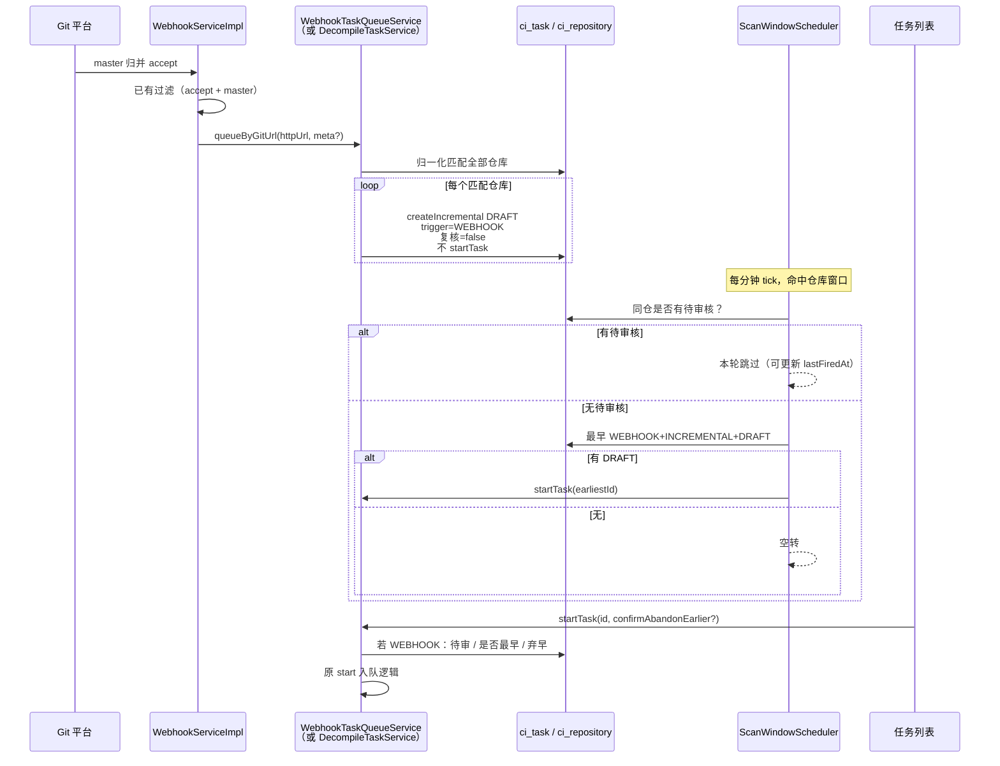

# Webhook 归并排队 + 时间窗口放行 · 详细设计

> **管什么**：Git 平台 master 归并回调后，为平台内匹配仓库排队增量任务（DRAFT、不执行）；扫描时间窗口命中时按 FIFO 放行；手动启动 WEBHOOK DRAFT 时的顺序校验与「放弃更早 draft」确认流。  
> **不管什么**：Webhook HTTP 入口 / 鉴权 / `action=accept` / `targetBranch=master` 过滤（公司侧 `WebhookServiceImpl` 已有）；增量 diff / 基线继承 / 推送语义（见既有增量方案）。  
> **关联**：[incremental-task-strict-gate.md](./incremental-task-strict-gate.md)、[incremental-baseline-design.md](./incremental-baseline-design.md)（若存在）、`ScanWindowScheduler`、`DecompileTaskService`。  
> **状态：待实施**（方案已确认，2026-07-23）。

---

## 〇、目标一句话

**Webhook 只下单不执行；时间窗口只放行最早一条无待审阻塞的 WEBHOOK 增量 DRAFT；手动触发可跳队但须确认并删除更早 DRAFT。**

---

## 一、已确认决策

| # | 决策 | 结论 |
|---|---|---|
| 1 | 时间窗口是否还造任务 | **否**。窗口只放行；**删除 `SCHEDULED` 触发源**（不兼容历史，见 §5.5） |
| 2 | 同仓多次归并 | **各自生成**独立 DRAFT（不合并） |
| 3 | 自动任务复核开关 | **跳过**入口复核与层级复核（`requireEntrypointReview=false`，`requireHierarchyReview=false`） |
| 4 | 未配扫描窗口的仓库 | **允许排队**，但**不会**被窗口自动放行（仅可手动启动） |
| 5 | 窗口每次放行条数 | **仅 1 条**：该仓创建时间最早的 `WEBHOOK + INCREMENTAL + DRAFT` |
| 6 | 窗口放行前置 | 该仓**必须无待审核任务**；有则本轮不执行 |
| 7 | 手动启动 WEBHOOK DRAFT | 须无待审核；若非最早须二次确认，确认后**删除更早 DRAFT、保留本条及更晚**，再启动本条 |
| 8 | Webhook 创建 vs 待审 | **创建不挡待审**（可排队积压）；**仅窗口/手动执行时挡待审** |
| 9 | 启动入口 | **沿用**现有「启动」按钮与 `POST /tasks/{id}/start`；**不**新增隔离接口；仅在 `startTask` 内增加 WEBHOOK 分支判断 |
| 10 | `SCHEDULED` | **从产品与代码中删除**；schema/注释/筛选项去掉；库内历史行可一次性迁移或清理，**不做只读兼容展示** |

---

## 二、现状与缺口

### 2.1 已具备

| 能力 | 位置 | 说明 |
|---|---|---|
| Webhook 入口与过滤 | 公司侧 `WebhookServiceImpl#processWebhook` | 已过滤 `action=accept`、`targetBranch=master`；TODO 处待接业务 |
| URL 来源 | `WebhookRequest.RepositoryDto.httpUrl` | 单次回调 = 单个远端仓库 |
| 增量创建门禁 | `DecompileTaskServiceImpl#validateIncrementalBaselineGate` | 须已发布基线 + 非本地路径 |
| 待复核门禁 | `validateNoPendingReviewTasks` | 手动新建任务时拒建；**WEBHOOK 排队创建跳过**；窗口/手动启动执行时仍挡 |
| 时间窗口配置 | `ci_scan_window` + 前端编排页 | 仓库级：周几位掩码 + 时:分 + enabled |
| 调度 tick | `ScanWindowScheduler#tick` | 默认每分钟；命中后 Redis 锁 + `lastFiredAt` 幂等 |

### 2.2 缺口

| # | 缺口 | 后果 |
|---|---|---|
| A | `processWebhook` TODO 未实现下发 | 归并回调无法排队增量 |
| B | `ScanWindowScheduler` 仍 `createInitialTask(..., "SCHEDULED")` + `startTask` | 与「只放行 WEBHOOK」目标冲突；且造的是全量 |
| C | `normalizeTriggerSource` 仅 `MANUAL` / `SCHEDULED` | 无法表达 `WEBHOOK` |
| D | 现有 `startTask` 无 WEBHOOK FIFO / 弃早确认 | 手动乱序启动会破坏队列语义（须在**同一接口**内补判断） |
| E | 无「按 gitUrl 归一化匹配多仓」的服务方法 | Webhook 侧难以复用 |
| F | 仍存在 `SCHEDULED` 写入与前端筛选项 | 与「删除 SCHEDULED、不兼容历史」冲突 |

---

## 三、核心原则

1. **下发与执行分离**：Webhook 只写 `DRAFT`；执行权只在「窗口放行」或「手动启动（含确认）」。
2. **FIFO 默认**：自动路径永远只启动创建最早的一条 WEBHOOK DRAFT。
3. **待审核只挡执行、不挡排队**：同仓有待审核时，Webhook **仍可**创建 DRAFT；窗口与手动启动**不得**放行执行。
4. **跳队须显式放弃**：手动启动非最早 DRAFT 时，用户确认后删除更早 DRAFT，语义为「放弃」，不是静默跳过。
5. **删除 `SCHEDULED`**：`trigger_source` 合法值不再包含 `SCHEDULED`；调度器不再造任务；前端筛选项删除；**不**做历史只读兼容（实施时可迁移/清理库内旧行）。
6. **启动入口不隔离**：页面仍用原「启动」按钮，后端仍用原 `startTask` / `POST /tasks/{id}/start`，仅增加 WEBHOOK 专用校验与可选 `confirmAbandonEarlier` 参数。
7. **增量硬门禁不降级**：无基线 / 本地路径等创建失败直接 skip，绝不改走全量。

---

## 四、端到端流程



---

## 五、Webhook 下发设计

### 5.1 公司侧接入点

文件：`WebhookServiceImpl#processWebhook`（包名以公司仓为准，如 `com.paic.codeinsight...`）。

在现有校验通过后（`action=accept` 且 `targetBranch=master`）：

```text
String httpUrl = request.getRepository().getHttpUrl();
webhookTaskQueueService.queueIncrementalDraftsByGitUrl(httpUrl, optionalMeta);
```

本方案**不**新增 Webhook HTTP 接口；默认入口已存在。

### 5.2 平台侧排队服务（建议）

新增薄服务（名称可定 `WebhookTaskQueueService`），供公司侧注入；本仓实现核心逻辑。

**方法建议：**

```java
/**
 * 按远端 httpUrl 匹配平台仓库，为每个可建仓创建一条 WEBHOOK 增量 DRAFT（不启动）。
 * @return 汇总：matched / queued / skipped（含原因）
 */
WebhookQueueResult queueIncrementalDraftsByGitUrl(String httpUrl, WebhookQueueMeta meta);
```

`WebhookQueueMeta`（可选）：`sourceBranch`、`targetBranch`、`mergeRequestId`、`mergeCommitId` —— 写入操作日志，便于溯源；不强制落 task 表新列（首期可用 `ci_operation_log`）。

### 5.3 URL 归一化与匹配

Webhook `httpUrl` 与 `ci_repository.git_url` 常不一致，匹配前统一归一化：

| 步骤 | 规则 |
|---|---|
| 1 | trim |
| 2 | 去末尾 `/` |
| 3 | 去末尾 `.git`（大小写不敏感） |
| 4 | host 小写（保留 path 原大小写或全小写，实现时二选一并单测固定） |
| 5 | 可选：统一 `http`/`https` 再比（若公司环境协议混用） |

查询：所有 `is_deleted=0` 且归一化 `git_url` 相等的仓库（**同一 URL 可挂多个系统 → 全部排队**）。

首期**不**用 `push_git_url` 匹配（分析源以 `git_url` 为准）；若后续需要可再开开关。

### 5.4 单仓创建规则

| 字段 | 值 |
|---|---|
| `type` | `INCREMENTAL` |
| `status` | `DRAFT` |
| `trigger_source` | `WEBHOOK` |
| `require_entrypoint_review` | `false` |
| `require_hierarchy_review` | `false` |
| 提示词 / 模型 / 入口配置 | 仓库默认绑定（与手动增量一致） |
| `startTask` | **不调用** |

**多次归并**：每次回调成功匹配后**各自新建**一条 DRAFT，不复用、不合并。

**门禁拆分（定稿）：**

| 阶段 | 待审（`PENDING_REVIEW` / `REVIEWING`） | 基线 / 本地路径 |
|---|---|---|
| Webhook **创建** DRAFT | **不校验**（允许在待审期间继续排队） | **仍校验**（无基线 / 本地路径 → skip） |
| 窗口放行 / 手动 `start`（WEBHOOK 分支） | **硬性阻挡**（有待审则不执行、不弃早） | 启动时任务已存在，不再重复基线创建门禁 |

理由：待审期间若创建也挡，归并回调会丢单；先排队、审完后由窗口按 FIFO 消化，更符合「有待审则不执行」的产品语义。

实现要点：Webhook 排队调用 `createIncrementalTask` 时**跳过** `validateNoPendingReviewTasks`；手动在前端新建增量任务仍走原门禁（创建也挡待审）。可新增重载或内部参数 `skipPendingReviewGate=true`，仅 WEBHOOK 路径开启。

**Skip（该仓不创建，记日志，不影响其它仓）：**

| 原因 | 错误码 / 说明 |
|---|---|
| `httpUrl` 为空 | warn，matched=0 |
| 无已发布基线 | `INCREMENTAL_NO_BASELINE` |
| 本地路径仓 | `INCREMENTAL_LOCAL_PATH_NOT_SUPPORTED` |
| 其它 `BusinessException` | 原 message |

> 同仓存在待审核时：**照常创建** WEBHOOK DRAFT；该 DRAFT 会积压至待审清空后，才可能被窗口或手动启动放行。

### 5.5 `trigger_source`（删除 SCHEDULED）

| 值 | 含义 | 新代码是否写入 |
|---|---|---|
| `MANUAL` | 前端手动创建 | 是 |
| `WEBHOOK` | 归并回调排队 | 是 |
| `KNOWLEDGE_REMEDIATION` | 知识纠错 | 是（既有） |

**`SCHEDULED`：删除，不做兼容。**

实施动作：

1. `normalizeTriggerSource`：合法集合为 `MANUAL` / `WEBHOOK` / `KNOWLEDGE_REMEDIATION`；**不再识别或写出 `SCHEDULED`**
2. `ScanWindowScheduler`：去掉一切 `createInitialTask(..., "SCHEDULED")`
3. schema COMMENT、`DecompileTask` JavaDoc、前端 `triggerSource` 筛选与 Tag：**去掉 SCHEDULED**
4. 库内已有 `trigger_source='SCHEDULED'` 的行：实施时一次性处理（建议迁移为 `MANUAL` 或按运维决定清理），**产品与代码路径均不再依赖该值**

`ci_task.trigger_source` 注释更新为：`MANUAL / WEBHOOK / KNOWLEDGE_REMEDIATION`。

---

## 六、时间窗口放行设计

### 6.1 改造 `ScanWindowScheduler#tick`

**删除：**

```java
decompileTaskService.createInitialTask(..., "SCHEDULED");
decompileTaskService.startTask(task.getId());
```

**改为（伪代码）：**

```java
CodeRepository repo = ...;
if (decompileTaskService.hasBlockingReviewTasks(repo.getSystemId(), repo.getId())) {
    // 有待审核：不 start；仍可写 lastFiredAt，避免同分钟空转刷锁
    updateLastFiredAt(w, now);
    continue;
}
DecompileTask earliest = decompileTaskService.findEarliestWebhookDraft(repo.getId());
if (earliest == null) {
    updateLastFiredAt(w, now);
    continue;
}
decompileTaskService.startTask(earliest.getId());
updateLastFiredAt(w, now);
```

### 6.2 查询条件：最早 WEBHOOK DRAFT

```text
repository_id = ?
AND type = 'INCREMENTAL'
AND status = 'DRAFT'
AND trigger_source = 'WEBHOOK'
AND is_deleted = 0
ORDER BY created_date ASC, id ASC
LIMIT 1
```

### 6.3 待审核判定

复用 / 抽取现有 `validateNoPendingReviewTasks` 的状态集合为只读查询 `hasBlockingReviewTasks`（不抛异常，返回 boolean），供窗口与手动启动共用。

状态集合与现网一致（以 `DecompileTaskServiceImpl` 为准，当前含 `PENDING_REVIEW` / `REVIEWING` 等）。

### 6.4 未配窗口

- Webhook 仍可为该仓创建 DRAFT。
- 因无 `ci_scan_window` 或 `enabled=false`，tick 不会命中 → **永不自动放行**。
- 仅可通过手动启动（§七）执行。

### 6.5 幂等与集群

保留现有：

- Redis `scan:fire:{repoId}:{slot}`（约 2 分钟）
- `lastFiredAt` 同分钟去重

集群多节点：依赖 Redis 锁；无 Redis 时现网 `tryLock` 返回 false 会导致整窗跳过——实施时若仍存在该问题，应改为「无 Redis 时单机放行」（顺带修复），避免本地/单机永远不放行。

### 6.6 窗口配置语义（不变）

仍为仓库级**定点**（周几 + 时:分），不是时间段。名称「时间窗口」保持现网 UI，本方案不改成区间。

---

## 七、手动启动（沿用原 `startTask`，内嵌 WEBHOOK 判断）

### 7.1 原则

- **不新增** `start-webhook` 接口，**不新增**独立启动按钮。
- 页面继续调用现有「启动」→ `POST /api/tasks/{id}/start`（或现网等价路径）。
- 后端在现有 `DecompileTaskServiceImpl#startTask`（及 Controller 入参）上增加 WEBHOOK 分支；非 WEBHOOK 任务行为不变。

### 7.2 API（扩展现有，非新路由）

`POST /api/tasks/{id}/start`

| 参数 | 类型 | 说明 |
|---|---|---|
| `confirmAbandonEarlier` | boolean，可选，默认 false | **仅当**任务为 WEBHOOK+DRAFT 且非最早时需要；用户确认后传 `true` |

非 WEBHOOK 任务忽略该参数。

**WEBHOOK 分支响应约定：**

| HTTP/业务码 | 场景 |
|---|---|
| 成功 | 非 WEBHOOK 按原逻辑；或 WEBHOOK 已是最早 / 已确认弃早并启动 |
| `WEBHOOK_START_BLOCKED_BY_REVIEW(2102)` | WEBHOOK 且同仓有待审核 |
| `WEBHOOK_ABANDON_EARLIER_REQUIRED(2101)` | WEBHOOK 且非最早、且未确认；body 可带 `earlierCount` / `earliestTaskId` |
| 其它原有错误 | 状态非法等，沿用现网 |

确认文案（前端在收到 2101 时弹窗，固定）：

> 之前还有更早的 draft，如果触发本条则会自动放弃之前的 draft

用户确认后再次调用**同一** `start` 接口：`confirmAbandonEarlier=true`。

### 7.3 `startTask` 内 WEBHOOK 处理步骤

```text
startTask(id, confirmAbandonEarlier = false):
  1. 加载 task（原有校验保留）
  2. 若 trigger_source != WEBHOOK：
       → 走原有 start 逻辑，结束
  3. // 以下仅 WEBHOOK
     若 status != DRAFT（或 type != INCREMENTAL）：按原非法状态处理
     若同仓 hasBlockingReviewTasks → 抛 2102
     查同仓 WEBHOOK+INCREMENTAL+DRAFT，ORDER BY created_date ASC, id ASC
     若 id == 最早.id → 进入原有 start 入队逻辑，结束
     若 id != 最早.id：
       a. confirmAbandonEarlier != true → 抛 2101
       b. 将早于本条的同仓 WEBHOOK DRAFT 置 CANCELLED（ABANDONED_BY_LATER_WEBHOOK_START）
       c. 晚于本条的 DRAFT 保留
       d. 对本条进入原有 start 入队逻辑
```

**弃早删除方式（推荐）：** 状态改为 `CANCELLED`，操作日志 `WEBHOOK_DRAFT_ABANDONED`；不要物理删行。

### 7.4 窗口放行与手动启动共用

`ScanWindowScheduler` 对最早 DRAFT 调用**同一个** `startTask(earliestId)`（可不传 `confirmAbandonEarlier`，因已是最早，不会进弃早分支）。待审检查可在 Scheduler 侧先做，也可依赖 `startTask` 内 2102（窗口侧建议先判断以免刷错误日志）。

---

## 八、数据模型与日志

### 8.1 表结构

`ci_task` **无需新列**（首期）。`trigger_source` 合法值改为 §5.5 三值；删除 SCHEDULED 相关 COMMENT / 索引说明中的 SCHEDULED 语义。

可选后续：`webhook_ref` / `merge_commit_id` —— 非本方案必做。

### 8.2 操作日志 `action_type`

| action_type | 时机 |
|---|---|
| `WEBHOOK_QUEUE_RECEIVED` | 收到 httpUrl，开始匹配 |
| `WEBHOOK_TASK_QUEUED` | 某仓成功创建 DRAFT |
| `WEBHOOK_TASK_SKIPPED` | 某仓 skip（含原因） |
| `SCAN_WINDOW_RELEASE` | 窗口成功 start 最早 DRAFT |
| `SCAN_WINDOW_SKIP_REVIEW` | 窗口因待审跳过 |
| `SCAN_WINDOW_SKIP_EMPTY` | 窗口无 DRAFT |
| `WEBHOOK_MANUAL_START` | 手动启动 WEBHOOK（含是否弃早） |
| `WEBHOOK_DRAFT_ABANDONED` | 弃早删除的每条 DRAFT |

### 8.3 前端

| 点 | 说明 |
|---|---|
| 启动按钮 | **沿用**现有「启动」；仍调 `startTask(id)`；若返回 2101 则弹确认后再调 `startTask(id, true)` |
| 任务列表 | 筛选项：**删除 SCHEDULED**，新增 `WEBHOOK`；WEBHOOK+DRAFT 可展示「等待时间窗口」 |
| 编排页 | 文案可改为「放行窗口」：不再定时造任务 |
| Tag | 去掉「定时触发」；增加「Webhook」展示 |

---

## 九、错误码建议

在 `ErrorCode` 中新增（编号可按现网序列微调）：

| Code | 常量 | 文案要点 |
|---|---|---|
| 2101 | `WEBHOOK_ABANDON_EARLIER_REQUIRED` | 存在更早 DRAFT，需确认放弃后才能启动本条 |
| 2102 | `WEBHOOK_START_BLOCKED_BY_REVIEW` | 同仓存在待审核任务，无法启动 |

> 不再需要「专用接口非法状态」码（2103）：WEBHOOK 与其它任务共用原 `start` 的状态校验。

既有 `2001`/`2002`/`2003` 增量门禁继续用于创建 skip。

---

## 十、实现清单（按类逐项验收）

> 验收时按 **ID（Cxx）** 勾选：改完对应类 + 关联单测/联调项即算该项完成。路径以本仓 `backend/src/main/java/com/company/codeinsight/` 为根（简称 `…/`）。

### 10.1 类改动总表

| ID | 动作 | 类 / 文件 | 改什么 | 关联验收 |
|---|---|---|---|---|
| **C01** | 新增 | `…/common/util/GitUrlNormalizer.java` | URL 归一化（trim / 去 `.git` / 去尾 `/` / host 小写等） | T1、T2 |
| **C02** | 新增 | `backend/src/test/.../GitUrlNormalizerTest.java` | 覆盖 http/https、`.git`、尾斜杠、大小写变体 | 单测绿 |
| **C03** | 改 | `…/repository/service/CodeRepositoryService.java` | 新增 `findAllByNormalizedGitUrl(String)` | T1 |
| **C04** | 改 | `…/repository/service/impl/CodeRepositoryServiceImpl.java` | 实现归一化匹配 | T1、T2 |
| **C05** | 改 | `…/common/exception/ErrorCode.java` | 新增 `WEBHOOK_ABANDON_EARLIER_REQUIRED(2101)`、`WEBHOOK_START_BLOCKED_BY_REVIEW(2102)`（**无** 2103） | T8–T10 |
| **C06** | 改 | `…/task/entity/DecompileTask.java` | `triggerSource` JavaDoc：**仅** `MANUAL` / `WEBHOOK` / `KNOWLEDGE_REMEDIATION`；**删除 SCHEDULED** | 代码评审 |
| **C07** | 改 | `backend/src/main/resources/db/schema.sql` + `schema-fresh.sql` | COMMENT 去掉 SCHEDULED、加入 WEBHOOK；可选一次性 `UPDATE ... SET trigger_source='MANUAL' WHERE trigger_source='SCHEDULED'` | T12、数据清理 |
| **C08** | 改 | `…/task/service/DecompileTaskService.java` | `hasBlockingReviewTasks`；`findEarliestWebhookDraft`；`listWebhookDrafts`；`startTask` 增加可选 `confirmAbandonEarlier`（或重载）；WEBHOOK 创建重载（`skipPendingReviewGate`） | T3–T11 |
| **C09** | 改 | `…/task/service/impl/DecompileTaskServiceImpl.java` | 见 **C09a–C09e**（核心；**无**独立 startWebhook） | T1–T12 |
| **C10** | 新增 | `…/task/service/WebhookTaskQueueService.java` | `queueIncrementalDraftsByGitUrl` | T1–T3b |
| **C11** | 新增 | `…/task/service/impl/WebhookTaskQueueServiceImpl.java` | 匹配仓 + 排队创建 | T1、T2、T3、T3b |
| **C12** | 新增 | `…/task/dto/WebhookQueueResult.java`（及可选 Meta） | 排队结果 DTO | 代码评审 |
| **C13** | 改 | `…/task/controller/DecompileTaskController.java` | **沿用**现有 `POST /{id}/start`；增加可选 query/body 参数 `confirmAbandonEarlier`；**不**新增路由 | T7–T10 |
| **C14** | 改 | `…/scanwindow/scheduler/ScanWindowScheduler.java` | 删除 SCHEDULED 造任务；待审检查 + 最早 DRAFT + `startTask`；无 Redis 可单机放行 | T4、T5、T6、T12 |
| **C15** | 改（可选） | 操作日志相关 | `WEBHOOK_*` / `SCAN_WINDOW_*` | 日志抽检 |
| **C16** | 新增 | `backend/src/test/.../WebhookTaskQueueServiceTest.java` | 排队、创建不挡待审、无基线 skip | T1、T2、T3b |
| **C17** | 新增 | `backend/src/test/.../WebhookStartTaskTest.java` | 经**同一** `startTask`：最早直启、2101、弃早、2102 | T7–T10 |
| **C18** | 新增/改 | `backend/src/test/.../ScanWindowSchedulerReleaseTest.java` | 放行最早、待审跳过、无 SCHEDULED 新行 | T4、T5、T12 |
| **C19** | 公司侧改 | `WebhookServiceImpl` | TODO → `queueIncrementalDraftsByGitUrl` | 联调归并 |
| **C20** | 改 | `frontend/src/api/task.ts` | **沿用** `startTask`；签名增加可选 `confirmAbandonEarlier`；类型去掉 `SCHEDULED`、加 `WEBHOOK` | T7–T9 |
| **C21** | 改 | `frontend/src/pages/tasks/TaskListTab.tsx` | **沿用**启动按钮；2101 弹确认后同 API 重试；筛选项删 SCHEDULED、加 WEBHOOK | T7–T10 |
| **C22** | 改 | `frontend/src/pages/tasks/detail.tsx` | 同上（原启动按钮） | T7–T9 |
| **C23** | 改 | `frontend/src/pages/tasks/queue.tsx` | Tag/筛选去掉 SCHEDULED，展示 WEBHOOK | 展示抽检 |
| **C24** | 改（可选） | `frontend/src/pages/basic/orchestration.tsx` | 窗口=放行说明 | 产品说明 |
| **C25** | 改 | 凡写死 `SCHEDULED` 的优先级/文案处（如 `defaultPriorityFor`） | 删除 SCHEDULED 分支；WEBHOOK 优先级可与原 SCHEDULED 对齐（如 60）或单独定义 | 代码评审 |

### 10.2 `DecompileTaskServiceImpl` 细项（C09 拆分）

| ID | 方法 / 区域 | 改动要点 | 验收 |
|---|---|---|---|
| **C09a** | `normalizeTriggerSource` | 合法：`MANUAL` / `WEBHOOK` / `KNOWLEDGE_REMEDIATION`；**删除 SCHEDULED 分支** | 落库无 SCHEDULED |
| **C09b** | `createIncrementalTask`（WEBHOOK 路径） | reviews=false；**跳过**待审创建门禁；仍走基线门禁；DRAFT；不 start | T2、T3、T3b |
| **C09c** | `hasBlockingReviewTasks` | 只读 boolean | T5、T10 |
| **C09d** | `findEarliestWebhookDraft` / `listWebhookDrafts` | FIFO 查询 | T4、T7–T9 |
| **C09e** | `startTask(id, confirmAbandonEarlier)` | 非 WEBHOOK → 原逻辑；WEBHOOK → §7.3 分支后进入原入队 | T7–T10、T4 |

> **不再**拆独立 `startWebhookTask`，也**不再**让普通 `start` 拒绝 WEBHOOK。窗口与手动共用同一 `startTask`。

### 10.3 `ScanWindowScheduler` 细项（C14）

| ID | 位置 | 改动 | 验收 |
|---|---|---|---|
| **C14a** | `tick()` | 删除 `createInitialTask(..., "SCHEDULED")` | T12 |
| **C14b** | 同上 | 待审 → 不 start | T5 |
| **C14c** | 同上 | 最早 WEBHOOK DRAFT → `startTask` | T4、T6 |
| **C14d** | `tryLock` | 无 Redis 允许单机放行 | 本地可放行 |

### 10.4 明确不改

| 类 | 说明 |
|---|---|
| `BaselineInheritanceService*` | 创建 DRAFT 不触发基线复制 |
| `CodeScannerServiceImpl` 增量严格门禁 | 不改 |
| 公司侧 Webhook HTTP 入口 | 不改；只改 `WebhookServiceImpl` TODO |
| `ScanWindowEntity` / 窗口 CRUD | 表结构不改 |
| 前端启动按钮组件结构 | **不新做按钮**；只加 2101 确认与参数 |

### 10.5 验收勾选顺序

```text
阶段 A 排队+删 SCHEDULED： C01–C04 C06 C07 C09a–b C10–C12 C16 C25  → T1 T2 T3 T3b
阶段 B 窗口放行：           C09c–d C14 C18                            → T4 T5 T6 T12
阶段 C 共用 start：         C05 C08 C09e C13 C17                      → T7 T8 T9 T10
阶段 D 前端：               C20–C24                                   → UI T7–T9
阶段 E 公司侧：             C19                                       → 真实 webhook
```

### 10.6 与测试用例映射

| 用例 | 主要覆盖类 ID |
|---|---|
| T1 | C01, C03, C04, C11 |
| T2 | C09b, C11 |
| T3 / T3b | C09b, C11 |
| T4 | C09d, C09e, C14c |
| T5 | C09c, C14b |
| T6 | C14 |
| T7–T9 | C09e, C13, C20, C21 |
| T10 | C09c, C09e |
| T11 | ~~删除~~（改为：MANUAL 任务 start 行为回归，确认未受 WEBHOOK 分支影响）→ C09e |
| T12 | C07, C14a, C23 |

---

## 十一、测试用例（验收）

| # | 场景 | 期望 |
|---|---|---|
| T1 | webhook httpUrl 匹配 2 个系统仓 | 各建 1 条 WEBHOOK DRAFT，均未 PENDING |
| T2 | 无基线仓 | skip，不建任务 |
| T3 | 同仓连续 3 次 webhook | 3 条 DRAFT，created_date 递增 |
| T3b | 同仓有 PENDING_REVIEW 时再收 webhook | **仍创建**新 WEBHOOK DRAFT |
| T4 | 窗口命中且无待审、有 3 条 DRAFT | 仅 start 最早 1 条 |
| T5 | 窗口命中但有 PENDING_REVIEW | 不 start |
| T6 | 仓无 scan window，有 DRAFT | 永不自动 start |
| T7 | 原「启动」点最早 WEBHOOK DRAFT | 直接启动，不删其它 |
| T8 | 原「启动」点第 2 条且未确认 | 同一 `start` 返回 2101 |
| T9 | 确认后再次原「启动」 | 更早 CANCELLED；本条 start；更晚保留 |
| T10 | 有待审时点启动 | 2102 |
| T11 | MANUAL DRAFT 点原「启动」 | 行为与改前一致（回归） |
| T12 | 代码/UI/schema 无 SCHEDULED；tick 不造 SCHEDULED 任务 | 筛选项与新写入均无 SCHEDULED |

---

## 十二、风险与兼容

| 风险 | 缓解 |
|---|---|
| 运维依赖「到点自动全量」 | 窗口改为放行 webhook；需全量请手动 INITIAL |
| 待审导致 DRAFT 堆积 | 列表可见；FIFO + 手动弃早 |
| URL 归一化漏匹配 | 单测 + 日志 |
| 删除 SCHEDULED 后旧数据 | 实施时一次性 UPDATE/清理；**不做长期兼容** |
| `start` 增加参数影响旧客户端 | `confirmAbandonEarlier` 可选默认 false；非 WEBHOOK 忽略 |

---

## 十三、非目标（本方案不做）

- 新增 Webhook HTTP 接口或鉴权改造  
- 新增隔离的 `start-webhook` 接口 / 独立启动按钮  
- `SCHEDULED` 历史只读兼容或双轨展示  
- 把扫描窗口改成「时间段」语义  
- Webhook 自动合并多次归并为单 DRAFT  
- 无基线时降级全量  
- 自动推送 / 跳过知识复核（仅跳过入口/层级断点）  

---

## 十四、实施顺序建议

1. **阶段 A**：删 SCHEDULED + WEBHOOK 排队（C01–C04, C06–C07, C09a–b, C10–C12, C16, C25）  
2. **阶段 B**：窗口放行（C09c–d, C14, C18）  
3. **阶段 C**：共用 `startTask` 内嵌 WEBHOOK（C05, C08, C09e, C13, C17）  
4. **阶段 D**：前端原按钮 + 2101 确认（C20–C24）  
5. **阶段 E**：公司侧 TODO（C19）  
6. 联调 T1–T12  

---

## 十五、附录：关键调用对照

### 现状（将删除）

```text
ScanWindowScheduler.tick
  → createInitialTask(..., "SCHEDULED")
  → startTask
```

### 目标

```text
WebhookServiceImpl.processWebhook
  → queueIncrementalDraftsByGitUrl(httpUrl)
       → createIncremental(..., WEBHOOK, reviews=false)  // DRAFT only

ScanWindowScheduler.tick
  → if review blocking: skip
  → else startTask(earliestWebhookDraftId)

UI「启动」按钮（不变）
  → POST /tasks/{id}/start?confirmAbandonEarlier=
       → startTask：非 WEBHOOK 走原逻辑；WEBHOOK 走 §7.3
```

---

**文档维护**：实施完成后将文首状态改为「已实施」。§5.4 定稿「创建不挡待审」；§5.5 **删除 SCHEDULED、不兼容历史**；§7 **沿用原 start，不隔离接口**。逐项验收以 **§10 C01–C25** 为准。